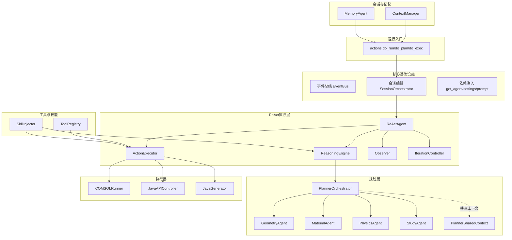
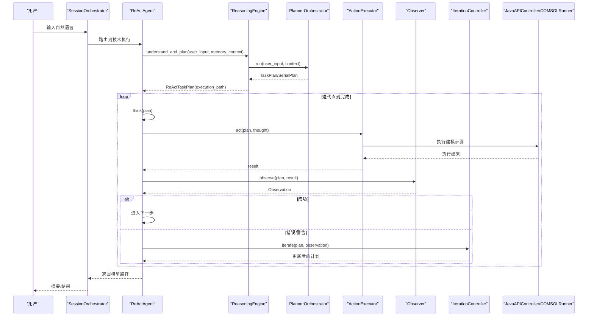
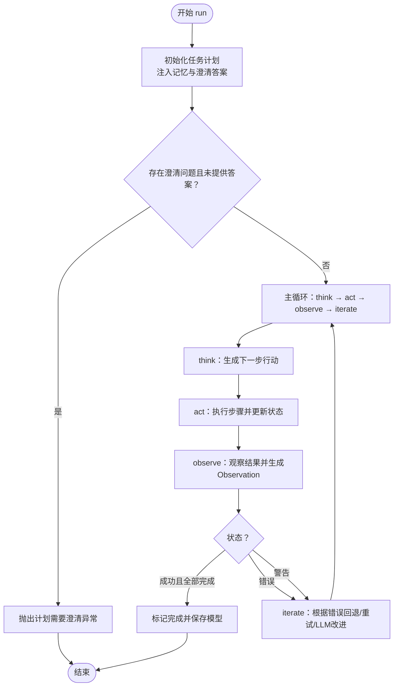
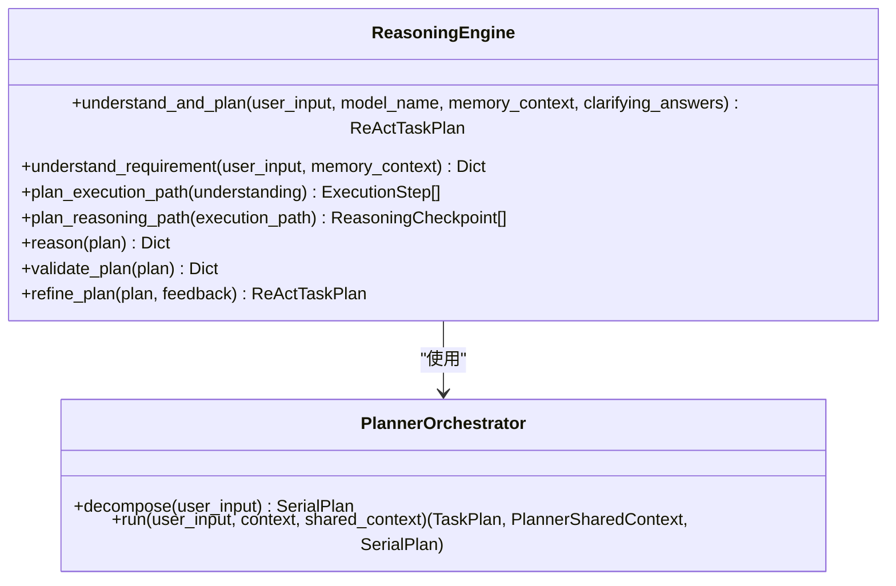
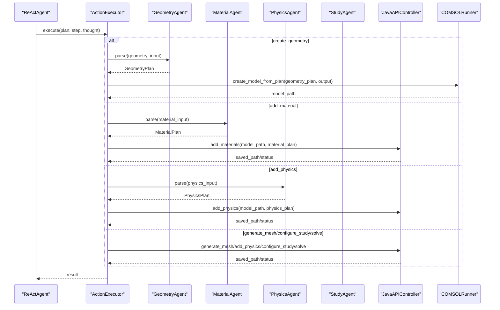
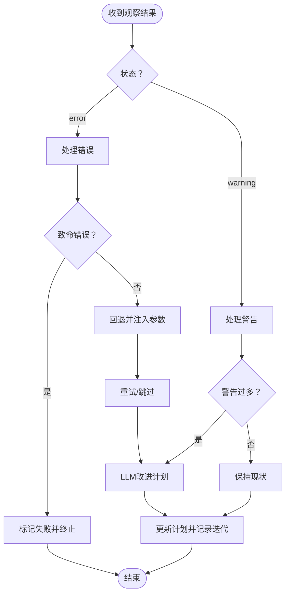
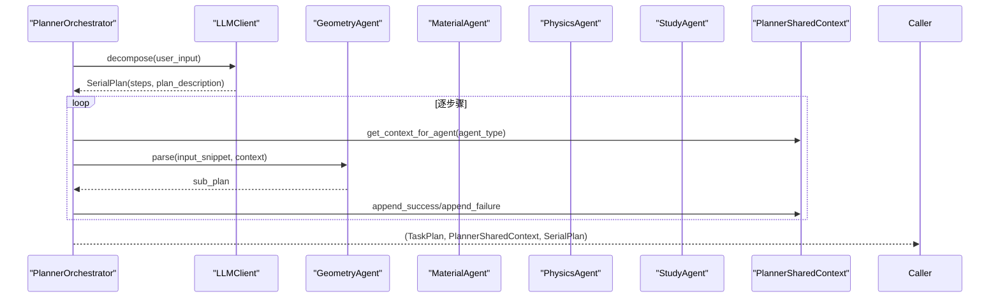
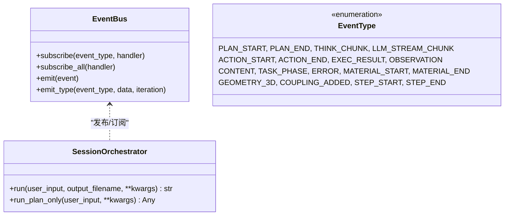
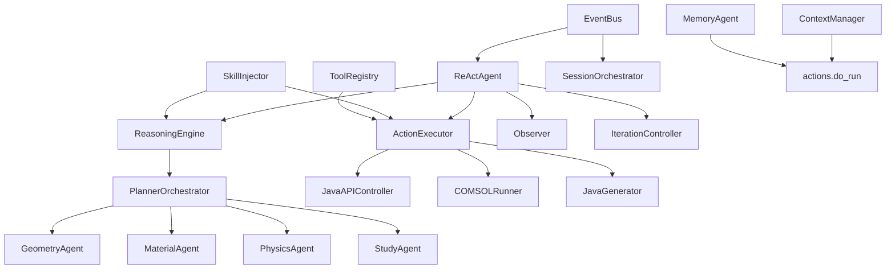

# Agent智能体系统

<cite>
**本文档引用的文件**
- [agent/__init__.py](file://agent/__init__.py)
- [agent/README.md](file://agent/README.md)
- [agent/react/react_agent.py](file://agent/react/react_agent.py)
- [agent/react/reasoning_engine.py](file://agent/react/reasoning_engine.py)
- [agent/react/action_executor.py](file://agent/react/action_executor.py)
- [agent/react/observer.py](file://agent/react/observer.py)
- [agent/react/iteration_controller.py](file://agent/react/iteration_controller.py)
- [agent/planner/orchestrator.py](file://agent/planner/orchestrator.py)
- [agent/planner/context.py](file://agent/planner/context.py)
- [agent/core/session.py](file://agent/core/session.py)
- [agent/core/events.py](file://agent/core/events.py)
- [schemas/task.py](file://schemas/task.py)
- [agent/run/actions.py](file://agent/run/actions.py)
- [agent/utils/config.py](file://agent/utils/config.py)
- [agent/skills/injector.py](file://agent/skills/injector.py)
- [agent/tools/registry.py](file://agent/tools/registry.py)
- [agent/memory/memory_agent.py](file://agent/memory/memory_agent.py)
</cite>

## 目录
1. [简介](#简介)
2. [项目结构](#项目结构)
3. [核心组件](#核心组件)
4. [架构总览](#架构总览)
5. [详细组件分析](#详细组件分析)
6. [依赖关系分析](#依赖关系分析)
7. [性能考量](#性能考量)
8. [故障排查指南](#故障排查指南)
9. [结论](#结论)
10. [附录](#附录)

## 简介
本文件面向COMSOL Agent智能体系统，围绕ReAct框架的推理-行动-观察循环、Planner编排器的多Agent协同、事件驱动架构与会话管理、智能体间通信协议、状态管理与错误处理机制进行系统化文档化。文档同时提供可视化图示与使用模式指引，帮助开发者与使用者快速理解并高效使用该系统。

## 项目结构
系统采用按功能域分层的模块化组织方式，核心分为：
- 核心基础设施：事件总线、路由、会话编排、依赖注入、Celery
- 规划层：几何/材料/物理/研究Agent与编排器
- ReAct执行层：推理引擎、行动执行器、观察器、迭代控制器
- 执行层：COMSOL运行器、Java API控制器、Java代码生成器
- 工具与技能：工具注册表、技能注入（向量检索+触发器）
- 会话与记忆：上下文管理、摘要记忆、异步更新
- 运行入口：CLI/TUI桥接与动作函数

**图表来源**
- [agent/core/session.py:10-70](file://agent/core/session.py#L10-L70)
- [agent/react/react_agent.py:19-60](file://agent/react/react_agent.py#L19-L60)
- [agent/react/reasoning_engine.py:108-141](file://agent/react/reasoning_engine.py#L108-L141)
- [agent/react/action_executor.py:19-28](file://agent/react/action_executor.py#L19-L28)
- [agent/planner/orchestrator.py:261-290](file://agent/planner/orchestrator.py#L261-L290)
- [agent/planner/context.py:38-70](file://agent/planner/context.py#L38-L70)
- [agent/run/actions.py:57-185](file://agent/run/actions.py#L57-L185)

**章节来源**
- [agent/README.md:1-95](file://agent/README.md#L1-L95)
- [agent/__init__.py:1-43](file://agent/__init__.py#L1-L43)

## 核心组件
- ReActAgent：协调推理与执行，驱动思考-行动-观察-迭代循环，支持事件总线与会话上下文。
- ReasoningEngine：将用户需求理解为可执行的执行链路与推理检查点，支持Planner编排器或单次理解规划。
- ActionExecutor：按步骤类型调用Java API控制器或COMSOLRunner，执行几何/材料/物理/网格/研究/求解等操作。
- Observer：对执行结果进行观察与验证，生成Observation并注入计划。
- IterationController：根据观察结果判断是否迭代、何时迭代、如何迭代，支持回退与参数注入。
- PlannerOrchestrator：将自然语言拆解为串行步骤，协调四个子Agent并维护共享上下文。
- PlannerSharedContext：跨Agent通信载体，记录已完成修改与错误，辅助后续步骤决策。
- EventBus：统一事件类型与事件体，支持UI逐步渲染与日志监控。
- SessionOrchestrator：按路由结果调用Q&A或技术执行路径，串联Planner→Core→Summary。
- ToolRegistry/SkillInjector：为ReAct与行动提供工具注册与隐性知识注入（向量检索+触发器）。
- COMSOLRunner/JavaAPIController/JavaGenerator：与COMSOL交互，生成/执行Java代码并保存.mph模型。
- ContextManager/MemoryAgent：维护会话摘要、历史与异步记忆更新。

**章节来源**
- [agent/react/react_agent.py:19-60](file://agent/react/react_agent.py#L19-L60)
- [agent/react/reasoning_engine.py:108-141](file://agent/react/reasoning_engine.py#L108-L141)
- [agent/react/action_executor.py:19-28](file://agent/react/action_executor.py#L19-L28)
- [agent/react/observer.py:12-18](file://agent/react/observer.py#L12-L18)
- [agent/react/iteration_controller.py:16-28](file://agent/react/iteration_controller.py#L16-L28)
- [agent/planner/orchestrator.py:261-290](file://agent/planner/orchestrator.py#L261-L290)
- [agent/planner/context.py:38-70](file://agent/planner/context.py#L38-L70)
- [agent/core/events.py:8-39](file://agent/core/events.py#L8-L39)
- [agent/core/session.py:10-27](file://agent/core/session.py#L10-L27)
- [agent/skills/injector.py:11-39](file://agent/skills/injector.py#L11-L39)
- [agent/tools/registry.py:23-33](file://agent/tools/registry.py#L23-L33)
- [agent/memory/memory_agent.py:13-34](file://agent/memory/memory_agent.py#L13-L34)

## 架构总览
ReAct框架以“理解→规划→执行→观察→迭代”为核心闭环，结合Planner编排器将复杂需求分解为可执行的建模步骤，再由ActionExecutor调用COMSOL Java API完成具体操作。事件总线贯穿全程，支撑UI渲染与可观测性；会话编排器负责路由与上下文注入；技能系统与工具注册表为Agent提供隐性知识与工具能力。

**图表来源**
- [agent/core/session.py:28-62](file://agent/core/session.py#L28-L62)
- [agent/react/react_agent.py:60-215](file://agent/react/react_agent.py#L60-L215)
- [agent/react/reasoning_engine.py:142-249](file://agent/react/reasoning_engine.py#L142-L249)
- [agent/planner/orchestrator.py:365-449](file://agent/planner/orchestrator.py#L365-L449)
- [agent/react/action_executor.py:48-80](file://agent/react/action_executor.py#L48-L80)
- [agent/react/observer.py:19-51](file://agent/react/observer.py#L19-L51)
- [agent/react/iteration_controller.py:115-152](file://agent/react/iteration_controller.py#L115-L152)

## 详细组件分析

### ReActAgent：推理-行动-观察循环
- 初始化：注入LLM客户端、ReasoningEngine、ActionExecutor、Observer、IterationController与事件总线。
- run流程：
  - 初始化任务计划（注入记忆摘要与澄清答案）。
  - 若存在澄清问题且未提供答案，抛出“计划需要澄清”异常，交由上层处理。
  - 主循环：think→act→observe→iterate，直至完成或失败。
  - 成功：保存并返回模型路径；失败：根据是否部分生成给出提示。
- think：基于当前计划生成下一步行动。
- act：根据行动类型执行具体步骤，更新当前步骤状态与结果。
- observe：对执行结果进行观察，生成Observation并注入计划。
- iterate：根据观察结果更新计划，支持回退与参数注入。

**图表来源**
- [agent/react/react_agent.py:60-215](file://agent/react/react_agent.py#L60-L215)
- [agent/react/iteration_controller.py:115-152](file://agent/react/iteration_controller.py#L115-L152)

**章节来源**
- [agent/react/react_agent.py:60-215](file://agent/react/react_agent.py#L60-L215)
- [agent/react/iteration_controller.py:115-152](file://agent/react/iteration_controller.py#L115-L152)

### ReasoningEngine：需求理解与计划生成
- understand_and_plan：优先使用PlannerOrchestrator进行串行步骤分解，再转为ReAct执行链路；也可回退到单次理解+规划。
- plan_execution_path：按COMSOL流程严格安排步骤（几何→材料→物理→网格→研究→求解），并支持stop_after_step截断。
- plan_reasoning_path：为每个执行步骤创建验证检查点，形成推理链路。
- reason：根据当前步骤状态决定下一步行动（继续、重试、跳过、完成）。
- validate_plan/refine_plan：验证计划合理性并根据反馈改进。

**图表来源**
- [agent/react/reasoning_engine.py:108-249](file://agent/react/reasoning_engine.py#L108-L249)
- [agent/planner/orchestrator.py:261-449](file://agent/planner/orchestrator.py#L261-L449)

**章节来源**
- [agent/react/reasoning_engine.py:142-249](file://agent/react/reasoning_engine.py#L142-L249)
- [agent/react/reasoning_engine.py:416-470](file://agent/react/reasoning_engine.py#L416-L470)

### ActionExecutor：多Agent行动执行
- 支持行动类型：几何建模、材料设置、物理场、网格划分、研究配置、求解、几何导入、创建选择集、导出结果、调用官方Java API、重试/跳过。
- 按步骤类型调用JavaAPIController或COMSOLRunner，生成UI反馈与事件。
- 支持call_official_api：两种用法（wrapper或method+args+target_path）。

**图表来源**
- [agent/react/action_executor.py:48-80](file://agent/react/action_executor.py#L48-L80)
- [agent/react/action_executor.py:83-138](file://agent/react/action_executor.py#L83-L138)
- [agent/react/action_executor.py:142-196](file://agent/react/action_executor.py#L142-L196)
- [agent/react/action_executor.py:199-327](file://agent/react/action_executor.py#L199-L327)
- [agent/react/action_executor.py:330-358](file://agent/react/action_executor.py#L330-L358)

**章节来源**
- [agent/react/action_executor.py:48-80](file://agent/react/action_executor.py#L48-L80)

### Observer：执行结果观察与验证
- 根据步骤类型分别观察几何、物理场、网格、研究、求解等结果。
- 生成Observation（success/warning/error），并可观察模型整体状态（文件存在性、大小、完成度）。

**章节来源**
- [agent/react/observer.py:19-51](file://agent/react/observer.py#L19-L51)
- [agent/react/observer.py:261-317](file://agent/react/observer.py#L261-L317)

### IterationController：迭代控制与计划更新
- should_iterate：根据错误/警告/失败步骤/迭代次数判断是否需要迭代。
- generate_feedback：汇总观察结果、当前步骤、历史观察、进度等。
- update_plan：处理错误（致命错误直接失败、可恢复错误回退并注入参数、通用重试）、处理警告（过多时优化计划）。
- _rollback_and_inject：根据错误信息确定应回退的步骤并注入修复参数。
- _llm_refine_plan：使用LLM根据错误/反馈改进计划，输出具体修改建议。

**图表来源**
- [agent/react/iteration_controller.py:29-70](file://agent/react/iteration_controller.py#L29-L70)
- [agent/react/iteration_controller.py:115-152](file://agent/react/iteration_controller.py#L115-L152)
- [agent/react/iteration_controller.py:154-216](file://agent/react/iteration_controller.py#L154-L216)
- [agent/react/iteration_controller.py:217-274](file://agent/react/iteration_controller.py#L217-L274)
- [agent/react/iteration_controller.py:308-389](file://agent/react/iteration_controller.py#L308-L389)

**章节来源**
- [agent/react/iteration_controller.py:115-152](file://agent/react/iteration_controller.py#L115-L152)

### PlannerOrchestrator：多Agent编排与共享上下文
- decompose：使用LLM将用户提示词拆解为串行步骤（geometry/material/physics/study），并支持clarifying_questions与case_library_suggestions。
- run：按顺序调用四个子Agent，维护PlannerSharedContext，注入“其他Agent已完成的修改与错误”到该步上下文。
- 过滤与截断：根据用户意图与关键词过滤步骤，避免擅自加材料/物理场/研究。
- 错误处理：任一步骤失败不影响后续步骤执行，但会在共享上下文中记录，供后续Agent适配。

**图表来源**
- [agent/planner/orchestrator.py:291-363](file://agent/planner/orchestrator.py#L291-L363)
- [agent/planner/orchestrator.py:365-449](file://agent/planner/orchestrator.py#L365-L449)
- [agent/planner/context.py:55-69](file://agent/planner/context.py#L55-L69)

**章节来源**
- [agent/planner/orchestrator.py:291-363](file://agent/planner/orchestrator.py#L291-L363)
- [agent/planner/orchestrator.py:365-449](file://agent/planner/orchestrator.py#L365-L449)
- [agent/planner/context.py:38-70](file://agent/planner/context.py#L38-L70)

### 事件驱动架构与会话管理
- EventBus：统一事件类型与事件体，支持全局与按类型订阅，核心逻辑只emit。
- SessionOrchestrator：根据路由结果调用Q&A或技术执行路径，串联Planner→Core→Summary，并在事件总线上发布内容。
- 事件类型覆盖：计划开始/结束、思考片段、行动开始/结束、执行结果、观察、内容、任务阶段、错误、材料/几何/耦合事件、步骤开始/结束等。

**图表来源**
- [agent/core/events.py:8-39](file://agent/core/events.py#L8-L39)
- [agent/core/session.py:28-62](file://agent/core/session.py#L28-L62)

**章节来源**
- [agent/core/events.py:43-79](file://agent/core/events.py#L43-L79)
- [agent/core/session.py:28-62](file://agent/core/session.py#L28-L62)

### 智能体间通信协议、状态管理与错误处理
- 通信协议：
  - PlannerSharedContext：按步骤记录agent_type、success、result_summary、error、timestamp，生成上下文行注入到其他Agent。
  - ReActTaskPlan：统一任务状态、执行链路、推理链路、观察结果、迭代历史、模型路径、澄清问题与案例库建议。
- 状态管理：
  - ExecutionStep：pending/running/completed/failed，携带step_type/action/parameters/result。
  - ReasoningCheckpoint：validation/verification/optimization，跟踪检查点状态与反馈。
  - IterationRecord：记录迭代原因、变更与本次观察结果。
- 错误处理：
  - 可恢复错误：通过回退到材料/物理步骤并注入参数，或重试当前步骤。
  - 致命错误：API/环境不可用，直接标记失败并终止。
  - 警告：过多时触发LLM优化计划。

**章节来源**
- [agent/planner/context.py:18-36](file://agent/planner/context.py#L18-L36)
- [schemas/task.py:12-26](file://schemas/task.py#L12-L26)
- [schemas/task.py:28-41](file://schemas/task.py#L28-L41)
- [schemas/task.py:54-62](file://schemas/task.py#L54-L62)
- [schemas/task.py:115-192](file://schemas/task.py#L115-L192)
- [agent/react/iteration_controller.py:154-216](file://agent/react/iteration_controller.py#L154-L216)

### 使用模式与示例
- do_run：默认模式，自然语言→创建模型；支持clarifying_answers传入澄清问题答案；会话ID存在时使用摘要上下文并异步更新记忆。
- do_plan：自然语言→JSON计划；可保存到文件。
- do_exec_from_file：根据JSON计划文件执行或仅生成Java代码。
- do_demo：运行演示用例，覆盖仅几何、材料、物理场、研究、完整流程。
- do_doctor：环境诊断，检查LLM与COMSOL/JVM配置。
- 上下文管理：show/history/stats/clear/set_summary/get_summary。

**章节来源**
- [agent/run/actions.py:57-185](file://agent/run/actions.py#L57-L185)
- [agent/run/actions.py:187-229](file://agent/run/actions.py#L187-L229)
- [agent/run/actions.py:231-251](file://agent/run/actions.py#L231-L251)
- [agent/run/actions.py:254-272](file://agent/run/actions.py#L254-L272)
- [agent/run/actions.py:274-354](file://agent/run/actions.py#L274-L354)
- [agent/run/actions.py:356-431](file://agent/run/actions.py#L356-L431)

## 依赖关系分析

**图表来源**
- [agent/react/reasoning_engine.py:161-177](file://agent/react/reasoning_engine.py#L161-L177)
- [agent/planner/orchestrator.py:286-289](file://agent/planner/orchestrator.py#L286-L289)
- [agent/react/react_agent.py:45-56](file://agent/react/react_agent.py#L45-L56)
- [agent/react/action_executor.py:24-25](file://agent/react/action_executor.py#L24-L25)
- [agent/skills/injector.py:95-112](file://agent/skills/injector.py#L95-L112)
- [agent/tools/registry.py:45-50](file://agent/tools/registry.py#L45-L50)
- [agent/core/events.py:63-78](file://agent/core/events.py#L63-L78)
- [agent/core/session.py:23-26](file://agent/core/session.py#L23-L26)
- [agent/run/actions.py:83-100](file://agent/run/actions.py#L83-L100)

**章节来源**
- [agent/react/reasoning_engine.py:161-177](file://agent/react/reasoning_engine.py#L161-L177)
- [agent/planner/orchestrator.py:286-289](file://agent/planner/orchestrator.py#L286-L289)
- [agent/react/react_agent.py:45-56](file://agent/react/react_agent.py#L45-L56)
- [agent/react/action_executor.py:24-25](file://agent/react/action_executor.py#L24-L25)
- [agent/skills/injector.py:95-112](file://agent/skills/injector.py#L95-L112)
- [agent/tools/registry.py:45-50](file://agent/tools/registry.py#L45-L50)
- [agent/core/events.py:63-78](file://agent/core/events.py#L63-L78)
- [agent/core/session.py:23-26](file://agent/core/session.py#L23-L26)
- [agent/run/actions.py:83-100](file://agent/run/actions.py#L83-L100)

## 性能考量
- LLM调用：ReasoningEngine与IterationController均使用LLM进行规划与改进，建议合理设置temperature与max_retries，避免过度调用。
- 事件流式输出：LLM_STREAM_CHUNK与THINK_CHUNK支持逐步渲染，降低UI等待时间。
- 异步记忆更新：MemoryAgent通过Celery异步更新会话摘要，避免阻塞主线程。
- Java API调用：COMSOLRunner与JavaAPIController涉及JVM启动与COMSOL求解，建议预热JVM并合理设置网格/研究参数以减少求解时间。
- 向量检索：SkillInjector优先使用向量检索，建议在技能库较大时建立持久化索引，提升检索效率。

[本节为通用指导，无需特定文件引用]

## 故障排查指南
- 环境检查：使用do_doctor检查LLM后端与COMSOL/JVM配置，关注错误/警告/信息项。
- 计划需要澄清：当ReActAgent抛出“计划需要澄清”异常时，前端应展示澄清问题列表并等待用户回答。
- 致命错误：如API/环境不可用（对象无属性、找不到项目根/JVM/JAR），直接标记失败并终止循环。
- 可恢复错误：如求解/研究/网格/物理失败且可归因于前置步骤（缺材料属性/边界等），回退到对应步骤并注入修复参数。
- 警告过多：当警告累积较多时，尝试通过LLM优化计划。
- 模型部分生成：若达到最大迭代次数或失败但仍生成部分模型，系统会提示模型已部分生成，便于用户在COMSOL中继续处理。

**章节来源**
- [agent/run/actions.py:254-272](file://agent/run/actions.py#L254-L272)
- [agent/react/react_agent.py:182-206](file://agent/react/react_agent.py#L182-L206)
- [agent/react/iteration_controller.py:164-178](file://agent/react/iteration_controller.py#L164-L178)
- [agent/react/iteration_controller.py:197-216](file://agent/react/iteration_controller.py#L197-L216)

## 结论
COMSOL Agent智能体系统通过ReAct框架实现了从自然语言到可执行建模步骤的自动化闭环，结合Planner编排器与多Agent协作，有效提升了复杂建模任务的可操作性与稳定性。事件驱动架构与会话管理确保了可观测性与上下文一致性，技能系统与工具注册表进一步增强了Agent的泛化能力。建议在生产环境中重视环境诊断、异步记忆与LLM调用策略，以获得更佳的用户体验与执行性能。

[本节为总结性内容，无需特定文件引用]

## 附录
- 配置管理：Settings集中管理LLM后端、COMSOL与JVM路径、日志级别等，支持从.env加载与动态重载。
- 工具注册表：ToolRegistry提供工具描述与执行能力，供ReAct与LLM function calling使用。
- 记忆Agent：按会话更新摘要记忆，支持Celery异步与同步回退。

**章节来源**
- [agent/utils/config.py:55-164](file://agent/utils/config.py#L55-L164)
- [agent/tools/registry.py:23-50](file://agent/tools/registry.py#L23-L50)
- [agent/memory/memory_agent.py:13-34](file://agent/memory/memory_agent.py#L13-L34)