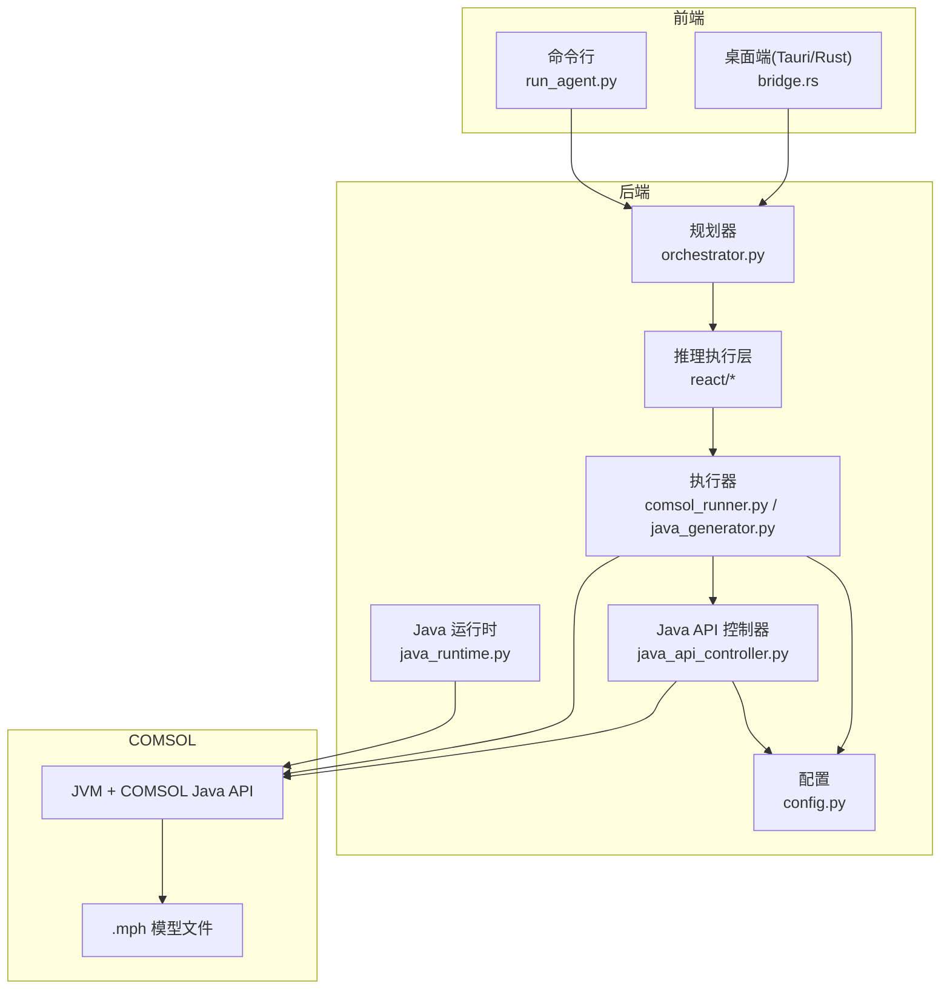
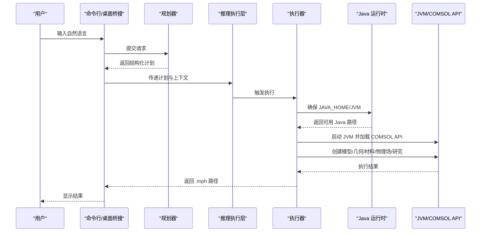
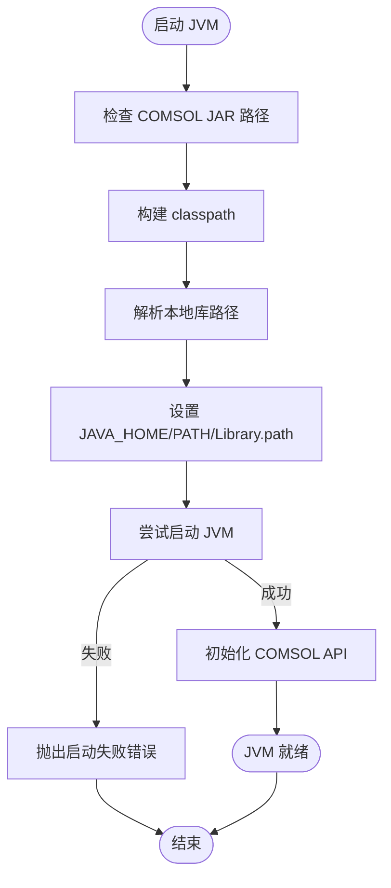
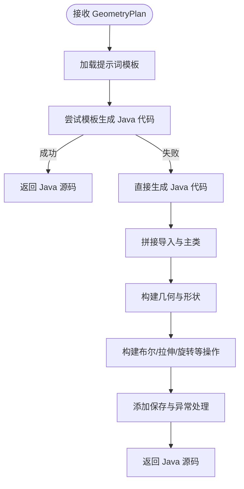
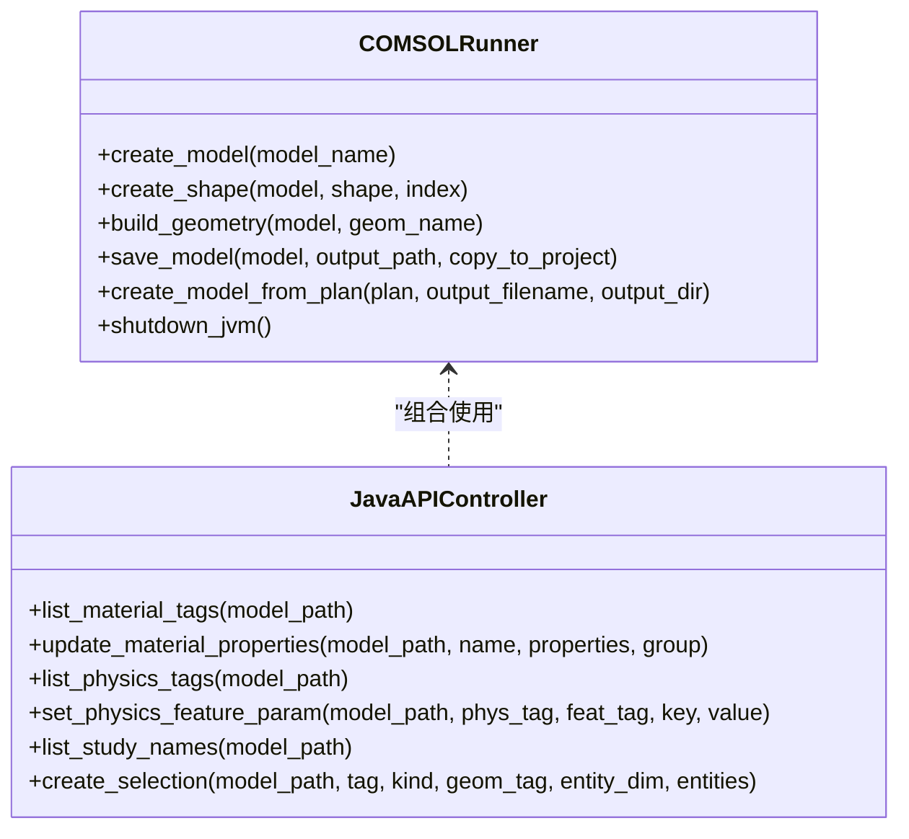
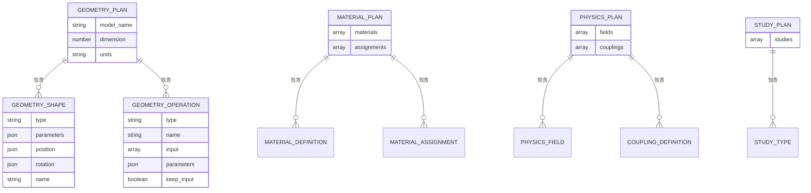
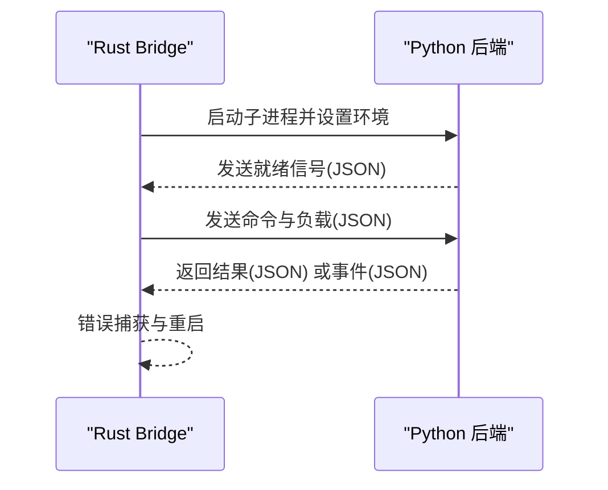
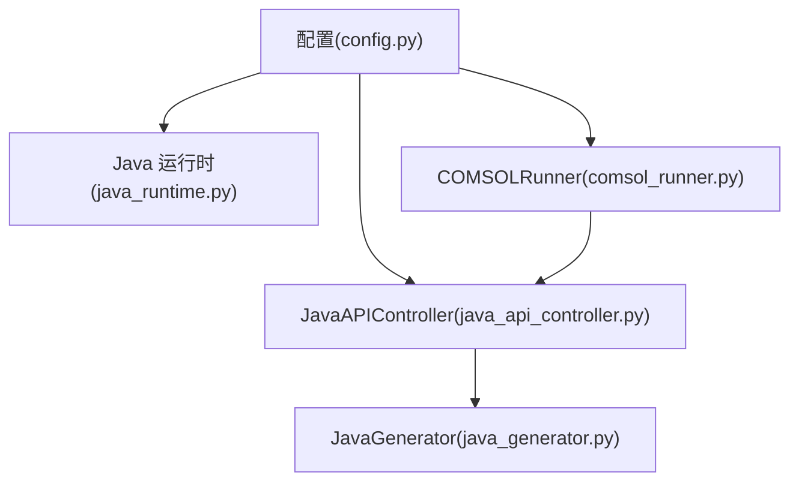

# COMSOL集成

<cite>
**本文档引用的文件**
- [agent\executor\java_generator.py](file://agent/executor/java_generator.py)
- [agent\executor\comsol_runner.py](file://agent/executor/comsol_runner.py)
- [agent\executor\java_api_controller.py](file://agent/executor/java_api_controller.py)
- [agent\utils\java_runtime.py](file://agent/utils/java_runtime.py)
- [schemas\geometry.py](file://schemas/geometry.py)
- [schemas\material.py](file://schemas/material.py)
- [schemas\physics.py](file://schemas/physics.py)
- [schemas\study.py](file://schemas/study.py)
- [prompts\executor\java_codegen.txt](file://prompts/executor/java_codegen.txt)
- [agent\utils\config.py](file://agent/utils/config.py)
- [agent\planner\orchestrator.py](file://agent/planner/orchestrator.py)
- [desktop\src-tauri\src\bridge.rs](file://desktop/src-tauri/src/bridge.rs)
- [scripts\run_agent.py](file://scripts/run_agent.py)
- [agent\README.md](file://agent/README.md)
- [docs/reference/comsol-api-links.md](file://docs/reference/comsol-api-links.md)
</cite>

## 目录
1. [简介](#简介)
2. [项目结构](#项目结构)
3. [核心组件](#核心组件)
4. [架构总览](#架构总览)
5. [详细组件分析](#详细组件分析)
6. [依赖关系分析](#依赖关系分析)
7. [性能考量](#性能考量)
8. [故障排查指南](#故障排查指南)
9. [结论](#结论)
10. [附录](#附录)

## 简介
本项目为 COMSOL Multiphysics 的智能集成系统，目标是将自然语言转化为可执行的 COMSOL 模型文件（.mph）。系统通过 AI 规划器将用户需求分解为几何、材料、物理场与研究等步骤，随后由执行器调用 COMSOL Java API 或生成 Java 代码并运行，最终输出标准 COMSOL 模型文件。系统同时提供桌面端桥接（Tauri + Rust）与命令行两种运行方式，支持自动 JVM/Java 环境管理与错误恢复。

## 项目结构
系统采用分层设计，核心分为规划层、推理执行层、执行层与工具层：
- 规划层：将自然语言拆解为结构化计划（几何/材料/物理场/研究）
- 推理执行层：ReAct 循环驱动，结合技能注入与 LLM，持续优化与执行
- 执行层：COMSOLRunner 直接调用 Java API，或 JavaGenerator 生成 Java 代码
- 工具层：Java 运行时管理、配置、日志、提示词加载等

**图表来源**
- [agent\planner\orchestrator.py:261-450](file://agent/planner/orchestrator.py#L261-L450)
- [agent\executor\comsol_runner.py:97-359](file://agent/executor/comsol_runner.py#L97-L359)
- [agent\executor\java_api_controller.py:103-1834](file://agent/executor/java_api_controller.py#L103-L1834)
- [agent\utils\java_runtime.py:217-308](file://agent/utils/java_runtime.py#L217-L308)
- [agent\utils\config.py:55-164](file://agent/utils/config.py#L55-L164)
- [desktop\src-tauri\src\bridge.rs:184-328](file://desktop/src-tauri/src/bridge.rs#L184-L328)
- [scripts\run_agent.py:17-76](file://scripts/run_agent.py#L17-L76)

**章节来源**
- [agent\README.md:1-95](file://agent/README.md#L1-L95)

## 核心组件
- Java-Python 桥接（JPype1）：在执行层通过 JPype 启动 JVM 并加载 COMSOL Java API，实现 Python 对 Java 对象的直接调用。
- Java 代码生成器：基于几何计划生成完整可编译的 Java 源码，用于复杂几何或受限环境下的离线执行。
- COMSOLRunner：封装 JVM 启动、类加载、API 调用、几何/材料/物理场/研究配置与模型保存。
- JavaAPIController：在直接调用与代码生成之间动态选择，提供更丰富的节点级操作（材料、物理场、研究、选择集等）。
- 数据模型：GeometryPlan、MaterialPlan、PhysicsPlan、StudyPlan，统一描述建模要素与参数。
- Java 运行时管理：自动检测/下载/使用内置 JDK，兼容系统/项目/打包环境。
- 桌面桥接：Rust 实现的 Tauri 桥接，负责与 Python 后端通信、握手、流式事件与错误恢复。

**章节来源**
- [agent\executor\comsol_runner.py:97-359](file://agent/executor/comsol_runner.py#L97-L359)
- [agent\executor\java_generator.py:14-205](file://agent/executor/java_generator.py#L14-L205)
- [agent\executor\java_api_controller.py:103-1834](file://agent/executor/java_api_controller.py#L103-L1834)
- [agent\utils\java_runtime.py:217-308](file://agent/utils/java_runtime.py#L217-L308)
- [schemas\geometry.py:150-200](file://schemas/geometry.py#L150-L200)
- [schemas\material.py:73-95](file://schemas/material.py#L73-L95)
- [schemas\physics.py:99-111](file://schemas/physics.py#L99-L111)
- [schemas\study.py:37-44](file://schemas/study.py#L37-L44)
- [desktop\src-tauri\src\bridge.rs:184-328](file://desktop/src-tauri/src/bridge.rs#L184-L328)

## 架构总览
系统整体流程：用户输入 → 规划器生成结构化计划 → 推理执行层驱动 → 执行器选择直接调用或代码生成 → COMSOL Java API 执行 → 保存 .mph 模型。

**图表来源**
- [agent\planner\orchestrator.py:291-450](file://agent/planner/orchestrator.py#L291-L450)
- [agent\executor\comsol_runner.py:106-154](file://agent/executor/comsol_runner.py#L106-L154)
- [agent\utils\java_runtime.py:217-257](file://agent/utils/java_runtime.py#L217-L257)
- [scripts\run_agent.py:45-66](file://scripts/run_agent.py#L45-L66)

## 详细组件分析

### Java-Python 桥接（JPype1）与 JVM 管理
- 动态导入 JPype：在首次使用 COMSOL 功能时检查并导入 jpype，未安装时抛出清晰错误。
- JVM 启动策略：优先使用 COMSOL 自带 JRE，否则使用内置/系统 JDK；设置 classpath、library.path、PATH 等 JVM 参数。
- 类加载与 API 调用：通过 JClass 加载 com.comsol.model.util.ModelUtil，初始化独立模式，随后进行模型创建与几何/材料/物理场等操作。
- 运行时保障：COMSOLRunner 维护 JVM 启动状态，避免重复启动；提供优雅关闭。

**图表来源**
- [agent\executor\comsol_runner.py:106-154](file://agent/executor/comsol_runner.py#L106-L154)
- [agent\utils\java_runtime.py:217-257](file://agent/utils/java_runtime.py#L217-L257)

**章节来源**
- [agent\executor\comsol_runner.py:19-154](file://agent/executor/comsol_runner.py#L19-L154)
- [agent\utils\java_runtime.py:18-308](file://agent/utils/java_runtime.py#L18-L308)

### Java 代码生成器（AI 指令到 Java 代码）
- 输入：GeometryPlan（包含形状、布尔运算、拉伸/旋转等）。
- 优先策略：尝试使用提示词模板生成 Java 代码；若失败则回退到直接生成 Java 代码。
- 生成内容：导入语句、主类、模型创建、组件/几何创建、形状与操作配置、几何构建、保存模型与异常处理。
- 支持形状：矩形、圆形、椭圆、多边形、长方体、圆柱、球、圆锥、圆环等；支持布尔运算与拉伸/旋转等操作。

**图表来源**
- [agent\executor\java_generator.py:20-78](file://agent/executor/java_generator.py#L20-L78)
- [prompts\executor\java_codegen.txt:1-89](file://prompts/executor/java_codegen.txt#L1-L89)

**章节来源**
- [agent\executor\java_generator.py:14-205](file://agent/executor/java_generator.py#L14-L205)
- [prompts\executor\java_codegen.txt:1-89](file://prompts/executor/java_codegen.txt#L1-L89)

### COMSOLRunner：Java API 封装与调用
- 模型生命周期：创建模型、创建组件与几何、创建形状、构建几何、保存模型。
- 几何创建：支持 2D/3D 形状与多边形；通过 dispatch 映射到具体创建方法。
- 材料/物理场/研究/选择集：提供统一的查询、删除、重命名、存在性检查与参数设置接口。
- 保存策略：先写临时文件再替换，避免文件被占用导致失败；必要时写入备用路径。

**图表来源**
- [agent\executor\comsol_runner.py:97-359](file://agent/executor/comsol_runner.py#L97-L359)
- [agent\executor\java_api_controller.py:103-1834](file://agent/executor/java_api_controller.py#L103-L1834)

**章节来源**
- [agent\executor\comsol_runner.py:97-359](file://agent/executor/comsol_runner.py#L97-L359)
- [agent\executor\java_api_controller.py:103-1834](file://agent/executor/java_api_controller.py#L103-L1834)

### 数据模型定义（几何/材料/物理场/研究）
- 几何：GeometryPlan 包含形状列表与操作列表，支持 2D/3D 形状与布尔/拉伸/旋转等操作；字段校验确保参数合法性。
- 材料：MaterialPlan 包含材料定义与分配；支持内置材料库与自定义属性；属性组别名映射（如 E/nu）。
- 物理场：PhysicsPlan 包含物理场类型、边界/域条件与初始条件；耦合定义支持多物理场耦合。
- 研究：StudyPlan 包含研究类型与参数，支持参数化扫描。

**图表来源**
- [schemas\geometry.py:150-200](file://schemas/geometry.py#L150-L200)
- [schemas\material.py:73-95](file://schemas/material.py#L73-L95)
- [schemas\physics.py:99-111](file://schemas/physics.py#L99-L111)
- [schemas\study.py:37-44](file://schemas/study.py#L37-L44)

**章节来源**
- [schemas\geometry.py:1-200](file://schemas/geometry.py#L1-L200)
- [schemas\material.py:1-95](file://schemas/material.py#L1-L95)
- [schemas\physics.py:1-111](file://schemas/physics.py#L1-L111)
- [schemas\study.py:1-44](file://schemas/study.py#L1-L44)

### 桌面桥接（Tauri + Rust）与命令行入口
- 桌面桥接：Rust 侧启动 Python 后端，等待握手信号，建立 stdin/stdout 流，支持事件推送与错误恢复；支持开发/打包两种模式。
- 命令行入口：run_agent.py 作为 CLI 入口，解析输入、调用 Planner 与 COMSOLRunner，输出 .mph 路径。

**图表来源**
- [desktop\src-tauri\src\bridge.rs:184-328](file://desktop/src-tauri/src/bridge.rs#L184-L328)
- [desktop\src-tauri\src\bridge.rs:352-417](file://desktop/src-tauri/src/bridge.rs#L352-L417)

**章节来源**
- [desktop\src-tauri\src\bridge.rs:184-528](file://desktop/src-tauri/src/bridge.rs#L184-L528)
- [scripts\run_agent.py:17-76](file://scripts/run_agent.py#L17-L76)

## 依赖关系分析
- 组件耦合：COMSOLRunner 与 JavaAPIController 通过配置与日志相互依赖；JavaAPIController 组合 COMSOLRunner 与 JavaGenerator。
- 外部依赖：JPype1（Java-Python 桥）、COMSOL JAR/本地库、JDK（系统/内置/打包）。
- 环境依赖：JAVA_HOME、PATH、java.library.path；不同平台（Windows/macOS/Linux）路径差异。
- 错误传播：从 JVM 启动、API 调用到文件保存，均通过异常捕获与日志记录，便于前端/CLI 展示与调试。

**图表来源**
- [agent\utils\config.py:55-164](file://agent/utils/config.py#L55-L164)
- [agent\utils\java_runtime.py:217-257](file://agent/utils/java_runtime.py#L217-L257)
- [agent\executor\comsol_runner.py:97-154](file://agent/executor/comsol_runner.py#L97-L154)
- [agent\executor\java_api_controller.py:103-112](file://agent/executor/java_api_controller.py#L103-L112)
- [agent\executor\java_generator.py:14-205](file://agent/executor/java_generator.py#L14-L205)

**章节来源**
- [agent\utils\config.py:55-164](file://agent/utils/config.py#L55-L164)
- [agent\utils\java_runtime.py:217-257](file://agent/utils/java_runtime.py#L217-L257)
- [agent\executor\comsol_runner.py:97-154](file://agent/executor/comsol_runner.py#L97-L154)
- [agent\executor\java_api_controller.py:103-112](file://agent/executor/java_api_controller.py#L103-L112)
- [agent\executor\java_generator.py:14-205](file://agent/executor/java_generator.py#L14-L205)

## 性能考量
- JVM 启动成本：尽量避免重复启动 JVM；COMSOLRunner 维护启动状态并在进程生命周期内复用。
- 代码生成 vs 直接调用：对于简单几何可直接调用 API；复杂场景优先生成 Java 代码，减少 Python 层开销。
- 文件 I/O：保存模型采用临时文件 + 替换策略，降低锁竞争；必要时写入备用路径。
- Java 运行时：优先使用 COMSOL 自带 JRE，减少额外依赖；内置 JDK 仅在首次使用时下载。
- 并发与流式：桌面桥接支持流式事件推送，前端可实时反馈进度与错误。

[本节为通用指导，无需特定文件引用]

## 故障排查指南
- 缺少 jpype1：首次使用 COMSOL 功能时抛出模块未找到错误，按提示安装 jpype1。
- 未配置 COMSOL JAR 路径：设置 COMSOL_JAR_PATH 或在配置中提供有效路径。
- JVM 启动失败：检查 JAVA_HOME、java.library.path 与本地库目录；确认平台匹配（win64/glnxa64/darwin64）。
- 保存模型失败：检查输出目录权限与磁盘空间；若文件被占用，系统会写入备用路径。
- API 不可用：不同 COMSOL 版本 API 名称可能变化（如 material/materials、physics/study 等），控制器已做兼容处理。
- 桌面桥接异常：查看 stderr 截图与握手超时信息，必要时重启桥接进程。

**章节来源**
- [agent\executor\comsol_runner.py:19-28](file://agent/executor/comsol_runner.py#L19-L28)
- [agent\executor\comsol_runner.py:113-154](file://agent/executor/comsol_runner.py#L113-L154)
- [agent\executor\java_api_controller.py:67-101](file://agent/executor/java_api_controller.py#L67-L101)
- [desktop\src-tauri\src\bridge.rs:200-233](file://desktop/src-tauri/src/bridge.rs#L200-L233)

## 结论
本系统通过 AI 规划与 Java API/代码生成双通道，实现了从自然语言到 COMSOL 模型文件的自动化流程。系统具备良好的跨平台与环境适应能力，提供完善的错误处理与性能优化策略。建议在生产环境中优先使用直接调用以获得更低延迟，复杂场景下采用代码生成以提升稳定性与可移植性。

## 附录
- COMSOL Java API 参考：官方在线文档与 PDF 手册链接，便于对照 API 行为与版本差异。
- 最佳实践：合理划分步骤（几何/材料/物理场/研究），在桌面端使用桥接以获得更好的交互体验，CLI 适合批处理与自动化。

**章节来源**
- [docs/reference/comsol-api-links.md:1-36](file://docs/reference/comsol-api-links.md#L1-L36)