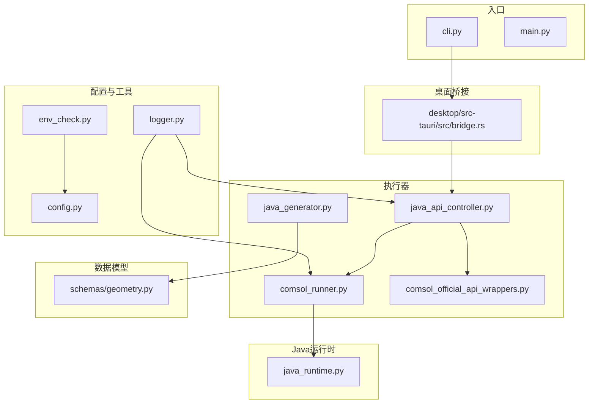
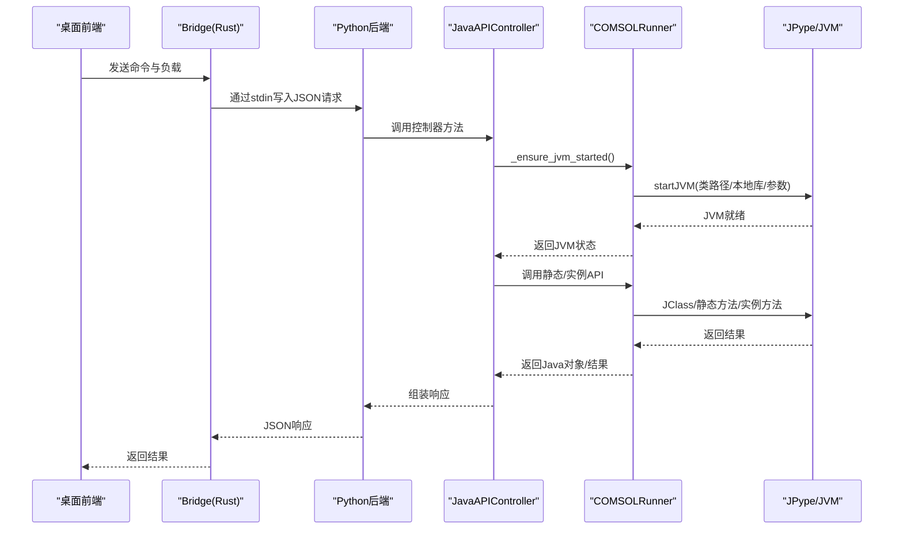
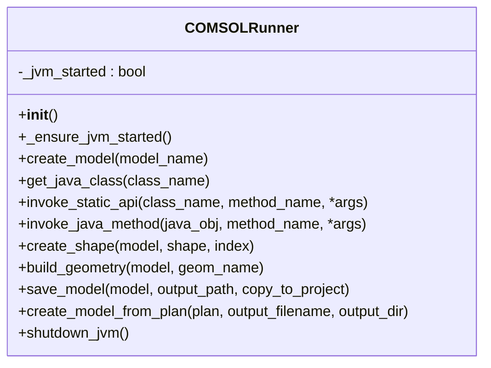
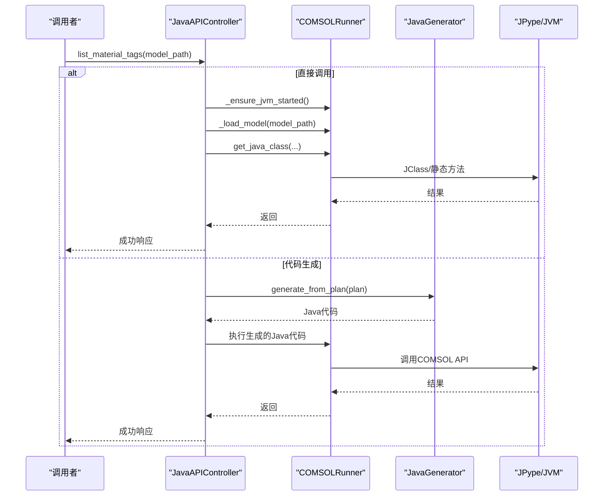
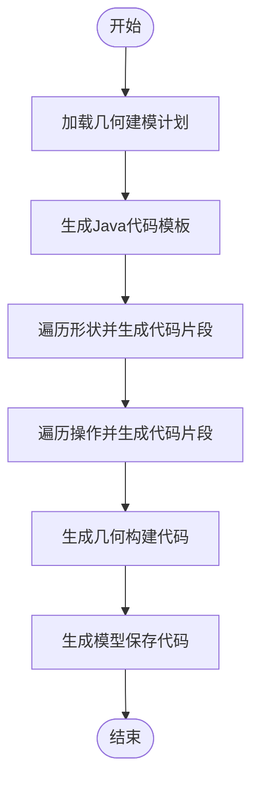
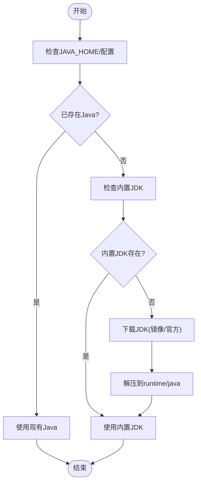
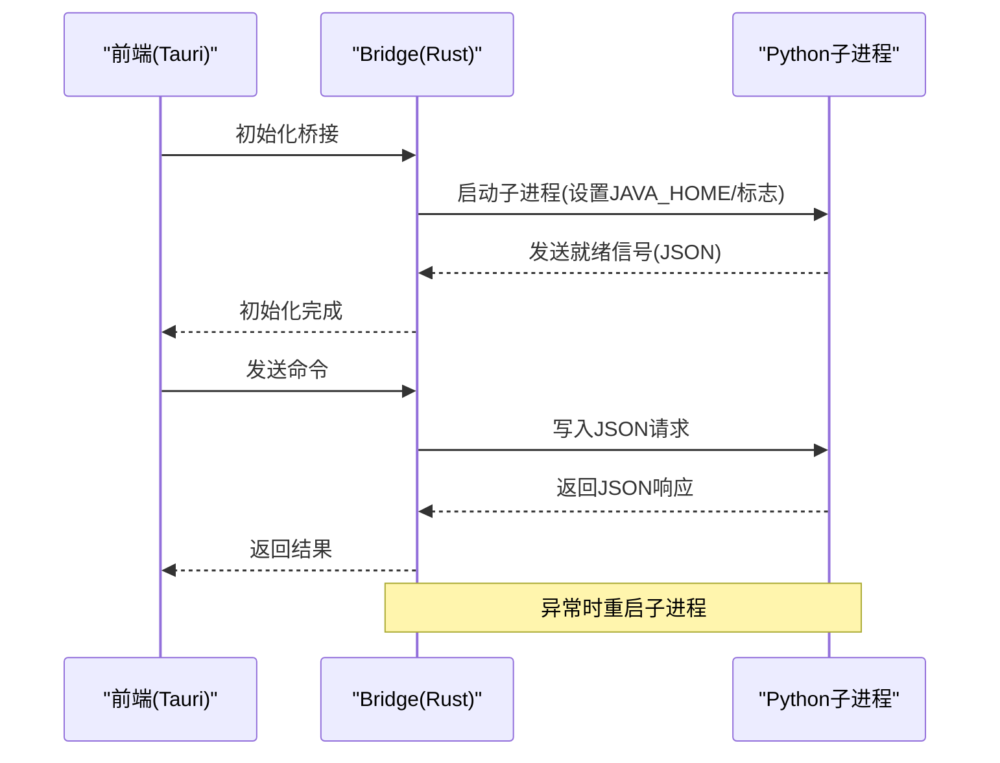
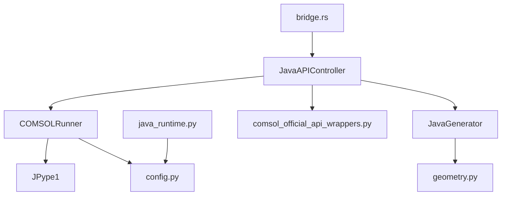

# Java API封装器

<cite>
**本文档引用的文件**
- [comsol_runner.py](file://agent/executor/comsol_runner.py)
- [java_runtime.py](file://agent/utils/java_runtime.py)
- [java_api_controller.py](file://agent/executor/java_api_controller.py)
- [java_generator.py](file://agent/executor/java_generator.py)
- [env_check.py](file://agent/utils/env_check.py)
- [config.py](file://agent/utils/config.py)
- [logger.py](file://agent/utils/logger.py)
- [geometry.py](file://schemas/geometry.py)
- [comsol_official_api_wrappers.py](file://agent/executor/comsol_official_api_wrappers.py)
- [bridge.rs](file://desktop/src-tauri/src/bridge.rs)
- [cli.py](file://cli.py)
- [main.py](file://main.py)
</cite>

## 目录
1. [简介](#简介)
2. [项目结构](#项目结构)
3. [核心组件](#核心组件)
4. [架构总览](#架构总览)
5. [详细组件分析](#详细组件分析)
6. [依赖关系分析](#依赖关系分析)
7. [性能考虑](#性能考虑)
8. [故障排除指南](#故障排除指南)
9. [结论](#结论)

## 简介
本文件面向Java API封装器，重点阐述COMSOL Java API的封装策略与JVM启动机制，涵盖以下主题：
- JPype1库的使用方式与JVM生命周期管理
- COMSOLRunner类的设计模式与核心方法（create_model、get_java_class、invoke_static_api等）
- JVM初始化流程、类路径配置与本地库加载
- 静态API调用与实例方法调用的实现策略
- 错误处理机制与故障排除指南
- 桌面桥接进程与Python子进程的交互模式

## 项目结构
该项目采用模块化组织，围绕“配置-运行时-执行器-工具”的层次划分：
- 配置与环境：config.py、env_check.py、logger.py
- Java运行时：java_runtime.py
- 执行器：comsol_runner.py、java_api_controller.py、java_generator.py
- 数据模型：schemas/geometry.py
- 桌面桥接：desktop/src-tauri/src/bridge.rs
- CLI入口：cli.py、main.py

图表来源
- [comsol_runner.py:1-359](file://agent/executor/comsol_runner.py#L1-L359)
- [java_runtime.py:1-308](file://agent/utils/java_runtime.py#L1-L308)
- [java_api_controller.py:1-800](file://agent/executor/java_api_controller.py#L1-L800)
- [java_generator.py:1-205](file://agent/executor/java_generator.py#L1-L205)
- [comsol_official_api_wrappers.py:1-800](file://agent/executor/comsol_official_api_wrappers.py#L1-L800)
- [geometry.py:1-200](file://schemas/geometry.py#L1-L200)
- [bridge.rs:1-640](file://desktop/src-tauri/src/bridge.rs#L1-L640)
- [cli.py:1-121](file://cli.py#L1-L121)
- [main.py:1-14](file://main.py#L1-L14)

章节来源
- [comsol_runner.py:1-359](file://agent/executor/comsol_runner.py#L1-L359)
- [java_runtime.py:1-308](file://agent/utils/java_runtime.py#L1-L308)
- [java_api_controller.py:1-800](file://agent/executor/java_api_controller.py#L1-L800)
- [java_generator.py:1-205](file://agent/executor/java_generator.py#L1-L205)
- [geometry.py:1-200](file://schemas/geometry.py#L1-L200)
- [bridge.rs:1-640](file://desktop/src-tauri/src/bridge.rs#L1-L640)
- [cli.py:1-121](file://cli.py#L1-L121)
- [main.py:1-14](file://main.py#L1-L14)

## 核心组件
- COMSOLRunner：负责JVM启动、类路径与本地库配置、COMSOL API初始化、静态与实例方法调用、几何建模与模型保存等。
- JavaAPIController：基于COMSOLRunner与JavaGenerator，提供材料、物理场、研究、选择集等节点的高级操作接口，并兼容COMSOL官方API包装器。
- JavaGenerator：将几何建模计划转换为COMSOL Java代码，用于复杂场景的批量生成与执行。
- JavaRuntime：管理JAVA_HOME解析、内置JDK下载与缓存、平台适配与镜像选择。
- EnvCheck：环境检查与验证，确保COMSOL JAR路径、Java可用性、输出目录可写等。
- Bridge（Rust）：桌面前端与Python后端之间的桥接进程，负责子进程管理、握手协议与错误传播。

章节来源
- [comsol_runner.py:97-359](file://agent/executor/comsol_runner.py#L97-L359)
- [java_api_controller.py:103-800](file://agent/executor/java_api_controller.py#L103-L800)
- [java_generator.py:14-205](file://agent/executor/java_generator.py#L14-L205)
- [java_runtime.py:217-258](file://agent/utils/java_runtime.py#L217-L258)
- [env_check.py:43-181](file://agent/utils/env_check.py#L43-L181)
- [bridge.rs:184-328](file://desktop/src-tauri/src/bridge.rs#L184-L328)

## 架构总览
COMSOL Java API封装器的整体架构分为三层：
- 应用层：桌面前端（Tauri）通过bridge.rs与Python后端通信。
- 控制层：JavaAPIController协调COMSOLRunner与JavaGenerator，提供统一的API接口。
- 执行层：COMSOLRunner负责JVM启动与COMSOL API调用，JavaRuntime负责Java运行时准备。

图表来源
- [bridge.rs:352-417](file://desktop/src-tauri/src/bridge.rs#L352-L417)
- [java_api_controller.py:103-127](file://agent/executor/java_api_controller.py#L103-L127)
- [comsol_runner.py:106-154](file://agent/executor/comsol_runner.py#L106-L154)

## 详细组件分析

### COMSOLRunner：JVM启动与API封装
COMSOLRunner是Java API封装的核心，承担以下职责：
- JVM启动与参数配置：解析COMSOL JAR路径、推断JVM路径、设置JAVA_HOME、类路径与本地库路径。
- COMSOL API初始化：启动JVM后调用ModelUtil.initStandalone进行COMSOL API初始化。
- 静态API调用：通过JClass加载Java类并调用静态方法。
- 实例方法调用：通过反射获取Java对象的方法并调用。
- 几何建模与模型保存：提供2D/3D形状创建、几何构建、模型保存等便捷方法。

图表来源
- [comsol_runner.py:97-359](file://agent/executor/comsol_runner.py#L97-L359)

章节来源
- [comsol_runner.py:97-154](file://agent/executor/comsol_runner.py#L97-L154)
- [comsol_runner.py:155-177](file://agent/executor/comsol_runner.py#L155-L177)
- [comsol_runner.py:178-325](file://agent/executor/comsol_runner.py#L178-L325)
- [comsol_runner.py:326-359](file://agent/executor/comsol_runner.py#L326-L359)

### JavaAPIController：高级API封装与混合模式
JavaAPIController在COMSOLRunner之上提供更高级别的API，支持：
- 材料节点：查询、删除、重命名、属性更新、批量删除。
- 物理场节点：查询、删除、重命名、激活状态检查、参数设置。
- 研究节点：查询、删除、重命名、清空。
- 选择集：创建、查询、删除、重命名。
- 几何与结果：导入几何、清空结果、获取模型树与节点树。
- 混合模式：对于简单操作直接调用COMSOLRunner，复杂场景使用JavaGenerator生成Java代码并执行。

图表来源
- [java_api_controller.py:103-127](file://agent/executor/java_api_controller.py#L103-L127)
- [java_api_controller.py:190-327](file://agent/executor/java_api_controller.py#L190-L327)
- [java_generator.py:20-35](file://agent/executor/java_generator.py#L20-L35)

章节来源
- [java_api_controller.py:103-800](file://agent/executor/java_api_controller.py#L103-L800)
- [java_generator.py:14-205](file://agent/executor/java_generator.py#L14-L205)

### JavaGenerator：几何建模代码生成
JavaGenerator将几何建模计划转换为COMSOL Java代码，支持：
- 2D/3D形状生成：矩形、圆、椭圆、多边形、长方体、圆柱、球、圆锥、环面等。
- 几何布尔运算与拉伸/旋转：并集、差集、交集、拉伸、旋转等。
- 输出模型保存路径与主函数模板。

图表来源
- [java_generator.py:20-78](file://agent/executor/java_generator.py#L20-L78)
- [java_generator.py:80-172](file://agent/executor/java_generator.py#L80-L172)
- [java_generator.py:174-204](file://agent/executor/java_generator.py#L174-L204)

章节来源
- [java_generator.py:14-205](file://agent/executor/java_generator.py#L14-L205)
- [geometry.py:24-200](file://schemas/geometry.py#L24-L200)

### JavaRuntime：JVM初始化与本地库加载
JavaRuntime负责：
- 解析JAVA_HOME：优先配置/环境变量，其次项目内JDK，最后内置JDK。
- 内置JDK下载：根据平台选择压缩包，支持清华镜像加速。
- 平台适配：Windows/Linux/macOS的JDK目录结构与二进制路径差异。
- 本地库路径：在桌面安装包中设置JAVA_HOME并注入PATH，确保JNI库可用。

图表来源
- [java_runtime.py:217-258](file://agent/utils/java_runtime.py#L217-L258)
- [java_runtime.py:260-308](file://agent/utils/java_runtime.py#L260-L308)

章节来源
- [java_runtime.py:18-308](file://agent/utils/java_runtime.py#L18-L308)

### 桌面桥接：Rust Bridge与Python子进程
桌面桥接通过bridge.rs管理Python子进程：
- 查找项目根与Python命令，优先使用虚拟环境中的Python。
- 启动子进程并建立stdin/stdout/stderr管道。
- 握手协议：等待子进程发送就绪信号，超时或失败则重启。
- 错误传播：捕获stderr缓冲区，拼接到错误消息中。
- 重启机制：在IO错误或子进程退出时自动重启。

图表来源
- [bridge.rs:184-328](file://desktop/src-tauri/src/bridge.rs#L184-L328)
- [bridge.rs:352-417](file://desktop/src-tauri/src/bridge.rs#L352-L417)
- [bridge.rs:420-528](file://desktop/src-tauri/src/bridge.rs#L420-L528)

章节来源
- [bridge.rs:184-328](file://desktop/src-tauri/src/bridge.rs#L184-L328)
- [bridge.rs:352-417](file://desktop/src-tauri/src/bridge.rs#L352-L417)
- [bridge.rs:420-528](file://desktop/src-tauri/src/bridge.rs#L420-L528)

## 依赖关系分析
- COMSOLRunner依赖JPype1进行JVM启动与Java类加载，依赖配置模块获取COMSOL JAR路径与输出目录。
- JavaAPIController依赖COMSOLRunner与JavaGenerator，同时可加载官方API包装模块以增强功能。
- JavaGenerator依赖几何计划数据模型，生成Java代码字符串。
- JavaRuntime独立于COMSOLRunner，负责JAVA_HOME解析与JDK下载。
- Bridge负责Python子进程生命周期管理，与前端通过JSON协议通信。

图表来源
- [comsol_runner.py:8-16](file://agent/executor/comsol_runner.py#L8-L16)
- [java_api_controller.py:13-19](file://agent/executor/java_api_controller.py#L13-L19)
- [java_generator.py:6-11](file://agent/executor/java_generator.py#L6-L11)
- [java_runtime.py:12-15](file://agent/utils/java_runtime.py#L12-L15)
- [bridge.rs:1-11](file://desktop/src-tauri/src/bridge.rs#L1-L11)

章节来源
- [comsol_runner.py:8-16](file://agent/executor/comsol_runner.py#L8-L16)
- [java_api_controller.py:13-19](file://agent/executor/java_api_controller.py#L13-L19)
- [java_generator.py:6-11](file://agent/executor/java_generator.py#L6-L11)
- [java_runtime.py:12-15](file://agent/utils/java_runtime.py#L12-L15)
- [bridge.rs:1-11](file://desktop/src-tauri/src/bridge.rs#L1-L11)

## 性能考虑
- JVM启动成本：JVM启动时间较长，建议在应用生命周期内复用JVM，避免频繁重启。
- 类路径与本地库：一次性设置类路径与本地库路径，减少重复配置开销。
- 批量操作：对于材料、物理场、研究等节点的批量删除与更新，尽量使用COMSOL提供的批量接口（如remove(tag)循环）。
- 代码生成：复杂几何建模优先使用JavaGenerator生成Java代码，避免Python侧大量反射调用带来的性能损耗。
- I/O优化：模型保存采用临时文件+原子替换策略，减少文件锁定冲突。

## 故障排除指南
常见问题与解决方案：
- 缺少JPype1：确保安装jpype1，否则在首次使用COMSOL功能时报错。
- 未配置COMSOL JAR路径：设置COMSOL_JAR_PATH，确保路径存在且包含COMSOL JAR文件。
- 未找到Java：未配置JAVA_HOME时，系统会尝试内置JDK；若仍失败，检查JAVA_HOME指向的JDK是否正确。
- 本地库加载失败（UnsatisfiedLinkError）：确保设置了comsol_native_path或使用COMSOL自带JRE，并将本地库路径加入PATH。
- 桌面桥接初始化失败：检查Python命令、虚拟环境、JAVA_HOME与握手信号；查看stderr缓冲区中的最近错误行。
- 模型保存失败：检查输出目录权限与磁盘空间，必要时启用“复制到项目目录”选项。

章节来源
- [comsol_runner.py:19-28](file://agent/executor/comsol_runner.py#L19-L28)
- [env_check.py:112-181](file://agent/utils/env_check.py#L112-L181)
- [bridge.rs:43-55](file://desktop/src-tauri/src/bridge.rs#L43-L55)
- [comsol_runner.py:312-324](file://agent/executor/comsol_runner.py#L312-L324)

## 结论
本Java API封装器通过COMSOLRunner与JavaAPIController实现了对COMSOL Java API的稳定封装，结合JavaGenerator与桌面桥接，提供了从几何建模到模型保存的完整链路。通过合理的JVM生命周期管理、类路径与本地库配置、以及错误处理与故障排除机制，系统能够在不同平台与部署环境下可靠运行。建议在生产环境中：
- 预热JVM并保持复用
- 明确配置COMSOL JAR路径与JAVA_HOME
- 使用JavaGenerator处理复杂几何建模
- 通过Bridge监控子进程状态与错误