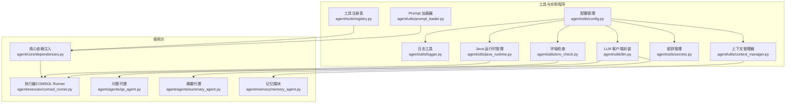
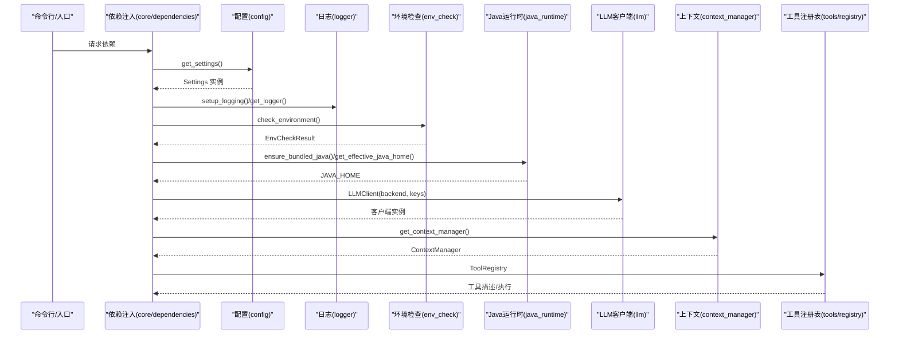
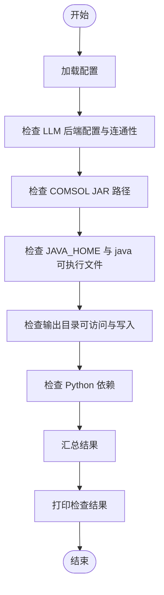
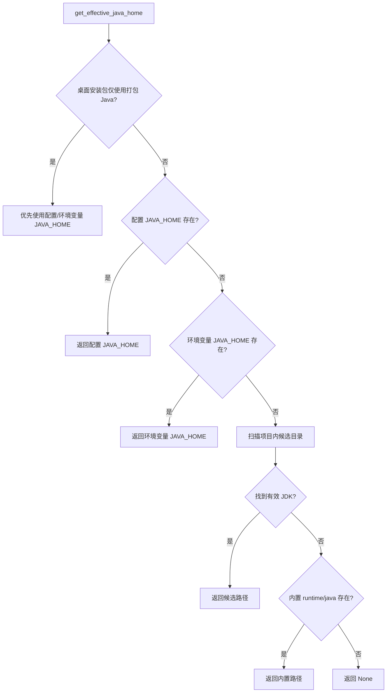
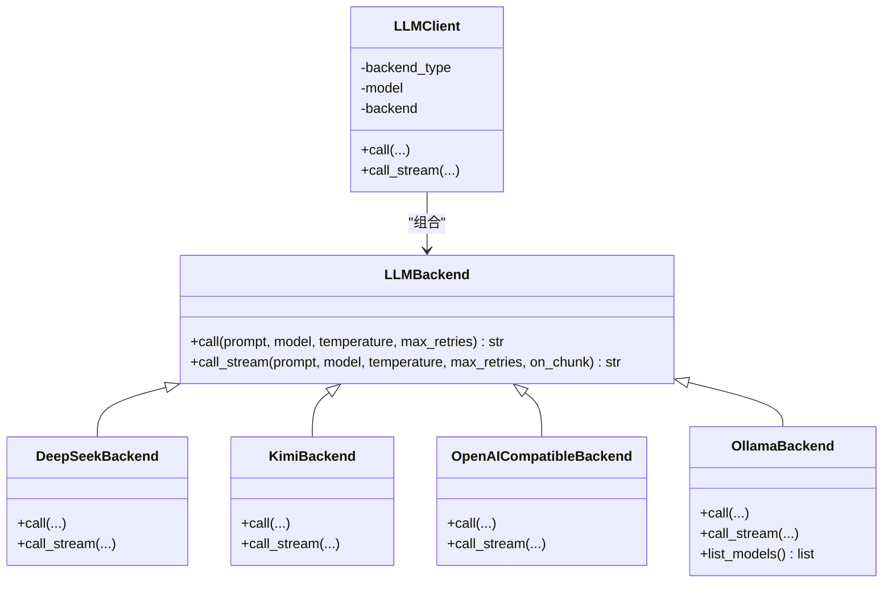
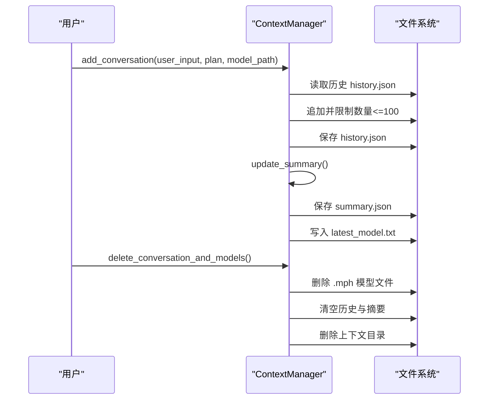
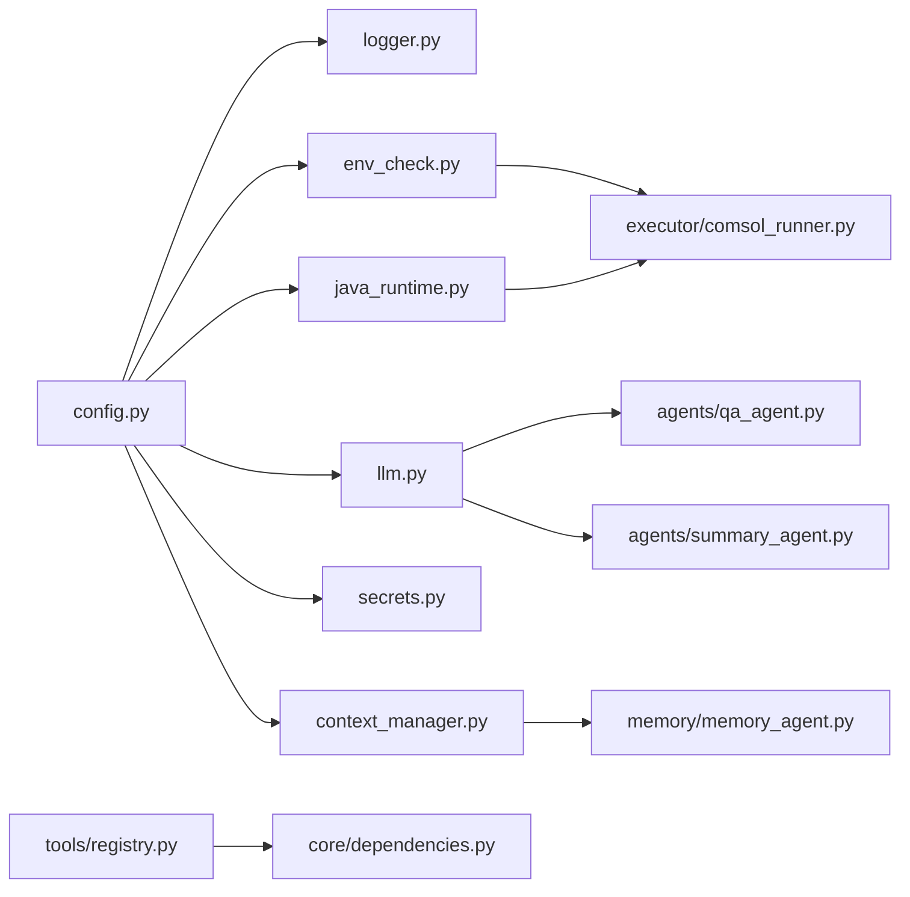

# 工具和实用程序

<cite>
**本文引用的文件**
- [agent/utils/config.py](file://agent/utils/config.py)
- [agent/utils/logger.py](file://agent/utils/logger.py)
- [agent/utils/env_check.py](file://agent/utils/env_check.py)
- [agent/utils/java_runtime.py](file://agent/utils/java_runtime.py)
- [agent/utils/llm.py](file://agent/utils/llm.py)
- [agent/utils/secrets.py](file://agent/utils/secrets.py)
- [agent/utils/context_manager.py](file://agent/utils/context_manager.py)
- [agent/utils/prompt_loader.py](file://agent/utils/prompt_loader.py)
- [agent/tools/registry.py](file://agent/tools/registry.py)
- [agent/core/dependencies.py](file://agent/core/dependencies.py)
- [agent/executor/comsol_runner.py](file://agent/executor/comsol_runner.py)
- [agent/agents/qa_agent.py](file://agent/agents/qa_agent.py)
- [agent/agents/summary_agent.py](file://agent/agents/summary_agent.py)
- [agent/memory/memory_agent.py](file://agent/memory/memory_agent.py)
</cite>

## 目录
1. [简介](#简介)
2. [项目结构](#项目结构)
3. [核心组件](#核心组件)
4. [架构总览](#架构总览)
5. [详细组件分析](#详细组件分析)
6. [依赖关系分析](#依赖关系分析)
7. [性能考虑](#性能考虑)
8. [故障排除指南](#故障排除指南)
9. [结论](#结论)
10. [附录](#附录)

## 简介
本文件面向 COMSOL Agent 的“工具和实用程序”模块，系统性地文档化以下能力：
- 配置管理系统：集中式设置解析、默认值与环境覆盖、密钥来源与安全掩码
- 日志记录机制：统一日志器工厂与日志初始化
- 环境检查工具：LLM 后端连通性、COMSOL/JVM 路径、输出目录权限、Python 依赖校验
- Java 运行时管理器：内置 JDK 自动下载与选择策略、平台适配、镜像加速
- LLM 客户端封装：统一抽象与多种后端实现（DeepSeek、Kimi、Ollama、OpenAI 兼容）
- 密钥管理：环境变量与 keyring 双通道读取、写入与掩码
- 上下文管理器：会话级对话历史、摘要、模型文件关联与清理
- 工具注册与调用：工具描述与执行桥接，供 ReAct 与 LLM function calling 使用
- 协作关系与最佳实践：模块间耦合、调用链路、性能优化与排障建议

## 项目结构
工具与实用程序主要位于 agent/utils 与 agent/tools 目录，并在 agent/core、agent/executor、agent/agents、agent/memory 等模块中被广泛复用。

图表来源
- [agent/utils/config.py:155-164](file://agent/utils/config.py#L155-L164)
- [agent/utils/env_check.py:43-181](file://agent/utils/env_check.py#L43-L181)
- [agent/utils/java_runtime.py:185-257](file://agent/utils/java_runtime.py#L185-L257)
- [agent/utils/llm.py:270-349](file://agent/utils/llm.py#L270-L349)
- [agent/utils/secrets.py:16-58](file://agent/utils/secrets.py#L16-L58)
- [agent/utils/context_manager.py:35-467](file://agent/utils/context_manager.py#L35-L467)
- [agent/utils/prompt_loader.py:8-36](file://agent/utils/prompt_loader.py#L8-L36)
- [agent/tools/registry.py:23-51](file://agent/tools/registry.py#L23-L51)
- [agent/core/dependencies.py:3-4](file://agent/core/dependencies.py#L3-L4)
- [agent/executor/comsol_runner.py:7-9](file://agent/executor/comsol_runner.py#L7-L9)
- [agent/agents/qa_agent.py:4-6](file://agent/agents/qa_agent.py#L4-L6)
- [agent/agents/summary_agent.py:4-6](file://agent/agents/summary_agent.py#L4-L6)
- [agent/memory/memory_agent.py:6-7](file://agent/memory/memory_agent.py#L6-L7)

章节来源
- [agent/utils/config.py:155-164](file://agent/utils/config.py#L155-L164)
- [agent/utils/env_check.py:43-181](file://agent/utils/env_check.py#L43-L181)
- [agent/utils/java_runtime.py:185-257](file://agent/utils/java_runtime.py#L185-L257)
- [agent/utils/llm.py:270-349](file://agent/utils/llm.py#L270-L349)
- [agent/utils/secrets.py:16-58](file://agent/utils/secrets.py#L16-L58)
- [agent/utils/context_manager.py:35-467](file://agent/utils/context_manager.py#L35-L467)
- [agent/utils/prompt_loader.py:8-36](file://agent/utils/prompt_loader.py#L8-L36)
- [agent/tools/registry.py:23-51](file://agent/tools/registry.py#L23-L51)
- [agent/core/dependencies.py:3-4](file://agent/core/dependencies.py#L3-L4)
- [agent/executor/comsol_runner.py:7-9](file://agent/executor/comsol_runner.py#L7-L9)
- [agent/agents/qa_agent.py:4-6](file://agent/agents/qa_agent.py#L4-L6)
- [agent/agents/summary_agent.py:4-6](file://agent/agents/summary_agent.py#L4-L6)
- [agent/memory/memory_agent.py:6-7](file://agent/memory/memory_agent.py#L6-L7)

## 核心组件
- 配置管理（Settings）：集中解析 .env、默认输出目录、后端密钥与模型映射、配置状态查询
- 日志工具（get_logger/setup_logging）：基于 loguru 的统一日志器与格式化输出
- 环境检查（check_environment/validate_environment）：LLM 后端连通性、COMSOL/JVM、输出目录权限、依赖完整性
- Java 运行时（ensure_bundled_java/get_effective_java_home）：内置 JDK 自动下载、镜像加速、路径判定
- LLM 客户端（LLMClient/后端实现）：统一抽象与多种后端封装，支持流式回调
- 密钥管理（get/set/delete/mask）：环境变量与 keyring 双通道，掩码展示
- 上下文管理器（ContextManager）：会话级历史、摘要、模型文件关联与清理
- 工具注册表（ToolRegistry）：工具描述与执行桥接

章节来源
- [agent/utils/config.py:55-164](file://agent/utils/config.py#L55-L164)
- [agent/utils/logger.py:9-41](file://agent/utils/logger.py#L9-L41)
- [agent/utils/env_check.py:43-181](file://agent/utils/env_check.py#L43-L181)
- [agent/utils/java_runtime.py:185-257](file://agent/utils/java_runtime.py#L185-L257)
- [agent/utils/llm.py:12-349](file://agent/utils/llm.py#L12-L349)
- [agent/utils/secrets.py:16-58](file://agent/utils/secrets.py#L16-L58)
- [agent/utils/context_manager.py:35-467](file://agent/utils/context_manager.py#L35-L467)
- [agent/tools/registry.py:23-51](file://agent/tools/registry.py#L23-L51)

## 架构总览
工具与实用程序模块围绕“配置—日志—环境—运行时—LLM—密钥—上下文—工具”的主干链路协作，形成清晰的分层与职责边界。

图表来源
- [agent/core/dependencies.py:3-4](file://agent/core/dependencies.py#L3-L4)
- [agent/utils/config.py:155-164](file://agent/utils/config.py#L155-L164)
- [agent/utils/logger.py:22-41](file://agent/utils/logger.py#L22-L41)
- [agent/utils/env_check.py:43-181](file://agent/utils/env_check.py#L43-L181)
- [agent/utils/java_runtime.py:216-257](file://agent/utils/java_runtime.py#L216-L257)
- [agent/utils/llm.py:270-349](file://agent/utils/llm.py#L270-L349)
- [agent/utils/context_manager.py:452-467](file://agent/utils/context_manager.py#L452-L467)
- [agent/tools/registry.py:23-51](file://agent/tools/registry.py#L23-L51)

## 详细组件分析

### 配置管理系统
- 设计要点
  - 基于 pydantic-settings 的强类型配置，支持 .env 加载与大小写不敏感
  - 默认输出目录自动推导至项目根下的 models
  - 后端密钥与模型名称的统一映射与回退策略（环境变量优先，再 keyring）
  - 配置状态查询（不暴露密钥）用于 UI 展示
- 关键流程
  - 单例模式：首次访问创建并确保输出目录存在
  - 后端选择：根据 llm_backend 返回对应 API Key/BaseURL/Model
- 最佳实践
  - 优先使用 .env 管理密钥，生产环境配合 keyring
  - 输出目录必须具备读写权限，避免后续 COMSOL 生成失败

章节来源
- [agent/utils/config.py:55-164](file://agent/utils/config.py#L55-L164)

### 日志记录机制
- 设计要点
  - get_logger 提供绑定模块名的日志器
  - setup_logging 移除默认处理器，添加控制台格式化输出，级别来自配置
- 最佳实践
  - 统一通过 get_logger 获取日志器，避免重复配置
  - 生产环境建议降低日志级别，减少 IO 开销

章节来源
- [agent/utils/logger.py:9-41](file://agent/utils/logger.py#L9-L41)

### 环境检查工具
- 设计要点
  - LLM 后端检查：DeepSeek/Kimi/OpenAI 兼容需密钥与网络可达；Ollama 检测服务与可用模型
  - COMSOL/JVM 检查：COMSOL_JAR_PATH 存在性与大小；JAVA_HOME 路径与可执行文件存在性
  - 输出目录检查：可访问性与写入测试
  - 依赖检查：openai、requests、jpype1
- 结果呈现
  - EnvCheckResult 支持错误/警告/信息三类记录，validate_environment 返回布尔与错误消息
  - print_check_result 使用 rich 输出面板与表格

图表来源
- [agent/utils/env_check.py:43-181](file://agent/utils/env_check.py#L43-L181)
- [agent/utils/env_check.py:200-234](file://agent/utils/env_check.py#L200-L234)

章节来源
- [agent/utils/env_check.py:43-181](file://agent/utils/env_check.py#L43-L181)
- [agent/utils/env_check.py:184-198](file://agent/utils/env_check.py#L184-L198)
- [agent/utils/env_check.py:200-234](file://agent/utils/env_check.py#L200-L234)

### Java 运行时管理器
- 设计要点
  - 有效 JAVA_HOME 解析顺序：配置 > 环境变量 > 项目内候选 > 内置 runtime/java
  - 内置 JDK 自动下载：Adoptium API + 可选清华镜像加速，首开体验优化
  - 路径判定：区分“内置 Java”“项目集成 Java”“系统 Java”
- 平台适配
  - 自动识别操作系统与 CPU 架构，拼装下载 URL
- 最佳实践
  - 首次使用允许自动下载，后续可通过设置禁用自动下载
  - 桌面安装包场景仅使用打包 Java，避免与系统冲突

图表来源
- [agent/utils/java_runtime.py:185-214](file://agent/utils/java_runtime.py#L185-L214)

章节来源
- [agent/utils/java_runtime.py:185-257](file://agent/utils/java_runtime.py#L185-L257)
- [agent/utils/java_runtime.py:50-99](file://agent/utils/java_runtime.py#L50-L99)

### LLM 客户端封装
- 设计要点
  - 抽象基类 LLMBackend 定义 call/call_stream 接口，不同后端实现差异化
  - 支持后端：DeepSeek、Kimi（OpenAI 兼容）、Ollama、OpenAI 兼容中转
  - 流式调用：on_chunk 回调逐段推送，失败时指数退避与部分结果回退
- 错误处理
  - 统一重试策略与超时控制，异常包装为可读错误信息
- 最佳实践
  - 根据需求选择流式/非流式，流式适合长文本与实时反馈
  - 合理设置温度与最大重试次数，平衡质量与稳定性

图表来源
- [agent/utils/llm.py:12-349](file://agent/utils/llm.py#L12-L349)

章节来源
- [agent/utils/llm.py:12-349](file://agent/utils/llm.py#L12-L349)

### 密钥管理
- 设计要点
  - 读取顺序：环境变量 > keyring；写入/删除均委托 keyring
  - 掩码展示：mask_key 仅显示前缀，避免泄露
- 最佳实践
  - 生产环境优先使用 keyring，避免硬编码在 .env
  - 定期轮换密钥，及时删除过期凭据

章节来源
- [agent/utils/secrets.py:16-58](file://agent/utils/secrets.py#L16-L58)

### 上下文管理器
- 设计要点
  - 会话级存储：.context/<id>/history.json、summary.json、latest_model.txt、operations.md
  - 历史与摘要：最多保留最近 100 条，摘要包含最近形状、偏好单位与近期活动
  - 模型关联与清理：支持删除会话关联的 .mph 模型文件与上下文目录
  - 多会话支持：通过 conversation_id 隔离存储
- 最佳实践
  - 为每个会话分配独立 id，避免跨会话污染
  - 定期清理历史与模型，控制磁盘占用

图表来源
- [agent/utils/context_manager.py:106-154](file://agent/utils/context_manager.py#L106-L154)
- [agent/utils/context_manager.py:201-242](file://agent/utils/context_manager.py#L201-L242)
- [agent/utils/context_manager.py:343-370](file://agent/utils/context_manager.py#L343-L370)

章节来源
- [agent/utils/context_manager.py:35-467](file://agent/utils/context_manager.py#L35-L467)

### 工具注册与调用
- 设计要点
  - Tool 定义包含 name/description/parameters/handler
  - ToolRegistry 提供注册、查询、列举与执行
  - 与 ReAct/LLM function calling 对接，返回标准化结果
- 最佳实践
  - 参数 schema 严格遵循 JSON Schema，便于 LLM 函数调用
  - handler 返回统一结构（status/message/...），便于上层处理

章节来源
- [agent/tools/registry.py:9-51](file://agent/tools/registry.py#L9-L51)

### Prompt 加载器
- 设计要点
  - 兼容旧接口的 PromptLoader 委托给 PromptManager，推荐直接使用管理器
  - 支持按类别与名称加载模板并格式化

章节来源
- [agent/utils/prompt_loader.py:8-36](file://agent/utils/prompt_loader.py#L8-L36)

## 依赖关系分析
- 模块内聚与耦合
  - config 为核心依赖源，被 logger、env_check、java_runtime、llm、secrets、context_manager 广泛依赖
  - logger 作为基础设施被多数模块使用
  - env_check 与 java_runtime 为执行器（COMSOL Runner）提供前置保障
  - llm 与 context_manager 分别服务于推理与记忆
  - tools/registry 为工具链路提供描述与执行桥接
- 外部依赖
  - requests、openai、jpype1、keyring、loguru、rich、pydantic-settings、python-dotenv 等

图表来源
- [agent/utils/config.py:155-164](file://agent/utils/config.py#L155-L164)
- [agent/utils/env_check.py:43-181](file://agent/utils/env_check.py#L43-L181)
- [agent/utils/java_runtime.py:216-257](file://agent/utils/java_runtime.py#L216-L257)
- [agent/utils/llm.py:270-349](file://agent/utils/llm.py#L270-L349)
- [agent/utils/context_manager.py:452-467](file://agent/utils/context_manager.py#L452-L467)
- [agent/tools/registry.py:23-51](file://agent/tools/registry.py#L23-L51)
- [agent/core/dependencies.py:3-4](file://agent/core/dependencies.py#L3-L4)
- [agent/executor/comsol_runner.py:7-9](file://agent/executor/comsol_runner.py#L7-L9)
- [agent/agents/qa_agent.py:4-6](file://agent/agents/qa_agent.py#L4-L6)
- [agent/agents/summary_agent.py:4-6](file://agent/agents/summary_agent.py#L4-L6)
- [agent/memory/memory_agent.py:6-7](file://agent/memory/memory_agent.py#L6-L7)

章节来源
- [agent/utils/config.py:155-164](file://agent/utils/config.py#L155-L164)
- [agent/utils/env_check.py:43-181](file://agent/utils/env_check.py#L43-L181)
- [agent/utils/java_runtime.py:216-257](file://agent/utils/java_runtime.py#L216-L257)
- [agent/utils/llm.py:270-349](file://agent/utils/llm.py#L270-L349)
- [agent/utils/context_manager.py:452-467](file://agent/utils/context_manager.py#L452-L467)
- [agent/tools/registry.py:23-51](file://agent/tools/registry.py#L23-L51)
- [agent/core/dependencies.py:3-4](file://agent/core/dependencies.py#L3-L4)
- [agent/executor/comsol_runner.py:7-9](file://agent/executor/comsol_runner.py#L7-L9)
- [agent/agents/qa_agent.py:4-6](file://agent/agents/qa_agent.py#L4-L6)
- [agent/agents/summary_agent.py:4-6](file://agent/agents/summary_agent.py#L4-L6)
- [agent/memory/memory_agent.py:6-7](file://agent/memory/memory_agent.py#L6-L7)

## 性能考虑
- 日志性能
  - 控制台输出格式化开销较小，建议在生产环境降低日志级别
- LLM 调用
  - 流式调用可提升感知延迟，但需注意网络抖动与部分响应回退
  - 合理设置温度与重试次数，避免过度请求
- Java 运行时
  - 首次自动下载内置 JDK 仅发生在无有效 JAVA_HOME 时，后续复用显著降低冷启动成本
- 环境检查
  - 仅在启动阶段进行，建议缓存结果并在配置变更时刷新
- 上下文管理
  - 历史与摘要文件 I/O 量有限，注意磁盘空间与清理策略

## 故障排除指南
- LLM 后端问题
  - 缺少密钥：确认 .env/keyring 设置，或使用 get_settings().show_config_status() 查看状态
  - OpenAI 兼容中转不可达：检查 base_url 与网络连通性
  - Ollama 服务异常：确认服务运行与端口开放
- COMSOL/JVM 问题
  - 未找到 Java：检查 JAVA_HOME、项目内 java11/jdk11 或内置 runtime/java
  - COMSOL JAR 不存在：确认 COMSOL_JAR_PATH 指向真实文件
- 输出目录问题
  - 权限不足：确保目录存在且具备读写权限
- 依赖缺失
  - openai/requests/jpype1：按提示安装对应包
- 密钥问题
  - keyring 不可用：检查系统 keychain 或改用环境变量

章节来源
- [agent/utils/env_check.py:43-181](file://agent/utils/env_check.py#L43-L181)
- [agent/utils/secrets.py:16-58](file://agent/utils/secrets.py#L16-L58)
- [agent/utils/java_runtime.py:216-257](file://agent/utils/java_runtime.py#L216-L257)

## 结论
COMSOL Agent 的工具与实用程序模块通过“配置—日志—环境—运行时—LLM—密钥—上下文—工具”的清晰分层，实现了高内聚、低耦合的工程化能力。建议在实际部署中：
- 明确密钥管理策略（.env + keyring）
- 在生产环境合理配置日志级别与输出目录
- 首次使用允许自动下载内置 JDK，后续按需禁用
- 使用流式 LLM 调用提升交互体验，同时做好重试与部分结果回退
- 定期清理上下文与模型文件，维持系统整洁

## 附录
- 自定义工具开发框架
  - 定义 Tool：提供 name/description/parameters/schema 与 handler
  - 注册：通过 ToolRegistry.register 注册
  - 执行：ToolRegistry.execute(name, plan, step, thought)
  - 示例路径参考：[agent/tools/registry.py:23-51](file://agent/tools/registry.py#L23-L51)
- 使用示例（路径）
  - LLM 客户端初始化与调用：[agent/utils/llm.py:270-349](file://agent/utils/llm.py#L270-L349)
  - 环境检查与结果打印：[agent/utils/env_check.py:43-181](file://agent/utils/env_check.py#L43-L181)、[agent/utils/env_check.py:200-234](file://agent/utils/env_check.py#L200-L234)
  - Java 运行时获取与下载：[agent/utils/java_runtime.py:216-257](file://agent/utils/java_runtime.py#L216-L257)
  - 上下文管理器增删查用：[agent/utils/context_manager.py:106-154](file://agent/utils/context_manager.py#L106-L154)、[agent/utils/context_manager.py:343-370](file://agent/utils/context_manager.py#L343-L370)
  - 密钥读写与掩码：[agent/utils/secrets.py:16-58](file://agent/utils/secrets.py#L16-L58)
  - 日志初始化与使用：[agent/utils/logger.py:22-41](file://agent/utils/logger.py#L22-L41)