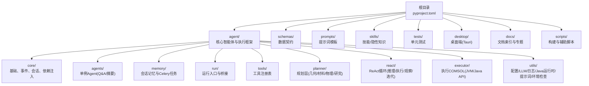
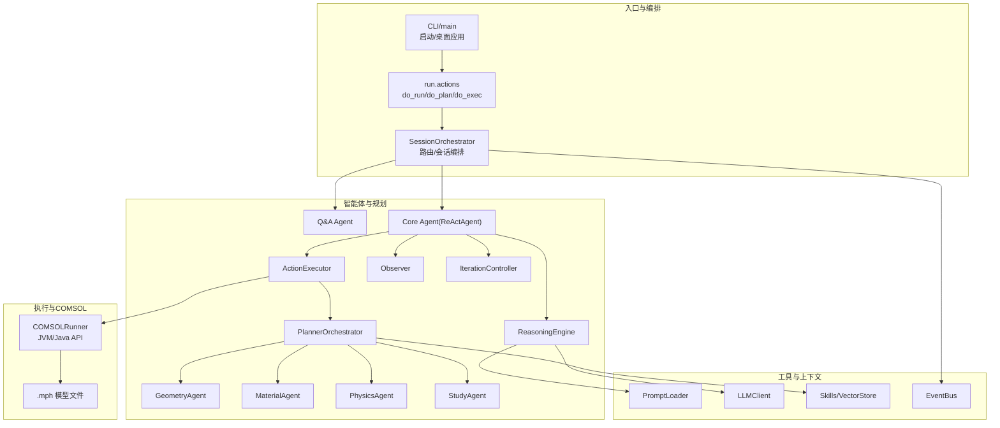
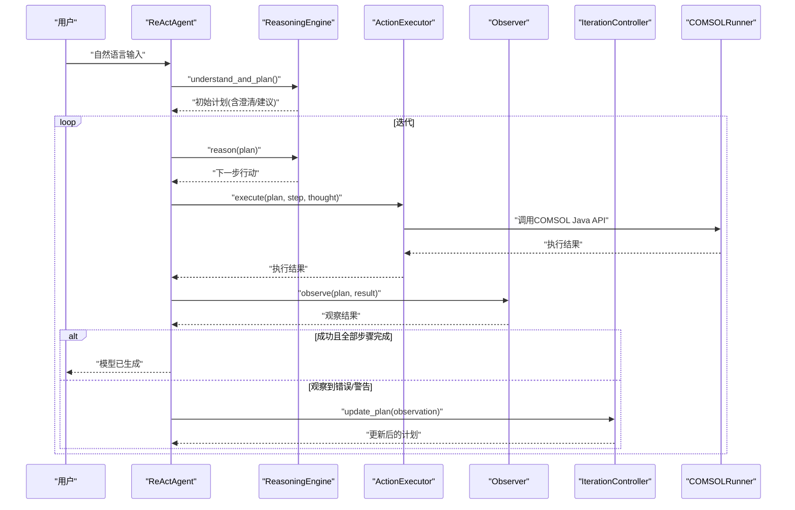
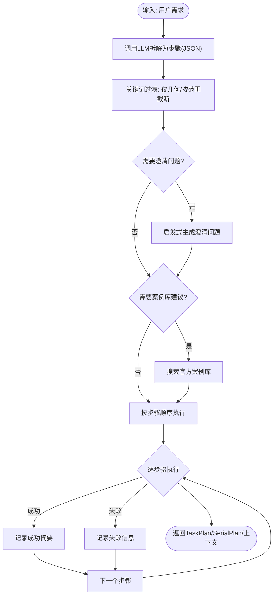
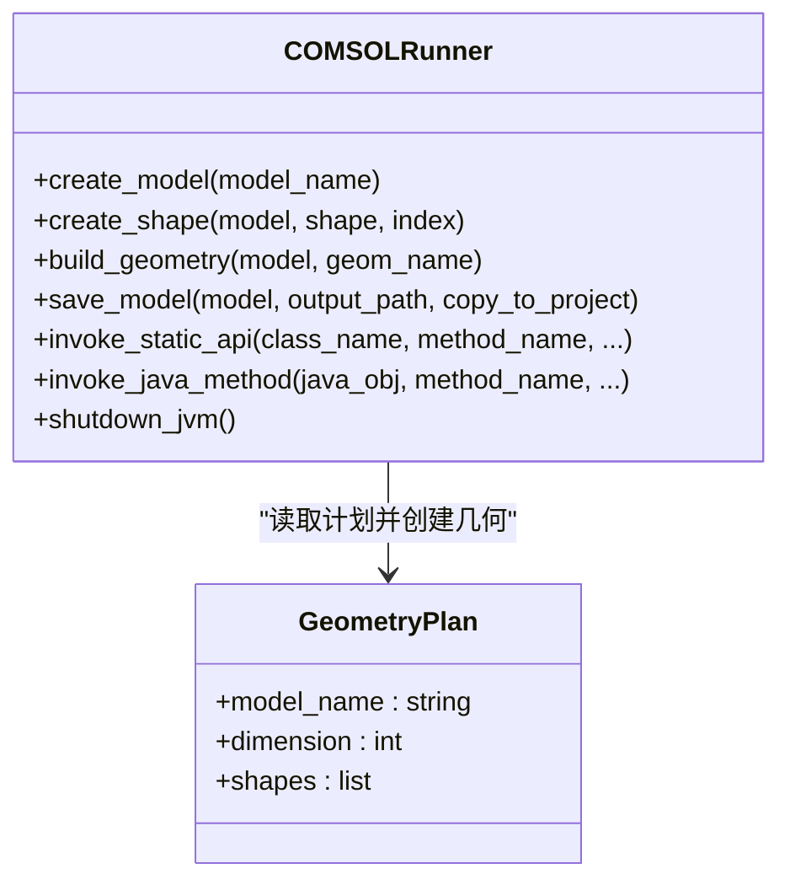
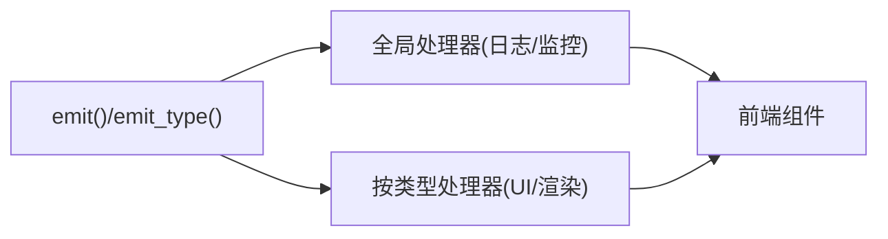
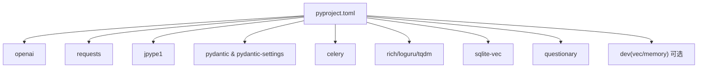

# 开发者指南

<cite>
**本文引用的文件**
- [agent/README.md](file://agent/README.md)
- [docs/README.md](file://docs/README.md)
- [main.py](file://main.py)
- [cli.py](file://cli.py)
- [bridge_entry.py](file://bridge_entry.py)
- [agent/core/base.py](file://agent/core/base.py)
- [agent/core/events.py](file://agent/core/events.py)
- [agent/core/session.py](file://agent/core/session.py)
- [agent/react/react_agent.py](file://agent/react/react_agent.py)
- [agent/planner/orchestrator.py](file://agent/planner/orchestrator.py)
- [agent/utils/config.py](file://agent/utils/config.py)
- [agent/utils/llm.py](file://agent/utils/llm.py)
- [agent/executor/comsol_runner.py](file://agent/executor/comsol_runner.py)
- [schemas/task.py](file://schemas/task.py)
- [pyproject.toml](file://pyproject.toml)
</cite>

## 目录
1. [简介](#简介)
2. [项目结构](#项目结构)
3. [核心组件](#核心组件)
4. [架构总览](#架构总览)
5. [详细组件分析](#详细组件分析)
6. [依赖分析](#依赖分析)
7. [性能考量](#性能考量)
8. [故障排查指南](#故障排查指南)
9. [结论](#结论)
10. [附录](#附录)

## 简介
本指南面向COMSOL Agent的开发者，系统阐述项目的整体架构设计、模块划分原则与扩展点识别，提供开发环境搭建、代码规范与贡献流程说明，总结核心设计模式与技术决策权衡，并给出COMSOL模块上下文管理与API集成的最佳实践。同时包含代码审查标准、性能优化技巧与调试方法，以及新功能开发、Bug修复与性能调优的实战指导。

## 项目结构
项目采用“功能域+层次化”的组织方式：
- agent/：核心智能体与执行框架（核心基础设施、Agent、规划器、ReAct循环、执行器、工具与技能、实用工具）
- schemas/：跨模块的数据契约（任务、几何、物理、研究、材料等）
- prompts/：提示词模板（按领域分层）
- skills/：技能/隐性知识（从目录加载、注入到Prompt）
- tests/：单元测试
- desktop/：桌面端（Tauri + React + TS）
- docs/：文档索引与专题文档
- scripts/：构建与辅助脚本
- 根目录配置：pyproject.toml（依赖与工具配置）

图表来源
- [agent/README.md:1-95](file://agent/README.md#L1-L95)
- [docs/README.md:1-62](file://docs/README.md#L1-L62)

章节来源
- [agent/README.md:1-95](file://agent/README.md#L1-L95)
- [docs/README.md:1-62](file://docs/README.md#L1-L62)

## 核心组件
- 基础设施与会话编排
  - BaseAgent：统一process接口与历史/记忆能力
  - EventBus/EventType/Event：事件总线与标准化事件结构
  - SessionOrchestrator：路由到QA或技术流程（Planner→Core→Summary）
- 规划层
  - PlannerOrchestrator：将自然语言拆解为串行步骤（几何→材料→物理→研究），维护共享上下文
- ReAct循环
  - ReActAgent：协调推理引擎、动作执行器、观察器与迭代控制器，驱动任务计划执行
- 执行层
  - COMSOLRunner：启动JVM、加载COMSOL Java API、创建几何/保存模型
- 工具与技能
  - Tool/ToolRegistry：工具注册表（供ReAct/函数调用）
  - Skills：从skills/目录加载隐性知识，按query注入到Prompt
- 实用工具
  - LLMClient：统一支持DeepSeek/Kimi/Ollama/OpenAI兼容后端
  - Settings/配置：LLM、COMSOL、Java、日志等配置与环境检查

章节来源
- [agent/core/base.py:1-47](file://agent/core/base.py#L1-L47)
- [agent/core/events.py:1-79](file://agent/core/events.py#L1-L79)
- [agent/core/session.py:1-70](file://agent/core/session.py#L1-L70)
- [agent/planner/orchestrator.py:1-450](file://agent/planner/orchestrator.py#L1-L450)
- [agent/react/react_agent.py:1-469](file://agent/react/react_agent.py#L1-L469)
- [agent/executor/comsol_runner.py:1-359](file://agent/executor/comsol_runner.py#L1-L359)
- [agent/utils/llm.py:1-349](file://agent/utils/llm.py#L1-L349)
- [agent/utils/config.py:1-164](file://agent/utils/config.py#L1-L164)

## 架构总览
系统采用“提示词驱动 + ReAct循环 + Planner编排 + Executor执行”的分层架构。核心流程：
- CLI/桌面端启动后，通过run/actions或tui-bridge进入会话编排
- SessionOrchestrator根据路由决定走QA或技术流程
- 技术流程中，ReActAgent驱动ReasoningEngine生成计划，ActionExecutor调用Planner与Executor，Observer观察结果，IterationController根据观察结果更新计划
- PlannerOrchestrator将用户需求拆解为串行步骤，按几何→材料→物理→研究顺序执行，并维护共享上下文
- Executor通过COMSOLRunner启动JVM并调用Java API，生成.mph模型文件

图表来源
- [cli.py:1-121](file://cli.py#L1-L121)
- [agent/core/session.py:1-70](file://agent/core/session.py#L1-L70)
- [agent/react/react_agent.py:1-469](file://agent/react/react_agent.py#L1-L469)
- [agent/planner/orchestrator.py:1-450](file://agent/planner/orchestrator.py#L1-L450)
- [agent/executor/comsol_runner.py:1-359](file://agent/executor/comsol_runner.py#L1-L359)
- [agent/utils/llm.py:1-349](file://agent/utils/llm.py#L1-L349)

## 详细组件分析

### ReActAgent与ReAct循环
- 职责：协调推理与执行；可选EventBus用于可观测性
- 关键流程：初始化任务计划→思考→行动→观察→迭代→保存模型
- 错误处理：区分可恢复与不可恢复错误，必要时生成集成建议
- 可扩展点：ReasoningEngine、ActionExecutor、Observer、IterationController均可替换或增强

图表来源
- [agent/react/react_agent.py:60-215](file://agent/react/react_agent.py#L60-L215)
- [agent/executor/comsol_runner.py:326-351](file://agent/executor/comsol_runner.py#L326-L351)

章节来源
- [agent/react/react_agent.py:1-469](file://agent/react/react_agent.py#L1-L469)

### PlannerOrchestrator与规划上下文
- 职责：将用户需求拆解为串行步骤（geometry→material→physics→study），维护PlannerSharedContext
- 关键机制：关键词过滤、澄清问题、案例库检索、错误传播与兜底
- 可扩展点：新增Agent类型（如边界/载荷）时，在agents目录新增Agent并在Orchestrator中注册

图表来源
- [agent/planner/orchestrator.py:291-449](file://agent/planner/orchestrator.py#L291-L449)

章节来源
- [agent/planner/orchestrator.py:1-450](file://agent/planner/orchestrator.py#L1-L450)

### COMSOLRunner与Java API集成
- 职责：启动JVM、加载COMSOL Java API、创建几何、保存模型
- 关键点：JVM路径/类路径/本地库路径解析、延迟导入jpype、2D/3D形状创建、模型保存与项目目录同步
- 扩展点：新增几何/物理/研究API时，扩展shape创建器映射与静态API调用

图表来源
- [agent/executor/comsol_runner.py:97-359](file://agent/executor/comsol_runner.py#L97-L359)
- [schemas/task.py:94-113](file://schemas/task.py#L94-L113)

章节来源
- [agent/executor/comsol_runner.py:1-359](file://agent/executor/comsol_runner.py#L1-L359)
- [schemas/task.py:1-192](file://schemas/task.py#L1-L192)

### 事件总线与可观测性
- EventBus：统一事件类型、订阅与发射
- 事件类型：计划开始/结束、思考片段、LLM流式片段、动作开始/结束、执行结果、观察、内容、任务阶段、错误、步骤开始/结束等
- 作用：UI层订阅并渲染，便于交互式逐步展示

图表来源
- [agent/core/events.py:43-79](file://agent/core/events.py#L43-L79)

章节来源
- [agent/core/events.py:1-79](file://agent/core/events.py#L1-L79)

### 会话编排与路由
- SessionOrchestrator：根据路由结果调用Q&A或技术流程；技术流程中再调用Core(ReAct)与Summary
- 作用：统一入口、路由分流、事件广播、错误兜底与摘要输出

章节来源
- [agent/core/session.py:1-70](file://agent/core/session.py#L1-L70)

### LLM客户端与多后端支持
- 支持：DeepSeek、Kimi、Ollama、OpenAI兼容中转API
- 特性：统一call/call_stream接口、重试与流式回调、模型选择与后端配置
- 配置：Settings中集中管理后端、模型、URL与密钥

章节来源
- [agent/utils/llm.py:1-349](file://agent/utils/llm.py#L1-L349)
- [agent/utils/config.py:55-164](file://agent/utils/config.py#L55-L164)

## 依赖分析
- 语言与运行时：Python 3.8+，JVM（COMSOL自带或内置JDK）
- 关键依赖：openai、requests、jpype1、pydantic/pydantic-settings、celery、rich、loguru、sqlite-vec、tqdm、questionary
- 可选依赖：dev(vec/memory)，用于测试、格式化、向量检索、记忆后台

图表来源
- [pyproject.toml:26-56](file://pyproject.toml#L26-L56)

章节来源
- [pyproject.toml:1-82](file://pyproject.toml#L1-L82)

## 性能考量
- JVM生命周期管理
  - COMSOLRunner中JVM仅启动一次，避免重复启动开销
  - 仅在首次使用COMSOL功能时触发JVM启动，减少冷启动成本
- LLM调用优化
  - 统一重试与指数退避，流式回调减少等待
  - 降低temperature与合理max_tokens，提升确定性与速度
- I/O与磁盘
  - 模型保存前确保目录存在，避免多次IO失败重试
  - 项目目录与输出目录分离，减少不必要的拷贝
- 并发与异步
  - Celery用于记忆异步任务，避免阻塞主线程
- 代码质量与缓存
  - Ruff/Black规范化，减少lint/format耗时
  - .ruff_cache目录缓存，加速二次检查

## 故障排查指南
- 启动与桌面端
  - CLI启动失败：检查Node.js/Cargo/npm是否存在；开发模式需要Tauri/Rust
  - 桌面应用启动失败：确认打包产物存在或开发模式可运行
- Bridge调试
  - 使用tui-bridge模式，开启stderr与traceback以便定位问题
- COMSOL与JVM
  - 未找到jpype：安装jpype1；JVM启动失败：检查COMSOL JAR路径与本地库路径
  - JNI/库路径问题：确保-Djava.library.path包含COMSOL本地库
- LLM后端
  - API Key/URL配置错误：通过Settings校验后端状态；流式失败：检查网络与超时
- 事件与UI
  - 事件未渲染：确认EventBus订阅正确；检查事件类型与数据结构
- 环境与配置
  - .env未生效：确认加载顺序与路径；输出目录不存在：自动创建但需权限

章节来源
- [cli.py:18-84](file://cli.py#L18-L84)
- [bridge_entry.py:1-20](file://bridge_entry.py#L1-L20)
- [agent/executor/comsol_runner.py:106-154](file://agent/executor/comsol_runner.py#L106-L154)
- [agent/utils/llm.py:320-349](file://agent/utils/llm.py#L320-L349)
- [agent/utils/config.py:137-144](file://agent/utils/config.py#L137-L144)

## 结论
本指南从架构、模块、流程、扩展点、性能与故障排查六个维度，系统梳理了COMSOL Agent的开发要点。建议开发者在新增Agent、扩展COMSOL API、优化LLM与I/O性能时，遵循事件驱动与分层解耦的设计原则，结合可观测性与可测试性，持续演进系统能力。

## 附录

### 开发环境搭建
- 安装Python 3.8+
- 安装依赖：uv sync 或 pip install -e .
- 配置COMSOL与Java：设置COMSOL_JAR_PATH与JAVA_HOME；或使用内置JDK
- 配置LLM后端：在.env中设置后端、模型与密钥
- 运行方式：uv run python cli.py 启动桌面应用；tui-bridge供桌面端后端子进程调用

章节来源
- [pyproject.toml:26-40](file://pyproject.toml#L26-L40)
- [agent/utils/config.py:78-87](file://agent/utils/config.py#L78-L87)
- [cli.py:87-116](file://cli.py#L87-L116)

### 代码规范与贡献流程
- 格式化：Black（line-length=100）
- Lint：Ruff（line-length=100）
- 测试：pytest（tests目录）
- 提交规范：参考docs/agent-design-skills/commit-conventions.md
- 分支与PR：参考docs/project/CONTRIBUTING.md

章节来源
- [pyproject.toml:69-82](file://pyproject.toml#L69-L82)
- [docs/README.md:40-43](file://docs/README.md#L40-L43)

### 新功能开发与扩展点
- 新增Agent：在agents/或planner/新增Agent，注册到依赖注入或Orchestrator
- 新增COMSOL API：在COMSOLRunner中扩展静态API调用或形状创建器映射
- 新增提示词：在prompts/相应目录新增模板，通过PromptLoader加载
- 新增工具：在tools/注册Tool与ToolRegistry，供ReAct/函数调用使用
- 新增技能：在skills/新增SKILL.md，通过loader/injector/vector_store注入

章节来源
- [agent/executor/comsol_runner.py:274-291](file://agent/executor/comsol_runner.py#L274-L291)
- [agent/planner/orchestrator.py:286-289](file://agent/planner/orchestrator.py#L286-L289)
- [agent/utils/llm.py:270-349](file://agent/utils/llm.py#L270-L349)

### Bug修复与性能调优实战
- Bug修复
  - 事件未渲染：检查EventBus订阅与事件类型一致性
  - COMSOL执行失败：查看观察结果与错误信息，回退到对应步骤补充
  - LLM流式中断：收集已接收片段并降级返回，记录重试日志
- 性能调优
  - JVM常驻：避免重复启动；仅在首次COMSOL调用时初始化
  - I/O批量化：合并模型保存与项目目录同步
  - LLM缓存：对稳定提示词结果进行缓存（注意隐私与时效）
  - 并发：使用Celery异步任务处理记忆更新

章节来源
- [agent/react/react_agent.py:163-187](file://agent/react/react_agent.py#L163-L187)
- [agent/utils/llm.py:52-98](file://agent/utils/llm.py#L52-L98)
- [agent/executor/comsol_runner.py:106-154](file://agent/executor/comsol_runner.py#L106-L154)