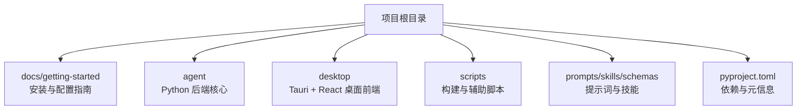
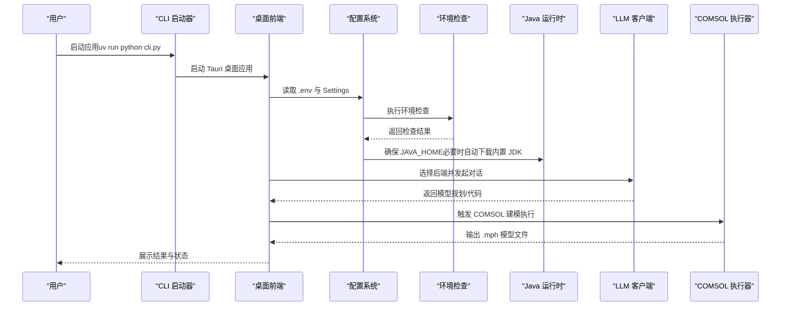
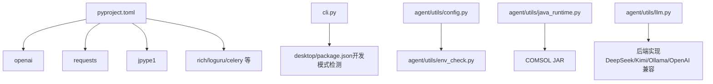

# 快速开始

<cite>
**本文引用的文件**
- [INSTALL.md](file://docs/getting-started/INSTALL.md)
- [CONFIG.md](file://docs/getting-started/CONFIG.md)
- [llm-backends.md](file://docs/getting-started/llm-backends.md)
- [ollama-setup.md](file://docs/getting-started/ollama-setup.md)
- [env.example](file://env.example)
- [pyproject.toml](file://pyproject.toml)
- [cli.py](file://cli.py)
- [main.py](file://main.py)
- [agent/utils/config.py](file://agent/utils/config.py)
- [agent/utils/env_check.py](file://agent/utils/env_check.py)
- [agent/utils/java_runtime.py](file://agent/utils/java_runtime.py)
- [agent/utils/llm.py](file://agent/utils/llm.py)
- [desktop/src/App.tsx](file://desktop/src/App.tsx)
</cite>

## 目录
1. [简介](#简介)
2. [项目结构](#项目结构)
3. [核心组件](#核心组件)
4. [架构总览](#架构总览)
5. [详细组件分析](#详细组件分析)
6. [依赖关系分析](#依赖关系分析)
7. [性能注意事项](#性能注意事项)
8. [故障排除指南](#故障排除指南)
9. [结论](#结论)
10. [附录](#附录)

## 简介
本指南面向首次使用 COMSOL Agent 的用户，目标是在最短时间内完成安装、环境配置与依赖准备，并成功生成第一个仿真模型。文档涵盖系统要求、环境变量配置、COMSOL 与 Java 运行时设置、LLM 后端（OpenAI、DeepSeek、Kimi、Ollama 等）配置，以及从安装到首次运行的完整流程。同时提供常见问题的排查方法与实用命令示例。

## 项目结构
该项目采用“源码运行 + 桌面端（可选）”的双模式。推荐使用 uv 管理 Python 环境与依赖，通过 CLI 启动桌面应用或在 TUI 中交互。核心目录与职责概览如下：
- docs/getting-started：安装、配置与后端使用指南
- agent：Python 后端核心（配置、环境检查、Java 运行时、LLM 客户端、执行器等）
- desktop：基于 Tauri + React 的桌面前端
- scripts：构建与辅助脚本
- prompts/skills/schemas：提示词、技能与数据模型定义
- pyproject.toml：项目元信息与依赖声明

章节来源
- [INSTALL.md:1-180](file://docs/getting-started/INSTALL.md#L1-L180)
- [pyproject.toml:1-82](file://pyproject.toml#L1-L82)

## 核心组件
- CLI 启动器：负责判断平台、优先运行打包好的桌面可执行文件，否则进入开发模式启动 Tauri 应用。
- 配置系统：读取 .env，提供 Settings 单例，统一管理 LLM 后端、COMSOL、Java、输出目录与日志级别。
- 环境检查：对 LLM 后端、COMSOL JAR、Java、输出目录与 Python 依赖进行一次性验证。
- Java 运行时：在未配置 JAVA_HOME 时，自动下载内置 JDK 11（可配置镜像与跳过策略）。
- LLM 客户端：封装 DeepSeek、Kimi、Ollama、OpenAI 兼容后端，支持流式与重试。
- 桌面前端：通过 Tauri 桥接后端，提供会话、对话、设置、后端切换、执行与诊断等功能。

章节来源
- [cli.py:1-121](file://cli.py#L1-L121)
- [agent/utils/config.py:1-164](file://agent/utils/config.py#L1-L164)
- [agent/utils/env_check.py:1-234](file://agent/utils/env_check.py#L1-L234)
- [agent/utils/java_runtime.py:1-308](file://agent/utils/java_runtime.py#L1-L308)
- [agent/utils/llm.py:1-349](file://agent/utils/llm.py#L1-L349)
- [desktop/src/App.tsx:1-100](file://desktop/src/App.tsx#L1-L100)

## 架构总览
下图展示了从用户启动到生成模型的关键交互路径：CLI 启动桌面应用 → 前端初始化桥接 → 后端加载配置与环境检查 → 选择 LLM 后端 → COMSOL Java 运行时就绪 → 执行建模与输出。

图表来源
- [cli.py:87-121](file://cli.py#L87-L121)
- [desktop/src/App.tsx:46-50](file://desktop/src/App.tsx#L46-L50)
- [agent/utils/config.py:137-143](file://agent/utils/config.py#L137-L143)
- [agent/utils/env_check.py:43-181](file://agent/utils/env_check.py#L43-L181)
- [agent/utils/java_runtime.py:217-257](file://agent/utils/java_runtime.py#L217-L257)
- [agent/utils/llm.py:270-349](file://agent/utils/llm.py#L270-L349)

章节来源
- [cli.py:87-121](file://cli.py#L87-L121)
- [desktop/src/App.tsx:46-50](file://desktop/src/App.tsx#L46-L50)
- [agent/utils/config.py:137-143](file://agent/utils/config.py#L137-L143)
- [agent/utils/env_check.py:43-181](file://agent/utils/env_check.py#L43-L181)
- [agent/utils/java_runtime.py:217-257](file://agent/utils/java_runtime.py#L217-L257)
- [agent/utils/llm.py:270-349](file://agent/utils/llm.py#L270-L349)

## 详细组件分析

### 安装与运行（从源码）
- 安装依赖：使用 uv 同步项目依赖。
- 启动应用：无参运行 CLI，优先尝试本地打包的桌面可执行文件；若不存在则进入开发模式启动 Tauri。
- 开发模式：需要 Node.js 与 Rust（Tauri）工具链；若缺失会给出明确提示。

章节来源
- [INSTALL.md:5-25](file://docs/getting-started/INSTALL.md#L5-L25)
- [cli.py:18-84](file://cli.py#L18-L84)

### 环境变量与配置文件
- 创建 .env 文件（可参考 env.example），至少配置 LLM 后端与 COMSOL JAR 路径；Java 可选（未配置时自动下载内置 JDK）。
- 输出目录默认为项目根目录下的 models，可自定义。
- 日志级别可选 INFO/DEBUG/WARNING/ERROR。

章节来源
- [CONFIG.md:3-58](file://docs/getting-started/CONFIG.md#L3-L58)
- [env.example:1-47](file://env.example#L1-L47)
- [agent/utils/config.py:50-103](file://agent/utils/config.py#L50-L103)

### LLM 后端配置
- 支持后端：deepseek、kimi、ollama、openai-compatible。
- 配置方式：.env 或在 TUI 中通过 /backend 切换。
- 依赖：deepseek/kimi/openai-compatible 使用 openai 客户端；ollama 使用 requests。

章节来源
- [llm-backends.md:1-73](file://docs/getting-started/llm-backends.md#L1-L73)
- [agent/utils/llm.py:9-349](file://agent/utils/llm.py#L1-L349)

### Ollama 本地部署与验证
- 安装与启动：Linux/Mac 使用脚本安装；Windows 从官网下载安装程序；本地默认监听 11434 端口。
- 下载模型：推荐 llama3 或 qwen2.5 等。
- 配置 mph-agent：.env 中设置 LLM_BACKEND=ollama、OLLAMA_URL、OLLAMA_MODEL。
- 验证：在 TUI 输入 /doctor 查看 Ollama 可访问性与可用模型列表。

章节来源
- [ollama-setup.md:1-177](file://docs/getting-started/ollama-setup.md#L1-L177)
- [agent/utils/env_check.py:94-110](file://agent/utils/env_check.py#L94-L110)

### COMSOL 与 Java 运行时
- COMSOL JAR 路径：推荐配置 plugins 目录（自动加载全部 jar）；旧版本可配置单个 comsol.jar。
- Java：未配置 JAVA_HOME 时，首次使用 COMSOL 功能会自动下载内置 JDK 11 到 runtime/java；可配置镜像与跳过策略。
- JNI 本地库：可选设置 COMSOL_NATIVE_PATH 以解决特定链接错误。

章节来源
- [INSTALL.md:43-67](file://docs/getting-started/INSTALL.md#L43-L67)
- [CONFIG.md:17-42](file://docs/getting-started/CONFIG.md#L17-L42)
- [agent/utils/java_runtime.py:217-257](file://agent/utils/java_runtime.py#L217-L257)

### 首次运行全流程（从零到生成模型）
- 步骤 1：安装 uv、Node.js、Rust（开发模式需要）
- 步骤 2：克隆仓库并在根目录执行依赖同步
- 步骤 3：创建 .env，配置 LLM 后端（推荐 Ollama）与 COMSOL JAR 路径
- 步骤 4：启动应用，输入 /doctor 进行环境诊断
- 步骤 5：在输入框中输入自然语言建模需求（如“创建一个宽1米、高0.5米的矩形”）
- 步骤 6：等待 COMSOL 执行器生成 .mph 模型文件，查看输出目录

章节来源
- [INSTALL.md:17-25](file://docs/getting-started/INSTALL.md#L17-L25)
- [INSTALL.md:94-107](file://docs/getting-started/INSTALL.md#L94-L107)
- [agent/utils/env_check.py:43-181](file://agent/utils/env_check.py#L43-L181)

## 依赖关系分析
- Python 依赖：通过 pyproject.toml 声明，核心包括 openai、requests、jpype1、rich、loguru、celery 等。
- 桌面端依赖：desktop/package.json（由 CLI 在开发模式下检测）。
- 运行时依赖：COMSOL JAR 与 Java（内置或系统）。

图表来源
- [pyproject.toml:26-40](file://pyproject.toml#L26-L40)
- [cli.py:54-84](file://cli.py#L54-L84)
- [agent/utils/config.py:137-143](file://agent/utils/config.py#L137-L143)
- [agent/utils/env_check.py:161-180](file://agent/utils/env_check.py#L161-L180)
- [agent/utils/java_runtime.py:217-257](file://agent/utils/java_runtime.py#L217-L257)
- [agent/utils/llm.py:270-349](file://agent/utils/llm.py#L270-L349)

章节来源
- [pyproject.toml:26-40](file://pyproject.toml#L26-L40)
- [cli.py:54-84](file://cli.py#L54-L84)
- [agent/utils/config.py:137-143](file://agent/utils/config.py#L137-L143)
- [agent/utils/env_check.py:161-180](file://agent/utils/env_check.py#L161-L180)
- [agent/utils/java_runtime.py:217-257](file://agent/utils/java_runtime.py#L217-L257)
- [agent/utils/llm.py:270-349](file://agent/utils/llm.py#L270-L349)

## 性能注意事项
- LLM 后端选择：本地开发建议 Ollama；中文与推理可选 DeepSeek/Kimi；自建或第三方中转使用 openai-compatible。
- 模型选择：Ollama 推荐 llama3/qwen2.5；较小模型（如 mistral）速度更快。
- 网络与并发：远程 Ollama 注意网络延迟与超时；避免同时运行多个请求。
- Java 与 COMSOL：优先使用内置 JDK 以减少环境差异；确保 COMSOL JAR 目录可读写。

## 故障排除指南
- 环境变量未生效：使用 .env 文件并在正确 shell 中设置；重启终端或重新加载配置。
- COMSOL JAR 找不到：确认 COMSOL 已安装；6.3+ 推荐 plugins 目录；6.1 及更早版本使用单个 comsol.jar。
- Java 环境错误：推荐不配置 JAVA_HOME，使用内置 JDK 11；或确保 JDK（非 JRE）版本与 COMSOL 兼容（通常 JDK 8-17）。
- 桌面端构建报错：Windows 需安装 Visual Studio 的 C++ 构建工具或配置 MinGW 工具链；确保 Rust 工具链匹配。
- LLM 后端连接失败：检查 API Key、Base URL 与网络连通性；使用 /doctor 查看诊断结果。
- 输出目录不可访问：确保目录存在且具备写权限；默认为项目根目录下的 models。

章节来源
- [INSTALL.md:108-180](file://docs/getting-started/INSTALL.md#L108-L180)
- [CONFIG.md:74-159](file://docs/getting-started/CONFIG.md#L74-L159)
- [agent/utils/env_check.py:184-198](file://agent/utils/env_check.py#L184-L198)

## 结论
通过本指南，您可以在本地快速完成 COMSOL Agent 的安装与配置，选择合适的 LLM 后端，准备 COMSOL 与 Java 运行时，并成功生成第一个仿真模型。遇到问题时，可借助 /doctor 诊断与 .env 配置进行定位与修复。建议在生产环境中固定后端与模型版本，并为输出目录与日志级别设置合理的策略。

## 附录

### 常用命令与路径
- 依赖同步：在项目根目录执行依赖同步命令
- 启动应用：无参运行 CLI 启动桌面应用
- 环境诊断：在 TUI 输入 /doctor
- 桌面端开发模式：确保 Node.js 与 Rust 工具链可用

章节来源
- [INSTALL.md:9-25](file://docs/getting-started/INSTALL.md#L9-L25)
- [cli.py:18-84](file://cli.py#L18-L84)
- [INSTALL.md:94-107](file://docs/getting-started/INSTALL.md#L94-L107)

### 配置文件模板（.env）
- LLM 后端与 API Key：按所选后端配置
- COMSOL JAR 路径：推荐 plugins 目录
- Java：可选，未配置时使用内置 JDK 11
- 输出目录：默认项目根目录下的 models

章节来源
- [env.example:4-47](file://env.example#L4-L47)
- [CONFIG.md:7-58](file://docs/getting-started/CONFIG.md#L7-L58)