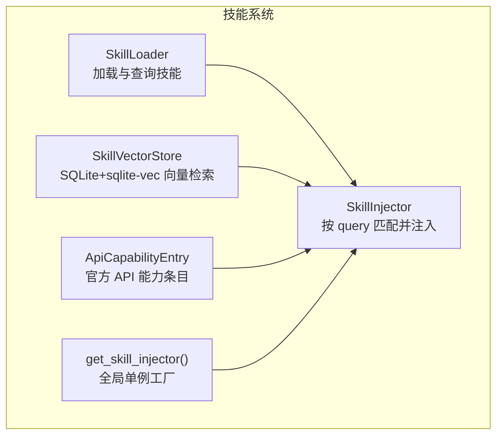
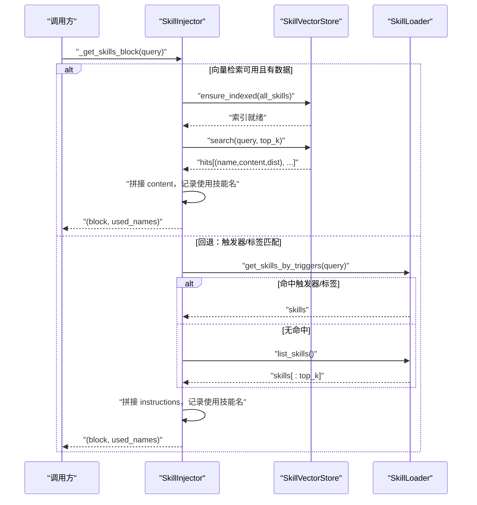
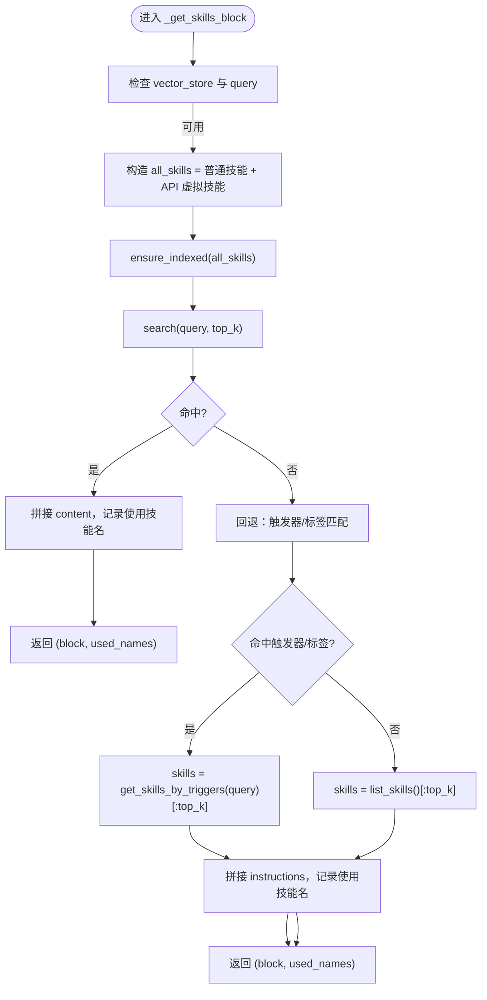
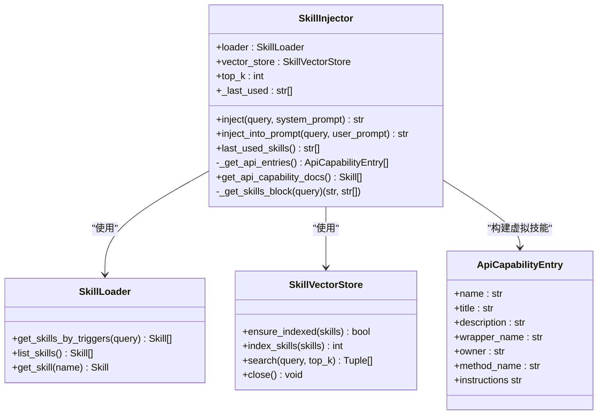

# 技能注入器

<cite>
**本文引用的文件**
- [agent/skills/injector.py](file://agent/skills/injector.py)
- [agent/skills/vector_store.py](file://agent/skills/vector_store.py)
- [agent/skills/loader.py](file://agent/skills/loader.py)
- [agent/skills/__init__.py](file://agent/skills/__init__.py)
- [agent/skills/api_catalog_builder.py](file://agent/skills/api_catalog_builder.py)
- [agent/planner/geometry_agent.py](file://agent/planner/geometry_agent.py)
- [agent/react/reasoning_engine.py](file://agent/react/reasoning_engine.py)
- [tests/test_skills.py](file://tests/test_skills.py)
- [skills/comsol-basics/SKILL.md](file://skills/comsol-basics/SKILL.md)
- [skills/comsol-3d/SKILL.md](file://skills/comsol-3d/SKILL.md)
</cite>

## 目录
1. [简介](#简介)
2. [项目结构](#项目结构)
3. [核心组件](#核心组件)
4. [架构总览](#架构总览)
5. [详细组件分析](#详细组件分析)
6. [依赖分析](#依赖分析)
7. [性能考量](#性能考量)
8. [故障排查指南](#故障排查指南)
9. [结论](#结论)
10. [附录](#附录)

## 简介
本文件面向“技能注入器（SkillInjector）”的技术文档，系统阐述其核心功能与实现细节，重点包括：
- 基于查询的技能匹配机制：向量检索优先策略与触发器/标签回退机制
- 技能块的构建与注入流程：系统提示词增强与用户提示词注入两种模式
- 接口设计与使用场景：inject 与 inject_into_prompt 的参数与行为差异
- MARKER 标记的作用与注入格式规范
- 实际使用示例：在规划器与推理引擎中的应用

## 项目结构
技能系统位于 agent/skills 目录，围绕“加载器（SkillLoader）—向量库（SkillVectorStore）—注入器（SkillInjector）—API 能力表（ApiCapabilityEntry）”形成闭环。全局工厂函数提供单例注入器，便于跨模块统一使用。

图表来源
- [agent/skills/loader.py:45-111](file://agent/skills/loader.py#L45-L111)
- [agent/skills/vector_store.py:40-196](file://agent/skills/vector_store.py#L40-L196)
- [agent/skills/injector.py:11-117](file://agent/skills/injector.py#L11-L117)
- [agent/skills/api_catalog_builder.py:10-108](file://agent/skills/api_catalog_builder.py#L10-L108)
- [agent/skills/__init__.py:23-40](file://agent/skills/__init__.py#L23-L40)

章节来源
- [agent/skills/__init__.py:1-40](file://agent/skills/__init__.py#L1-L40)

## 核心组件
- SkillLoader：扫描技能目录，解析 SKILL.md（YAML frontmatter + Markdown 正文），缓存为 name -> Skill，并提供按触发词/标签的快速查询。
- SkillVectorStore：基于 SQLite + sqlite-vec 的向量检索与持久化，支持自动建索引、嵌入生成与检索。
- SkillInjector：核心注入器，依据 query 优先向量检索，否则回退至触发器/标签匹配，最终将技能块注入到系统提示词或用户提示词中。
- ApiCapabilityEntry：将官方 Java API 能力元信息转换为可注入的技能文本块，参与向量检索与注入。
- get_skill_injector：全局单例工厂，按需自动创建向量检索能力。

章节来源
- [agent/skills/loader.py:8-111](file://agent/skills/loader.py#L8-L111)
- [agent/skills/vector_store.py:40-196](file://agent/skills/vector_store.py#L40-L196)
- [agent/skills/injector.py:11-117](file://agent/skills/injector.py#L11-L117)
- [agent/skills/api_catalog_builder.py:10-108](file://agent/skills/api_catalog_builder.py#L10-L108)
- [agent/skills/__init__.py:23-40](file://agent/skills/__init__.py#L23-L40)

## 架构总览
SkillInjector 的工作流分为两条路径：向量检索优先与触发器/标签回退。向量检索通过 SkillVectorStore 搜索 Top-K 相似技能；若不可用或无命中，则回退到 SkillLoader 的触发器/标签匹配，并限制 Top-K 输出。

图表来源
- [agent/skills/injector.py:63-93](file://agent/skills/injector.py#L63-L93)
- [agent/skills/vector_store.py:128-174](file://agent/skills/vector_store.py#L128-L174)
- [agent/skills/loader.py:92-107](file://agent/skills/loader.py#L92-L107)

## 详细组件分析

### SkillInjector 类与接口
- MARKER：注入标记，用于标识注入段落的起始位置，便于解析与日志追踪。
- inject(system_prompt)：在系统提示词末尾追加“技能块”，适合需要在系统层面增强背景知识的场景。
- inject_into_prompt(query, user_prompt)：将技能块前置到用户提示词前部，适合单条用户消息的场景，确保 LLM 在推理与行动阶段都能采纳隐性知识。
- last_used_skills()：返回本轮注入使用的技能名列表，便于日志与统计。

章节来源
- [agent/skills/injector.py:8-117](file://agent/skills/injector.py#L8-L117)

#### _get_skills_block 工作流详解
- 向量检索优先策略
  - 若配置了 SkillVectorStore 且 query 非空：动态构造“普通技能 + 官方 API 能力表虚拟技能”集合，确保向量库覆盖官方 API 能力；调用 ensure_indexed 确保索引存在；执行 search 返回 Top-K 命中；若命中则拼接 content 并记录使用技能名，直接返回。
- 回退机制
  - 若向量检索未命中：使用 SkillLoader.get_skills_by_triggers(query) 获取命中触发器/标签的技能；若无命中则取全部技能的前 top_k；最后拼接各技能的 instructions（忽略空内容），记录使用技能名并返回。
- 复杂度与健壮性
  - 向量检索复杂度近似 O(log N) 检索 + K 结果拼接；回退查询复杂度取决于触发器/标签匹配与排序；对空 query、空结果、索引异常均具备保护逻辑。

图表来源
- [agent/skills/injector.py:63-93](file://agent/skills/injector.py#L63-L93)

章节来源
- [agent/skills/injector.py:63-93](file://agent/skills/injector.py#L63-L93)

### SkillLoader 与技能格式
- 技能文件：每个技能目录包含 SKILL.md，采用 YAML frontmatter（name/description/tags/triggers 等）与正文（instructions）两部分。
- 查询接口：
  - get_skills_by_triggers(query)：按触发词与标签进行关键词匹配，命中优先。
  - list_skills()：返回全部技能列表。
- 示例技能文件展示了典型的触发词与指令内容组织方式，便于注入器进行精确匹配与回退。

章节来源
- [agent/skills/loader.py:22-111](file://agent/skills/loader.py#L22-L111)
- [skills/comsol-basics/SKILL.md:1-41](file://skills/comsol-basics/SKILL.md#L1-L41)
- [skills/comsol-3d/SKILL.md:1-51](file://skills/comsol-3d/SKILL.md#L1-L51)

### SkillVectorStore 向量检索
- 数据结构：使用 sqlite-vec 的 vec0 虚拟表，字段包含 embedding（向量）、skill_name（元数据）、content（辅助列）。
- 嵌入模型：可选 sentence-transformers 模型，默认向量维度为 384；若无嵌入模型或失败，仅做持久化存储，检索回退。
- 自动建索引：ensure_indexed 在表为空且存在嵌入模型时全量重建索引；index_skills 支持批量写入并校验维度。
- 检索接口：search 返回 (name, content, distance) 列表，若无嵌入或表为空则返回空列表。

章节来源
- [agent/skills/vector_store.py:40-196](file://agent/skills/vector_store.py#L40-L196)

### ApiCapabilityEntry 与官方 API 能力表
- 将 JavaAPIController 的官方 API 元信息转换为可注入的技能文本块，包含标题、所属类、方法签名、用途与元数据字段，便于向量检索与注入。
- get_api_capability_docs 将这些条目转换为内存中的 Skill 对象集合，参与向量检索与注入。

章节来源
- [agent/skills/api_catalog_builder.py:10-108](file://agent/skills/api_catalog_builder.py#L10-L108)
- [agent/skills/injector.py:40-61](file://agent/skills/injector.py#L40-L61)

### 全局单例工厂
- get_skill_injector：返回全局单例 SkillInjector；若未显式传入 vector_store 且已安装向量依赖，则自动创建并启用向量检索能力，确保开箱即用。

章节来源
- [agent/skills/__init__.py:23-40](file://agent/skills/__init__.py#L23-L40)

### 使用场景与接口说明

#### inject(system_prompt)
- 适用场景：需要在系统提示词层面增强背景知识，使 LLM 在整个对话过程中都能受益。
- 参数与行为：
  - query：用于匹配技能的查询文本
  - system_prompt：待增强的系统提示词
  - 返回：在 system_prompt 末尾追加“技能块”的新提示词；若无匹配技能则原样返回

章节来源
- [agent/skills/injector.py:95-102](file://agent/skills/injector.py#L95-L102)

#### inject_into_prompt(query, user_prompt)
- 适用场景：单条用户消息的场景，将技能作为隐性知识前置到用户提示词前部，确保推理与行动阶段均可采纳。
- 参数与行为：
  - query：用于匹配技能的查询文本
  - user_prompt：用户提示词
  - 返回：在 user_prompt 前部追加“技能块”的新提示词；若无匹配技能则原样返回

章节来源
- [agent/skills/injector.py:104-112](file://agent/skills/injector.py#L104-L112)

#### MARKER 标记与注入格式规范
- MARKER：固定标记，用于标识注入段落的起始位置，便于解析与日志追踪。
- 注入格式：
  - inject：在 system_prompt 末尾追加“技能块”，中间以 MARKER 分隔
  - inject_into_prompt：在 user_prompt 前部追加“技能块”，并在其后添加分隔线与原始 user_prompt

章节来源
- [agent/skills/injector.py:8-117](file://agent/skills/injector.py#L8-L117)

### 实际使用示例

#### 在规划器几何 Agent 中注入
- 场景：几何 Agent 解析用户输入时，将匹配到的技能前置到提示词前部，提升几何建模相关的理解与规划质量。
- 关键调用：在提示词构建后，调用 inject_into_prompt 将技能注入到用户提示词前部。

章节来源
- [agent/planner/geometry_agent.py:95-100](file://agent/planner/geometry_agent.py#L95-L100)

#### 在推理引擎中注入
- 场景：推理引擎在规划执行路径前，将技能注入到提示词中，提升任务类型识别与步骤规划的准确性。
- 关键调用：在生成提示词后，调用 inject_into_prompt 将技能注入到用户输入对应的提示词前部。

章节来源
- [agent/react/reasoning_engine.py:270-278](file://agent/react/reasoning_engine.py#L270-L278)

#### 单元测试验证
- 测试覆盖：
  - inject_into_prompt 在存在技能与空技能场景的行为
  - last_used_skills 返回使用的技能名列表
  - MARKER 标记的存在性与注入位置

章节来源
- [tests/test_skills.py:74-105](file://tests/test_skills.py#L74-L105)

## 依赖分析
SkillInjector 的耦合关系清晰，职责单一：负责“匹配 + 注入”。其依赖通过构造函数注入，便于测试与扩展。

图表来源
- [agent/skills/injector.py:11-117](file://agent/skills/injector.py#L11-L117)
- [agent/skills/loader.py:45-111](file://agent/skills/loader.py#L45-L111)
- [agent/skills/vector_store.py:40-196](file://agent/skills/vector_store.py#L40-L196)
- [agent/skills/api_catalog_builder.py:10-108](file://agent/skills/api_catalog_builder.py#L10-L108)

## 性能考量
- 向量检索优先策略：在 query 有效且向量库已索引的情况下，检索效率高；ensure_indexed 会在首次使用或清空后自动重建索引，避免重复建索引带来的开销。
- 回退机制：当向量检索不可用或无命中时，触发器/标签匹配与 Top-K 限制保证了注入的可控性与稳定性。
- 嵌入模型与维度：默认 384 维向量，若嵌入失败或模型缺失，系统仍可工作但无法进行向量检索，属于安全回退。
- 日志与可观测性：向量库在索引与检索过程中记录调试信息，便于定位性能瓶颈与异常。

## 故障排查指南
- 向量检索未生效
  - 检查是否安装 sqlite-vec 扩展与向量依赖；确认 get_default_embedder 是否可用；确认 SkillVectorStore 初始化成功。
  - 检查 ensure_indexed 是否正常执行并写入数据。
- 注入结果为空
  - 检查 query 是否为空；确认 SkillLoader 是否正确加载技能；确认触发器/标签是否与 query 匹配。
- MARKER 未出现
  - 确认 inject 或 inject_into_prompt 是否被调用；确认返回值是否被正确使用。
- 性能问题
  - 确认向量库是否已索引；检查嵌入维度与内容长度限制；评估 top_k 设置是否合理。

章节来源
- [agent/skills/vector_store.py:29-38](file://agent/skills/vector_store.py#L29-L38)
- [agent/skills/vector_store.py:128-143](file://agent/skills/vector_store.py#L128-L143)
- [agent/skills/injector.py:95-112](file://agent/skills/injector.py#L95-L112)
- [tests/test_skills.py:74-105](file://tests/test_skills.py#L74-L105)

## 结论
SkillInjector 通过“向量检索优先 + 触发器/标签回退”的双轨策略，实现了高效、稳健的技能匹配与注入。结合全局单例工厂与统一的 MARKER 格式，系统在规划、推理与执行等多环节中能够稳定地引入隐性知识，提升 COMSOL 建模任务的理解与执行质量。建议在生产环境中开启向量检索能力，并合理设置 top_k 与监控日志，以获得最佳效果。

## 附录
- 技能文件示例：参见 skills/comsol-basics 与 skills/comsol-3d 目录下的 SKILL.md，了解触发词与指令内容的组织方式。
- 单元测试：参见 tests/test_skills.py，验证注入器在不同场景下的行为。