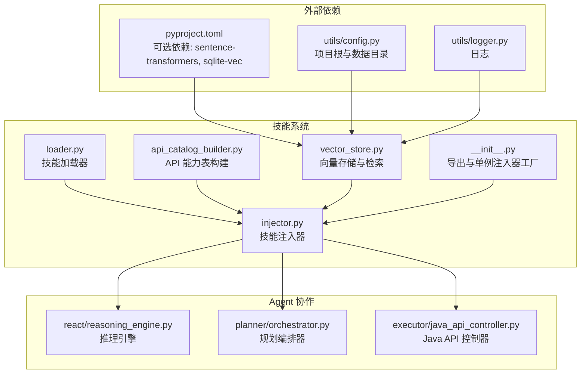
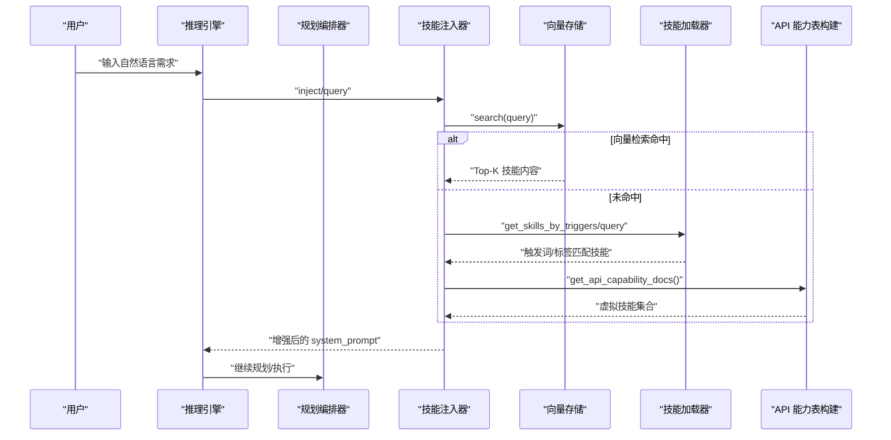
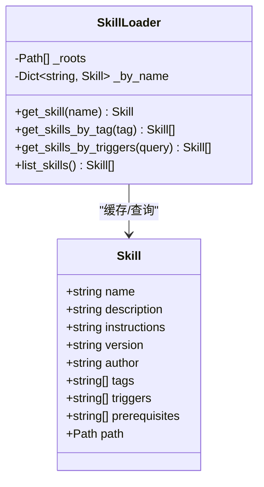
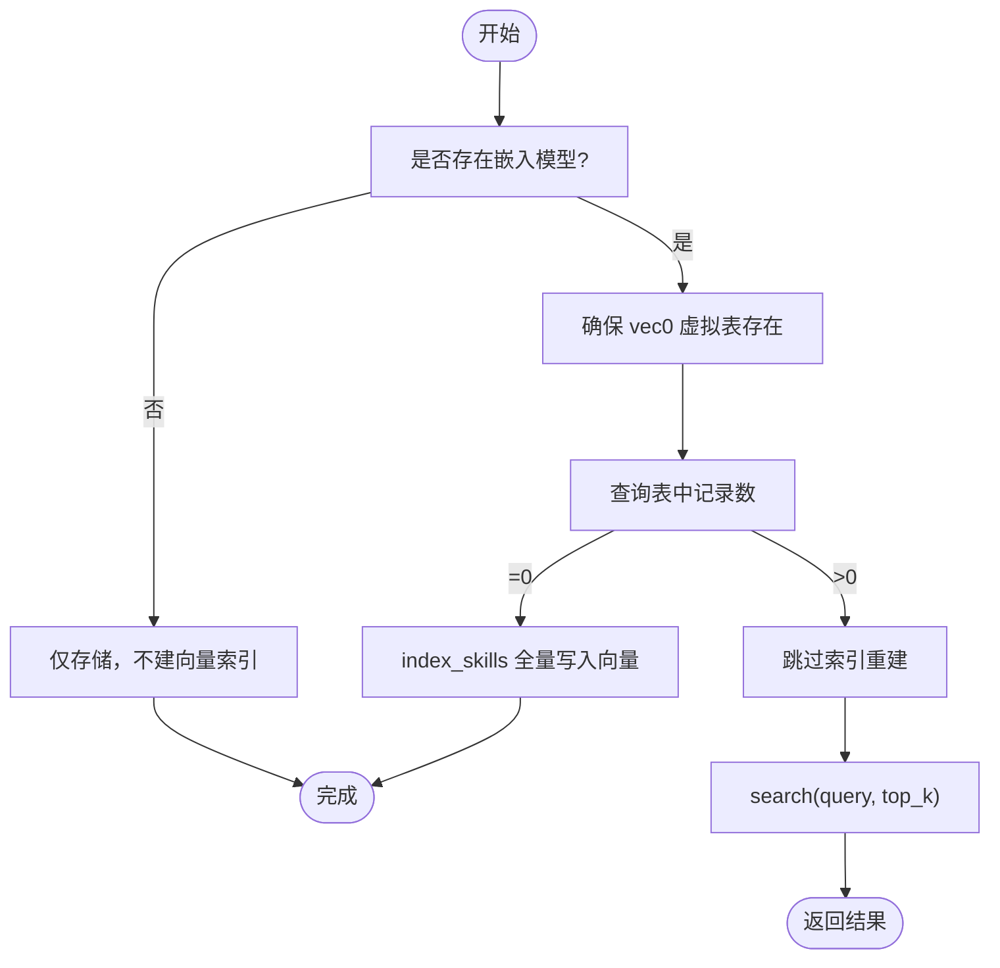
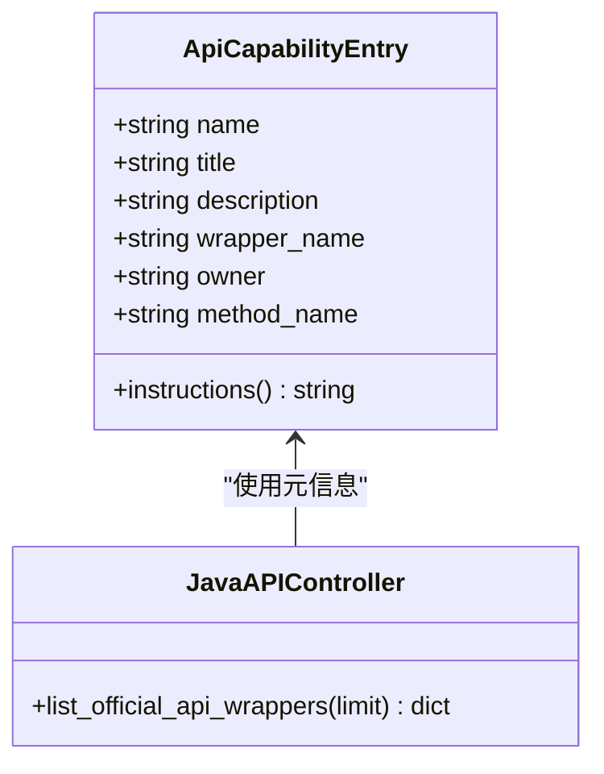
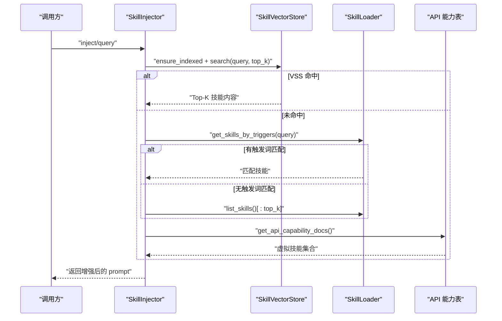
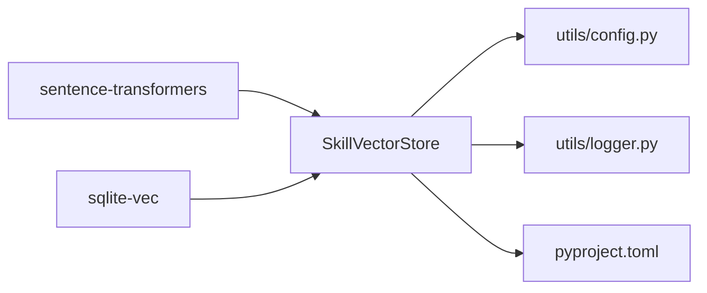

# 技能系统

<cite>
**本文引用的文件**
- [agent/skills/__init__.py](file://agent/skills/__init__.py)
- [agent/skills/injector.py](file://agent/skills/injector.py)
- [agent/skills/loader.py](file://agent/skills/loader.py)
- [agent/skills/vector_store.py](file://agent/skills/vector_store.py)
- [agent/skills/api_catalog_builder.py](file://agent/skills/api_catalog_builder.py)
- [agent/utils/config.py](file://agent/utils/config.py)
- [agent/utils/logger.py](file://agent/utils/logger.py)
- [agent/executor/java_api_controller.py](file://agent/executor/java_api_controller.py)
- [agent/react/reasoning_engine.py](file://agent/react/reasoning_engine.py)
- [agent/planner/orchestrator.py](file://agent/planner/orchestrator.py)
- [agent/utils/prompt_loader.py](file://agent/utils/prompt_loader.py)
- [pyproject.toml](file://pyproject.toml)
- [tests/test_skills.py](file://tests/test_skills.py)
- [skills/comsol-basics/SKILL.md](file://skills/comsol-basics/SKILL.md)
- [skills/comsol-3d/SKILL.md](file://skills/comsol-3d/SKILL.md)
- [skills/comsol-physics/SKILL.md](file://skills/comsol-physics/SKILL.md)
</cite>

## 目录
1. [简介](#简介)
2. [项目结构](#项目结构)
3. [核心组件](#核心组件)
4. [架构总览](#架构总览)
5. [组件详解](#组件详解)
6. [依赖关系分析](#依赖关系分析)
7. [性能与可扩展性](#性能与可扩展性)
8. [故障排查指南](#故障排查指南)
9. [结论](#结论)
10. [附录](#附录)

## 简介
本文件系统化阐述 COMSOL 技能系统的整体设计与实现，重点包括：
- 技能注入机制如何将专业知识动态集成到 AI 推理与行动过程中
- 向量检索系统（VSS）的工作原理与实现细节
- API 能力表构建、技能加载机制与触发器匹配算法
- 技能系统的扩展性设计与自定义开发流程
- 现有技能案例的深入分析与新技能开发最佳实践
- 技能系统与 Agent 的协作示例与调用序列

## 项目结构
技能系统位于 agent/skills 目录，围绕“加载-向量化-检索-注入-使用”闭环组织，同时与执行器、推理引擎、规划器等模块协同工作。

图表来源
- [agent/skills/__init__.py:1-40](file://agent/skills/__init__.py#L1-L40)
- [agent/skills/injector.py:1-117](file://agent/skills/injector.py#L1-L117)
- [agent/skills/loader.py:1-111](file://agent/skills/loader.py#L1-L111)
- [agent/skills/vector_store.py:1-196](file://agent/skills/vector_store.py#L1-L196)
- [agent/skills/api_catalog_builder.py:1-108](file://agent/skills/api_catalog_builder.py#L1-L108)
- [agent/utils/config.py:1-164](file://agent/utils/config.py#L1-L164)
- [agent/utils/logger.py:1-41](file://agent/utils/logger.py#L1-L41)
- [agent/react/reasoning_engine.py:1-200](file://agent/react/reasoning_engine.py#L1-L200)
- [agent/planner/orchestrator.py:1-200](file://agent/planner/orchestrator.py#L1-L200)
- [agent/executor/java_api_controller.py:1-200](file://agent/executor/java_api_controller.py#L1-L200)
- [pyproject.toml:1-82](file://pyproject.toml#L1-L82)

章节来源
- [agent/skills/__init__.py:1-40](file://agent/skills/__init__.py#L1-L40)
- [agent/skills/injector.py:1-117](file://agent/skills/injector.py#L1-L117)
- [agent/skills/loader.py:1-111](file://agent/skills/loader.py#L1-L111)
- [agent/skills/vector_store.py:1-196](file://agent/skills/vector_store.py#L1-L196)
- [agent/skills/api_catalog_builder.py:1-108](file://agent/skills/api_catalog_builder.py#L1-L108)
- [agent/utils/config.py:1-164](file://agent/utils/config.py#L1-L164)
- [agent/utils/logger.py:1-41](file://agent/utils/logger.py#L1-L41)
- [agent/react/reasoning_engine.py:1-200](file://agent/react/reasoning_engine.py#L1-L200)
- [agent/planner/orchestrator.py:1-200](file://agent/planner/orchestrator.py#L1-L200)
- [agent/executor/java_api_controller.py:1-200](file://agent/executor/java_api_controller.py#L1-L200)
- [pyproject.toml:1-82](file://pyproject.toml#L1-L82)

## 核心组件
- 技能加载器（SkillLoader）：扫描技能目录，解析 SKILL.md（YAML frontmatter + Markdown 正文），缓存为内存字典，支持按名称、标签、触发词查询。
- 向量存储（SkillVectorStore）：基于 SQLite + sqlite-vec 的持久化与向量检索，支持嵌入模型（如 sentence-transformers）生成向量，首次使用自动建索引。
- API 能力表构建（ApiCapabilityEntry + build_api_capability_entries）：从 JavaAPIController 的官方 API 元信息生成“虚拟技能”，用于向量检索与注入。
- 技能注入器（SkillInjector）：根据用户 query 优先向量检索（VSS），其次触发词/标签匹配，将匹配到的技能 instructions 作为隐性知识注入到 system_prompt 或 user_prompt。
- 单例注入器工厂（get_skill_injector）：按需创建 SkillInjector，自动探测并启用向量检索（若安装了可选依赖）。

章节来源
- [agent/skills/loader.py:1-111](file://agent/skills/loader.py#L1-L111)
- [agent/skills/vector_store.py:1-196](file://agent/skills/vector_store.py#L1-L196)
- [agent/skills/api_catalog_builder.py:1-108](file://agent/skills/api_catalog_builder.py#L1-L108)
- [agent/skills/injector.py:1-117](file://agent/skills/injector.py#L1-L117)
- [agent/skills/__init__.py:1-40](file://agent/skills/__init__.py#L1-L40)

## 架构总览
技能系统通过“加载-向量化-检索-注入-使用”的流水线，将 COMSOL 专业知识（几何、材料、物理场、API 能力）转化为可被 LLM 与执行器采纳的隐性知识。推理引擎与规划器在不同阶段调用注入器，确保上下文始终包含最相关的技能片段。

图表来源
- [agent/react/reasoning_engine.py:1-200](file://agent/react/reasoning_engine.py#L1-L200)
- [agent/planner/orchestrator.py:1-200](file://agent/planner/orchestrator.py#L1-L200)
- [agent/skills/injector.py:63-117](file://agent/skills/injector.py#L63-L117)
- [agent/skills/vector_store.py:145-174](file://agent/skills/vector_store.py#L145-L174)
- [agent/skills/loader.py:92-107](file://agent/skills/loader.py#L92-L107)
- [agent/skills/api_catalog_builder.py:80-106](file://agent/skills/api_catalog_builder.py#L80-L106)

## 组件详解

### 技能加载器（SkillLoader）
- 职责：扫描技能根目录（默认为项目根 skills/），解析每个子目录中的 SKILL.md，提取 frontmatter 与正文，构建 Skill 对象并缓存。
- 关键能力：
  - 按名称获取：get_skill(name)
  - 按标签筛选：get_skills_by_tag(tag)
  - 按触发词/标签匹配：get_skills_by_triggers(query)，命中优先级：触发词 > 标签
  - 列出所有技能：list_skills()
- 解析策略：优先使用 YAML frontmatter；若失败则回退为简单键值行解析，支持数组字段（如 tags、triggers）。

图表来源
- [agent/skills/loader.py:8-111](file://agent/skills/loader.py#L8-L111)

章节来源
- [agent/skills/loader.py:1-111](file://agent/skills/loader.py#L1-L111)

### 向量存储与检索（SkillVectorStore）
- 职责：在 SQLite 中创建 sqlite-vec 虚拟表，持久化技能向量与内容，提供向量相似度检索。
- 关键特性：
  - 默认向量维度：384（与常用 sentence-transformers 模型一致）
  - 自动建索引：ensure_indexed 在表为空且存在嵌入模型时全量索引
  - 检索接口：search(query, top_k) 返回 (name, content, distance)
  - 嵌入回退：无嵌入模型时仍可存储，但检索回退至调用方处理
- 数据持久化：默认 DB 路径为项目根 data/skills.db，使用项目根目录解析函数确定。

图表来源
- [agent/skills/vector_store.py:128-174](file://agent/skills/vector_store.py#L128-L174)
- [agent/utils/config.py:32-47](file://agent/utils/config.py#L32-L47)

章节来源
- [agent/skills/vector_store.py:1-196](file://agent/skills/vector_store.py#L1-L196)
- [agent/utils/config.py:1-164](file://agent/utils/config.py#L1-L164)

### API 能力表构建（ApiCapabilityEntry + build_api_capability_entries）
- 职责：从 JavaAPIController 的官方 API 元信息（wrapper_name、owner、method_name）构建能力条目，生成可用于向量检索与注入的 instructions 文本块。
- 标题生成：基于 owner 与 method_name 的启发式规则，生成易读标题（如“删除研究节点”、“创建节点/对象”等）。
- 虚拟技能：将 API 条目转换为 Skill 对象（仅内存，不写文件），参与向量检索与注入。

图表来源
- [agent/skills/api_catalog_builder.py:10-106](file://agent/skills/api_catalog_builder.py#L10-L106)
- [agent/executor/java_api_controller.py:103-118](file://agent/executor/java_api_controller.py#L103-L118)

章节来源
- [agent/skills/api_catalog_builder.py:1-108](file://agent/skills/api_catalog_builder.py#L1-L108)
- [agent/executor/java_api_controller.py:1-200](file://agent/executor/java_api_controller.py#L1-L200)

### 技能注入器（SkillInjector）
- 职责：根据 query 优先进行向量检索（VSS），否则回退到触发词/标签匹配，将匹配到的技能 instructions 拼接到 system_prompt 或 user_prompt 中。
- 注入方式：
  - inject(query, system_prompt)：在 system_prompt 末尾追加“=== RELEVANT SKILLS ===”块
  - inject_into_prompt(query, user_prompt)：在 user_prompt 前部追加技能块
- 回退策略：若无向量检索命中，优先按触发词匹配，其次按标签匹配，最后取前 K 个技能。
- 虚拟技能：自动构建官方 API 能力表为“虚拟技能”，参与检索与注入。

图表来源
- [agent/skills/injector.py:63-117](file://agent/skills/injector.py#L63-L117)
- [agent/skills/vector_store.py:128-174](file://agent/skills/vector_store.py#L128-L174)
- [agent/skills/loader.py:92-107](file://agent/skills/loader.py#L92-L107)
- [agent/skills/api_catalog_builder.py:40-61](file://agent/skills/api_catalog_builder.py#L40-L61)

章节来源
- [agent/skills/injector.py:1-117](file://agent/skills/injector.py#L1-L117)

### 单例注入器工厂（get_skill_injector）
- 职责：返回全局 SkillInjector 单例，支持传入自定义 loader、vector_store 与 top_k；若未显式提供 vector_store 且安装了向量可选依赖，则自动创建并启用。
- 自动探测：通过 get_default_embedder 获取嵌入模型，进而创建 SkillVectorStore。

章节来源
- [agent/skills/__init__.py:23-40](file://agent/skills/__init__.py#L23-L40)
- [agent/skills/vector_store.py:188-196](file://agent/skills/vector_store.py#L188-L196)

### 与 Agent 的协作
- 推理引擎（ReasoningEngine）：在理解与规划阶段调用注入器，将技能注入 system_prompt，提升 LLM 对 COMSOL 专业领域的上下文能力。
- 规划编排器（PlannerOrchestrator）：在任务分解与串行步骤规划时，结合注入的技能优化几何、材料、物理场、研究等步骤的生成质量。
- Java API 控制器（JavaAPIController）：通过 API 能力表构建模块提供的“虚拟技能”，帮助 LLM 更准确地选择与调用 COMSOL 官方 API。

章节来源
- [agent/react/reasoning_engine.py:1-200](file://agent/react/reasoning_engine.py#L1-L200)
- [agent/planner/orchestrator.py:1-200](file://agent/planner/orchestrator.py#L1-L200)
- [agent/skills/api_catalog_builder.py:80-106](file://agent/skills/api_catalog_builder.py#L80-L106)
- [agent/executor/java_api_controller.py:1-200](file://agent/executor/java_api_controller.py#L1-L200)

## 依赖关系分析
- 可选依赖：
  - sentence-transformers：提供默认嵌入模型，用于向量检索
  - sqlite-vec：SQLite 扩展，提供向量相似度检索能力
- 运行时依赖：
  - sqlite3：持久化存储
  - loguru：日志记录
  - pydantic-settings/python-dotenv：配置管理

图表来源
- [agent/skills/vector_store.py:188-196](file://agent/skills/vector_store.py#L188-L196)
- [pyproject.toml:42-56](file://pyproject.toml#L42-L56)
- [agent/utils/config.py:1-164](file://agent/utils/config.py#L1-L164)
- [agent/utils/logger.py:1-41](file://agent/utils/logger.py#L1-L41)

章节来源
- [pyproject.toml:1-82](file://pyproject.toml#L1-L82)
- [agent/skills/vector_store.py:188-196](file://agent/skills/vector_store.py#L188-L196)
- [agent/utils/config.py:1-164](file://agent/utils/config.py#L1-L164)
- [agent/utils/logger.py:1-41](file://agent/utils/logger.py#L1-L41)

## 性能与可扩展性
- 向量检索性能
  - 首次使用自动建索引：ensure_indexed 在空表时全量索引，避免频繁重建带来的开销
  - 向量维度与内容长度：默认 384 维，content 最大长度限制，平衡检索精度与存储/查询成本
  - 嵌入失败回退：无嵌入模型时仍可存储，检索回退到调用方
- 可扩展性设计
  - 插件式技能目录：通过 roots 参数扩展技能根目录，支持多来源技能
  - 触发词/标签匹配：无需向量化即可快速回退，保证在小规模技能库下的响应速度
  - 虚拟技能：API 能力表动态生成，无需维护静态文件
- 开发者建议
  - 为技能编写清晰的 triggers 与 tags，提升关键词匹配命中率
  - 将高频、高价值技能置于前 K 位，合理设置 top_k
  - 在生产环境安装向量可选依赖，启用 sqlite-vec 与 sentence-transformers

[本节为通用性能讨论，不直接分析具体文件]

## 故障排查指南
- 向量检索不可用
  - 现象：向量检索返回空，或抛出“加载 sqlite-vec 失败”
  - 排查：确认已安装 sqlite-vec；检查嵌入模型初始化是否成功
  - 参考：[agent/skills/vector_store.py:29-37](file://agent/skills/vector_store.py#L29-L37), [agent/skills/vector_store.py:188-196](file://agent/skills/vector_store.py#L188-L196)
- 技能未生效
  - 现象：注入后 prompt 未包含技能块
  - 排查：确认技能目录存在且 SKILL.md 格式正确；检查触发词/标签是否匹配；确认 top_k 设置合理
  - 参考：[agent/skills/loader.py:58-84](file://agent/skills/loader.py#L58-L84), [agent/skills/injector.py:63-93](file://agent/skills/injector.py#L63-L93)
- 日志定位
  - 使用 get_logger 获取日志记录器，查看嵌入失败、索引写入等调试信息
  - 参考：[agent/utils/logger.py:1-41](file://agent/utils/logger.py#L1-L41)

章节来源
- [agent/skills/vector_store.py:29-37](file://agent/skills/vector_store.py#L29-L37)
- [agent/skills/vector_store.py:188-196](file://agent/skills/vector_store.py#L188-L196)
- [agent/skills/loader.py:58-84](file://agent/skills/loader.py#L58-L84)
- [agent/skills/injector.py:63-93](file://agent/skills/injector.py#L63-L93)
- [agent/utils/logger.py:1-41](file://agent/utils/logger.py#L1-L41)

## 结论
技能系统通过“加载-向量化-检索-注入-使用”的闭环，将 COMSOL 专业知识与官方 API 能力无缝融入 AI 推理与执行流程。其设计兼顾性能与可扩展性：在具备向量可选依赖时提供语义检索能力，在不具备时仍可通过触发词/标签快速回退。配合推理引擎与规划编排器，技能系统显著提升了 Agent 在几何、材料、物理场与 COMSOL 操作方面的专业能力与稳定性。

[本节为总结性内容，不直接分析具体文件]

## 附录

### 现有技能案例分析
- comsol-basics：涵盖 2D/3D 几何建模基础、命名规范与 JSON 约定，触发词丰富，适合几何类任务的快速匹配。
- comsol-3d：聚焦三维建模要点、布尔运算与常见场景，对向量检索与关键词匹配均友好。
- comsol-physics：系统梳理物理场类型、边界条件、域条件与耦合关系，适合物理场规划与材料施加阶段的知识注入。

章节来源
- [skills/comsol-basics/SKILL.md:1-41](file://skills/comsol-basics/SKILL.md#L1-L41)
- [skills/comsol-3d/SKILL.md:1-51](file://skills/comsol-3d/SKILL.md#L1-L51)
- [skills/comsol-physics/SKILL.md:1-80](file://skills/comsol-physics/SKILL.md#L1-L80)

### 新技能开发最佳实践
- Frontmatter 规范
  - 必填：name、description
  - 建议：version、author、tags、triggers、prerequisites
- 正文结构
  - 分点清晰、术语统一、提供示例与反例
  - 明确适用范围与边界条件
- 触发词与标签
  - 覆盖用户常见表达与关键词，提升匹配召回
- 向量检索优化
  - 保持 instructions 精炼且语义明确
  - 避免过长内容导致截断与精度下降
- 测试与验证
  - 使用单元测试验证解析与匹配逻辑
  - 参考：[tests/test_skills.py:1-105](file://tests/test_skills.py#L1-L105)

章节来源
- [agent/skills/loader.py:22-42](file://agent/skills/loader.py#L22-L42)
- [agent/skills/injector.py:63-93](file://agent/skills/injector.py#L63-L93)
- [tests/test_skills.py:1-105](file://tests/test_skills.py#L1-L105)

### 技能系统与 Agent 协作示例
- 推理引擎调用注入器
  - 在理解与规划阶段，将用户输入与记忆上下文增强为 system_prompt，再交给 LLM 生成计划
  - 参考：[agent/react/reasoning_engine.py:142-200](file://agent/react/reasoning_engine.py#L142-L200)
- 规划编排器与注入器
  - 在任务分解与串行步骤规划时，注入技能以优化步骤生成质量
  - 参考：[agent/planner/orchestrator.py:1-200](file://agent/planner/orchestrator.py#L1-L200)
- API 能力表与执行器
  - 通过 API 能力表构建模块生成“虚拟技能”，辅助 LLM 选择正确的 COMSOL API
  - 参考：[agent/skills/api_catalog_builder.py:80-106](file://agent/skills/api_catalog_builder.py#L80-L106), [agent/executor/java_api_controller.py:1-200](file://agent/executor/java_api_controller.py#L1-L200)

章节来源
- [agent/react/reasoning_engine.py:142-200](file://agent/react/reasoning_engine.py#L142-L200)
- [agent/planner/orchestrator.py:1-200](file://agent/planner/orchestrator.py#L1-L200)
- [agent/skills/api_catalog_builder.py:80-106](file://agent/skills/api_catalog_builder.py#L80-L106)
- [agent/executor/java_api_controller.py:1-200](file://agent/executor/java_api_controller.py#L1-L200)