# 提示词系统

<cite>
**本文引用的文件**
- [orchestrator_decompose.txt](file://prompts/planner/orchestrator_decompose.txt)
- [geometry_planner.txt](file://prompts/planner/geometry_planner.txt)
- [physics_planner.txt](file://prompts/planner/physics_planner.txt)
- [study_planner.txt](file://prompts/planner/study_planner.txt)
- [reasoning.txt](file://prompts/react/reasoning.txt)
- [validation.txt](file://prompts/react/validation.txt)
- [java_codegen.txt](file://prompts/executor/java_codegen.txt)
- [prompt_loader.py](file://agent/utils/prompt_loader.py)
- [prompt_manager.py](file://agent/utils/prompt_manager.py)
</cite>

## 目录
1. [简介](#简介)
2. [项目结构](#项目结构)
3. [核心组件](#核心组件)
4. [架构总览](#架构总览)
5. [详细组件分析](#详细组件分析)
6. [依赖分析](#依赖分析)
7. [性能考虑](#性能考虑)
8. [故障排查指南](#故障排查指南)
9. [结论](#结论)
10. [附录](#附录)

## 简介
本文件系统化梳理 COMSOL Agent 的提示词体系，覆盖 Planner 分解提示词、ReAct 推理与验证提示词，以及 Java 代码生成提示词的实现策略与优化技巧。文档重点解释各类提示词模板的设计原理、应用场景、参数化配置与动态生成机制，并提供优化最佳实践与效果评估方法，帮助读者快速定制与扩展提示词。

## 项目结构
提示词资源集中于 prompts 目录，按功能域划分为 planner、react、executor 三类：
- planner：面向任务分解与各子域规划（几何、物理场、研究）
- react：面向推理与验证（规划生成、合理性校验）
- executor：面向 Java 代码生成（基于结构化计划）

提示词加载通过工具模块 PromptLoader/PromptManager 实现，支持按类别与名称加载与格式化（占位符替换）。

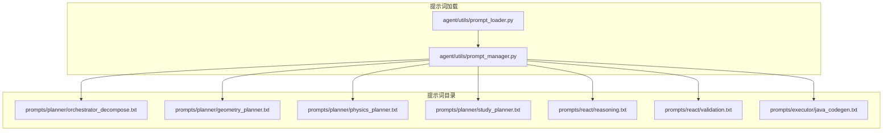

**图表来源**
- [prompt_loader.py:1-36](file://agent/utils/prompt_loader.py#L1-L36)
- [prompt_manager.py:43-120](file://agent/utils/prompt_manager.py#L43-L120)
- [orchestrator_decompose.txt:1-68](file://prompts/planner/orchestrator_decompose.txt#L1-L68)
- [geometry_planner.txt:1-72](file://prompts/planner/geometry_planner.txt#L1-L72)
- [physics_planner.txt:1-68](file://prompts/planner/physics_planner.txt#L1-L68)
- [study_planner.txt:1-31](file://prompts/planner/study_planner.txt#L1-L31)
- [reasoning.txt:1-62](file://prompts/react/reasoning.txt#L1-L62)
- [validation.txt:1-35](file://prompts/react/validation.txt#L1-L35)
- [java_codegen.txt:1-89](file://prompts/executor/java_codegen.txt#L1-L89)

**章节来源**
- [prompt_loader.py:1-36](file://agent/utils/prompt_loader.py#L1-L36)
- [prompt_manager.py:43-120](file://agent/utils/prompt_manager.py#L43-L120)

## 核心组件
- Planner 分解提示词：将用户输入解析为“步骤序列”，限定仅输出用户明确或隐含要求的步骤，严格遵循 COMSOL 建模顺序（几何→材料→物理场→研究），并可输出澄清问题。
- 几何规划提示词：将自然语言转为结构化几何 JSON，支持 2D/3D 形状与布尔运算、拉伸/旋转等操作，自动推断维度。
- 物理场规划提示词：将自然语言转为结构化物理场 JSON，支持多种物理场与边界/域/初始条件，以及多物理场耦合。
- 研究规划提示词：将自然语言转为研究配置 JSON，支持稳态、瞬态、特征值、频域等类型。
- ReAct 推理提示词：生成完整建模计划（task_type、required_steps、stop_after_step、parameters 等），并支持导入几何、创建选择集、导出结果、调用官方 Java API 等高级动作。
- ReAct 验证提示词：对建模计划进行顺序、参数、依赖与完整性校验，输出 valid、errors、warnings、suggestions。
- Java 代码生成提示词：依据结构化计划生成完整、可编译运行的 COMSOL Java API 代码，规范命名与调用顺序。

**章节来源**
- [orchestrator_decompose.txt:1-68](file://prompts/planner/orchestrator_decompose.txt#L1-L68)
- [geometry_planner.txt:1-72](file://prompts/planner/geometry_planner.txt#L1-L72)
- [physics_planner.txt:1-68](file://prompts/planner/physics_planner.txt#L1-L68)
- [study_planner.txt:1-31](file://prompts/planner/study_planner.txt#L1-L31)
- [reasoning.txt:1-62](file://prompts/react/reasoning.txt#L1-L62)
- [validation.txt:1-35](file://prompts/react/validation.txt#L1-L35)
- [java_codegen.txt:1-89](file://prompts/executor/java_codegen.txt#L1-L89)

## 架构总览
提示词系统围绕“输入→规划→执行”的闭环工作流组织，Planner 负责任务拆解与范围界定，React 负责生成与验证，Executor 将计划转化为可执行的 Java 代码。

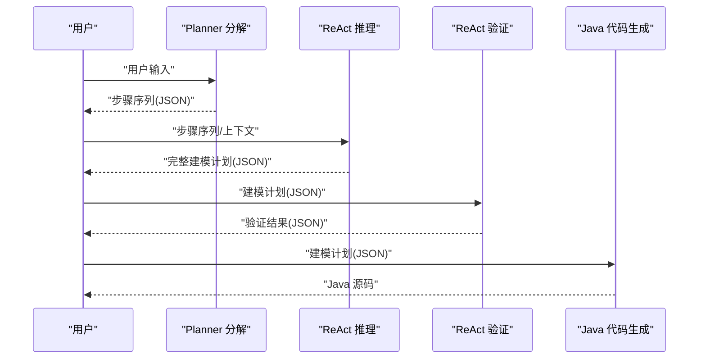

**图表来源**
- [orchestrator_decompose.txt:1-68](file://prompts/planner/orchestrator_decompose.txt#L1-L68)
- [reasoning.txt:1-62](file://prompts/react/reasoning.txt#L1-L62)
- [validation.txt:1-35](file://prompts/react/validation.txt#L1-L35)
- [java_codegen.txt:1-89](file://prompts/executor/java_codegen.txt#L1-L89)

## 详细组件分析

### Planner 分解提示词（编排与范围界定）
- 设计原理
  - 明确“完成范围”：仅输出用户明确或隐含要求的步骤，避免臆增材料/物理场/研究/求解。
  - 严格顺序：几何→材料→物理场→研究，不可打乱。
  - 可选澄清问题：当信息不足时，输出 1–3 条单选问题，选项 2–6 个。
- 应用场景
  - 用户仅需几何：输出 geometry 即止。
  - 几何+材料：输出 geometry, material。
  - 几何+物理场：输出 geometry, material, physics。
  - 几何+网格：通常输出 geometry, material, physics（网格在执行层处理）。
  - 完整流程：输出 geometry, material, physics, study。
- 参数化配置
  - 输入占位符：{user_input}
  - 输出结构：steps（含 step_index、agent_type、description、input_snippet）、plan_description、clarifying_questions（可选）。
- 动态生成机制
  - 通过 PromptManager/PromptLoader 加载模板，注入 {user_input} 后提交给 LLM。
- 优化要点
  - 强化“仅输出用户明确/隐含”的约束，减少歧义。
  - 对“仅/仅限/就…为止”等语义进行规则化提取，提升范围判定准确率。
  - 控制澄清问题数量与选项质量，避免过度引导。

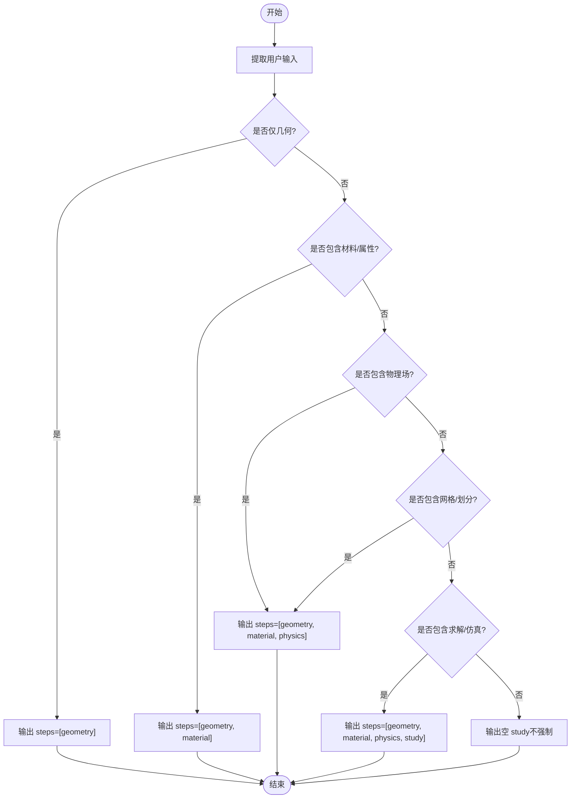

**图表来源**
- [orchestrator_decompose.txt:1-68](file://prompts/planner/orchestrator_decompose.txt#L1-L68)

**章节来源**
- [orchestrator_decompose.txt:1-68](file://prompts/planner/orchestrator_decompose.txt#L1-L68)

### 几何规划提示词（形状与布尔运算）
- 设计原理
  - 将自然语言描述映射为结构化几何 JSON，支持 2D/3D 形状与布尔运算、拉伸/旋转。
  - 自动推断维度：出现 3D/三维/立方体/圆柱/球/锥/圆环/拉伸/深度等关键词时 dimension=3。
  - 默认单位为米（m），未指定位置使用默认坐标。
- 参数化配置
  - 输入占位符：{user_input}
  - 输出结构：model_name、units、dimension、shapes（含 type、parameters、position、rotation、name）、operations（布尔/拉伸/旋转）。
- 动态生成机制
  - PromptManager 加载模板，注入 {user_input} 后提交给 LLM。
- 优化要点
  - 对“位置/旋转/参数”进行显式约束，避免模糊描述导致的几何偏差。
  - 在 operations 为空时保持数组为空，减少冗余。

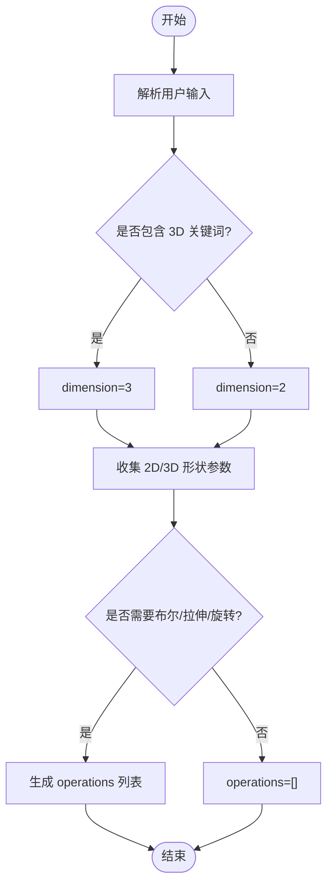

**图表来源**
- [geometry_planner.txt:1-72](file://prompts/planner/geometry_planner.txt#L1-L72)

**章节来源**
- [geometry_planner.txt:1-72](file://prompts/planner/geometry_planner.txt#L1-L72)

### 物理场规划提示词（多物理场与边界条件）
- 设计原理
  - 支持多种物理场类型（传热、电磁、结构、流体、声学、压电、化学、多体）。
  - 结构力学需明确杨氏模量与泊松比，否则求解会报错。
  - 支持边界条件、域条件、初始条件与多物理场耦合。
- 参数化配置
  - 输入占位符：{user_input}
  - 输出结构：fields（含 type、parameters、boundary_conditions、domain_conditions、initial_conditions）、couplings。
- 动态生成机制
  - PromptManager 加载模板，注入 {user_input} 后提交给 LLM。
- 优化要点
  - 对“结构力学”等强约束场景，增加必填参数提醒。
  - 对“热-结构耦合”等耦合场景，显式生成耦合定义。

```mermaid
flowchart TD
S3(["开始"]) --> A3["识别物理场类型"]
A3 --> B3{"是否为结构力学?"}
B3 --> |是| C3["要求 E 与 nu 参数"]
B3 --> |否| D3["继续"]
C3 --> E3["生成 fields 与边界条件"]
D3 --> E3
E3 --> F3{"是否存在多物理场耦合?"}
F3 --> |是| G3["生成 couplings"]
F3 --> |否| H3["couplings=[]"]
G3 --> Z3(["结束"])
H3 --> Z3
```

**图表来源**
- [physics_planner.txt:1-68](file://prompts/planner/physics_planner.txt#L1-L68)

**章节来源**
- [physics_planner.txt:1-68](file://prompts/planner/physics_planner.txt#L1-L68)

### 研究规划提示词（研究类型与求解设置）
- 设计原理
  - 支持稳态、瞬态、特征值、频域等研究类型。
  - 默认使用稳态，用户未明确指定时采用。
- 参数化配置
  - 输入占位符：{user_input}
  - 输出结构：studies（含 type、parameters，如 solver_settings）。
- 动态生成机制
  - PromptManager 加载模板，注入 {user_input} 后提交给 LLM。
- 优化要点
  - 对瞬态/频域等复杂研究类型，预置典型参数模板，降低用户输入负担。

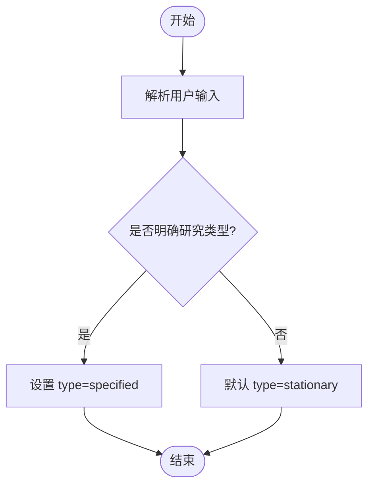

**图表来源**
- [study_planner.txt:1-31](file://prompts/planner/study_planner.txt#L1-L31)

**章节来源**
- [study_planner.txt:1-31](file://prompts/planner/study_planner.txt#L1-L31)

### ReAct 推理提示词（完整建模计划）
- 设计原理
  - 生成完整建模计划，包含 task_type、required_steps、stop_after_step、parameters 等。
  - 支持导入几何、创建选择集、导出结果、调用官方 Java API 等高级动作。
  - 对关键信息缺失时输出 clarifying_questions。
- 参数化配置
  - 输入占位符：{memory_context}、{user_input}
  - 输出结构：task_type、required_steps、stop_after_step、parameters（geometry_input、material_input、physics_input、mesh、study_input）、plan_description、clarifying_questions、case_library_suggestions。
- 动态生成机制
  - PromptManager 加载模板，注入 {memory_context} 与 {user_input} 后提交给 LLM。
- 优化要点
  - 明确“中断与保存”规则，确保 stop_after_step 与 required_steps 一致。
  - 对 call_official_api 的 method/wrapper_name/target_path 进行严格约束，避免越权或无效调用。

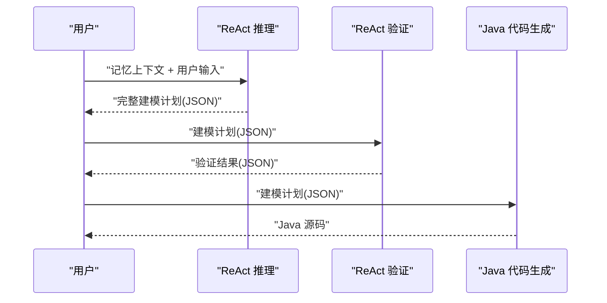

**图表来源**
- [reasoning.txt:1-62](file://prompts/react/reasoning.txt#L1-L62)
- [validation.txt:1-35](file://prompts/react/validation.txt#L1-L35)
- [java_codegen.txt:1-89](file://prompts/executor/java_codegen.txt#L1-L89)

**章节来源**
- [reasoning.txt:1-62](file://prompts/react/reasoning.txt#L1-L62)

### ReAct 验证提示词（合理性与完整性校验）
- 设计原理
  - 校验步骤顺序、参数完整性、步骤间依赖、是否遗漏必要步骤、3D 形状与维度匹配。
- 参数化配置
  - 输入占位符：{plan_json}
  - 输出结构：valid、errors、warnings、suggestions。
- 动态生成机制
  - PromptManager 加载模板，注入 {plan_json} 后提交给 LLM。
- 优化要点
  - 对“维度与形状一致性”进行强约束，避免 3D 形状 dimension=2 的错误。
  - 对关键参数缺失（如结构力学的 E/nu）给出明确错误提示。

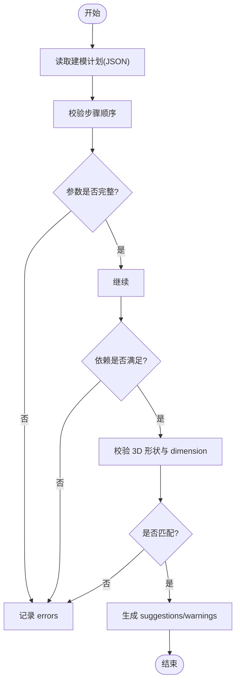

**图表来源**
- [validation.txt:1-35](file://prompts/react/validation.txt#L1-L35)

**章节来源**
- [validation.txt:1-35](file://prompts/react/validation.txt#L1-L35)

### Java 代码生成提示词（COMSOL Java API）
- 设计原理
  - 基于结构化计划生成完整、可编译运行的 COMSOL Java API 代码。
  - 规范命名与调用顺序：组件 comp1、几何 geom1、网格 mesh1、研究 std1、选择集 sel1 等。
  - 支持几何导入、网格、布尔运算、材料、物理场、研究、选择集、结果导出、保存等。
- 参数化配置
  - 输入占位符：{plan_json}
  - 输出要求：完整 Java 源码（含 import、主类、所有配置步骤、保存及异常处理）。
- 动态生成机制
  - PromptManager 加载模板，注入 {plan_json} 后提交给 LLM。
- 优化要点
  - 对“几何构建后调用 geom(...).run()；网格构建后调用 mesh(...).run()”进行强制约束。
  - 对导入几何、选择集、导出结果等关键步骤提供模板化参数设置。

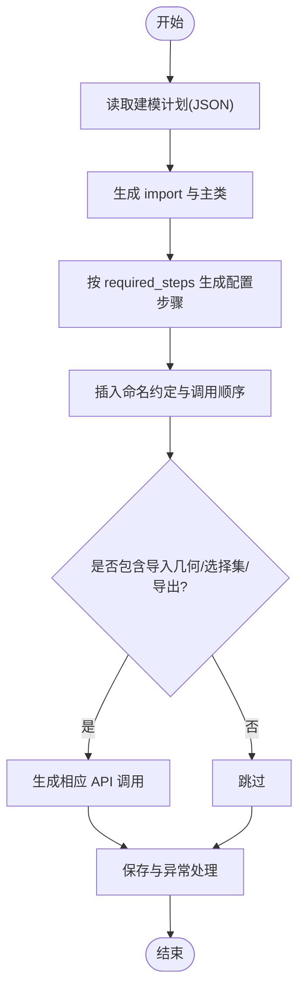

**图表来源**
- [java_codegen.txt:1-89](file://prompts/executor/java_codegen.txt#L1-L89)

**章节来源**
- [java_codegen.txt:1-89](file://prompts/executor/java_codegen.txt#L1-L89)

### 提示词动态生成与参数化配置
- PromptLoader/PromptManager
  - PromptLoader 作为兼容层，内部委托 PromptManager。
  - PromptManager 提供 load 与 format 接口，支持按 category/name 加载模板并注入 kwargs。
  - 缓存机制：内部维护 _cache，避免重复读取文件。
- 参数化配置
  - 所有模板均使用占位符（如 {user_input}、{memory_context}、{plan_json}）进行参数注入。
  - format 支持任意关键字参数，便于在不同阶段注入上下文。
- 最佳实践
  - 明确占位符清单，避免遗漏或多余占位符。
  - 对复杂模板分块设计，提升可读性与可维护性。
  - 在 format 前进行参数校验，确保关键字段非空。

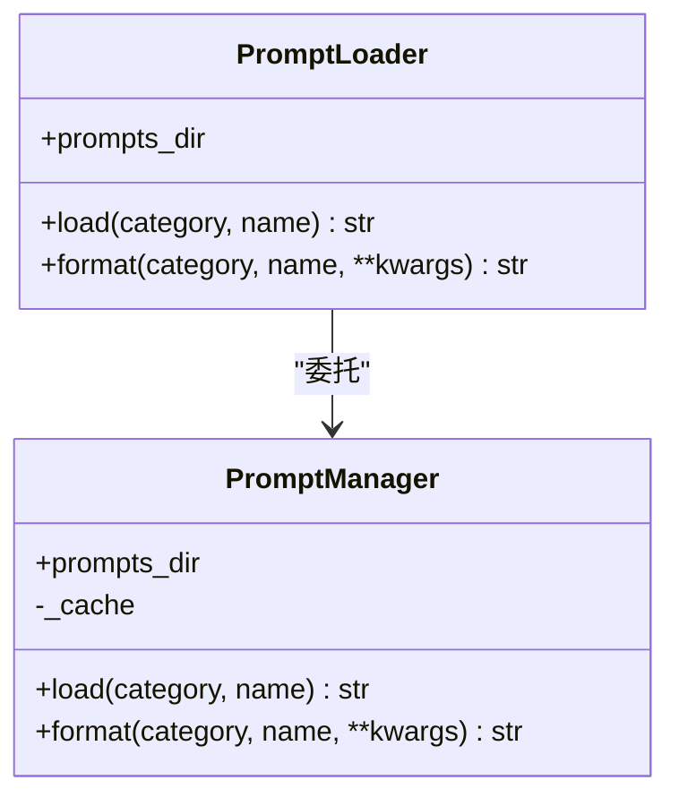

**图表来源**
- [prompt_loader.py:1-36](file://agent/utils/prompt_loader.py#L1-L36)
- [prompt_manager.py:43-120](file://agent/utils/prompt_manager.py#L43-L120)

**章节来源**
- [prompt_loader.py:1-36](file://agent/utils/prompt_loader.py#L1-L36)
- [prompt_manager.py:43-120](file://agent/utils/prompt_manager.py#L43-L120)

## 依赖分析
提示词系统依赖关系清晰：提示词模板通过 PromptManager/PromptLoader 加载，Planner/React/Executor 各自消费模板并注入上下文，形成“模板→格式化→LLM→结构化输出”的链路。

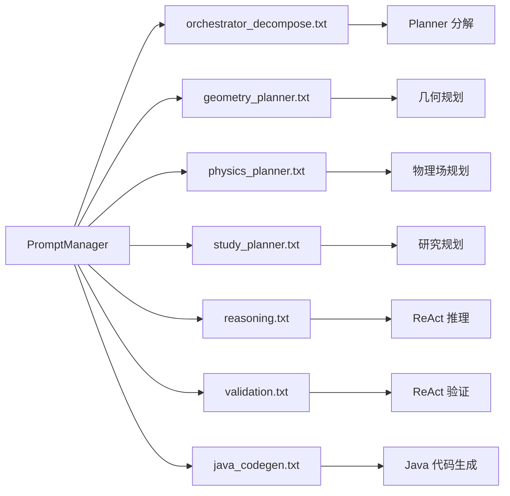

**图表来源**
- [prompt_manager.py:43-120](file://agent/utils/prompt_manager.py#L43-L120)
- [orchestrator_decompose.txt:1-68](file://prompts/planner/orchestrator_decompose.txt#L1-L68)
- [geometry_planner.txt:1-72](file://prompts/planner/geometry_planner.txt#L1-L72)
- [physics_planner.txt:1-68](file://prompts/planner/physics_planner.txt#L1-L68)
- [study_planner.txt:1-31](file://prompts/planner/study_planner.txt#L1-L31)
- [reasoning.txt:1-62](file://prompts/react/reasoning.txt#L1-L62)
- [validation.txt:1-35](file://prompts/react/validation.txt#L1-L35)
- [java_codegen.txt:1-89](file://prompts/executor/java_codegen.txt#L1-L89)

**章节来源**
- [prompt_manager.py:43-120](file://agent/utils/prompt_manager.py#L43-L120)

## 性能考虑
- 模板缓存：PromptManager 内部缓存已加载模板，减少 IO 开销。
- 占位符最小化：仅保留必要占位符，降低格式化成本。
- 输出结构化：通过 JSON 输出减少后处理开销，提高下游解析效率。
- 分阶段验证：ReAct 验证提前发现错误，避免无效执行链路。

## 故障排查指南
- Planner 分解范围过大/过小
  - 症状：输出步骤超出用户意图或遗漏关键步骤。
  - 排查：检查“完成范围”与“仅/仅限/就…为止”等语义提取规则。
- 几何维度不匹配
  - 症状：3D 形状 dimension=2。
  - 排查：确认关键词提取逻辑与 dimension 设置。
- 物理场参数缺失
  - 症状：结构力学求解报“未定义材料属性 nu”。
  - 排查：检查 physics_planner 的 E/nu 要求与 clarifying_questions。
- Java 代码生成异常
  - 症状：语法错误或 API 调用顺序不当。
  - 排查：核对 java_codegen 的命名约定与调用顺序约束。

**章节来源**
- [validation.txt:1-35](file://prompts/react/validation.txt#L1-L35)
- [physics_planner.txt:1-68](file://prompts/planner/physics_planner.txt#L1-L68)
- [java_codegen.txt:1-89](file://prompts/executor/java_codegen.txt#L1-L89)

## 结论
提示词系统通过 Planner、ReAct 与 Executor 的协同，实现了从自然语言到结构化计划再到可执行 Java 代码的完整闭环。其设计强调“仅输出用户明确/隐含”的约束、严格的步骤顺序与参数完整性校验，并通过 PromptManager 的动态加载与格式化能力，提供了良好的可扩展性与可维护性。建议在实际应用中结合业务场景持续迭代提示词模板与验证规则，以获得更稳定的建模体验。

## 附录
- 自定义提示词开发步骤
  - 明确目标域与输出结构，设计占位符清单。
  - 编写模板并进行小规模测试，逐步完善规则与示例。
  - 通过 PromptManager 加载与 format 注入参数，观察输出质量。
  - 引入 ReAct 验证，确保输出的合理性与完整性。
  - 对关键路径（如 Java 代码生成）进行回归测试，保证稳定性。