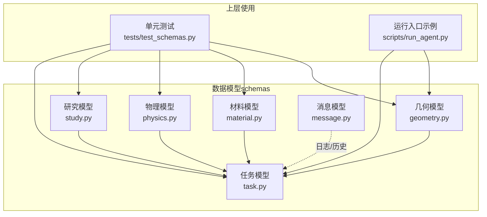
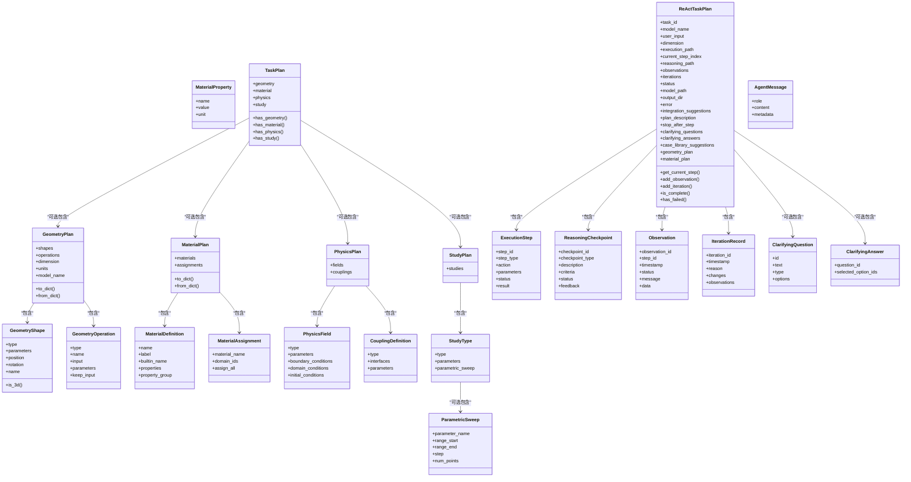
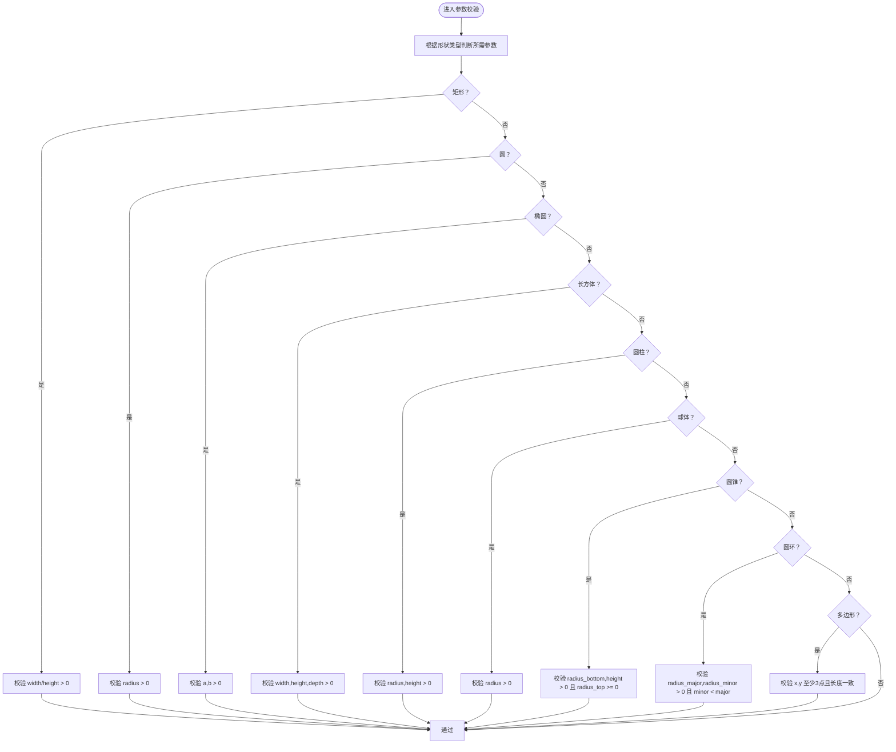
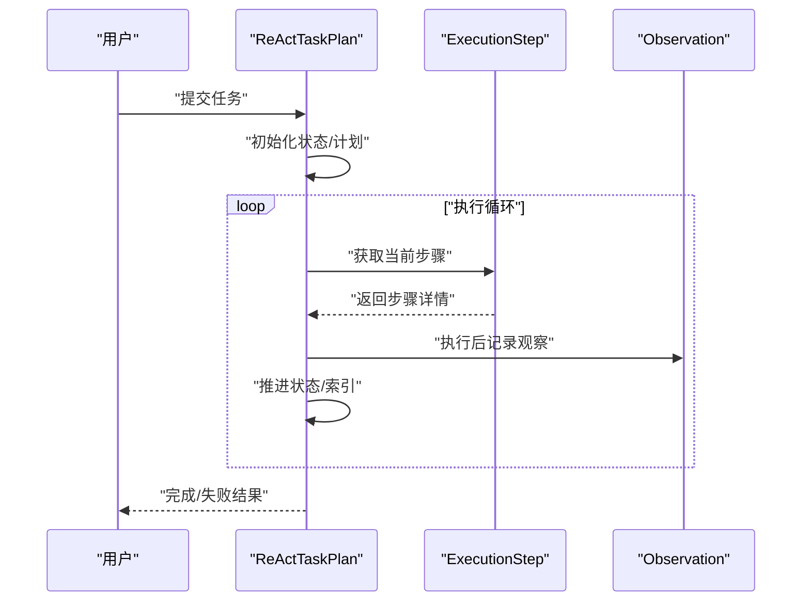
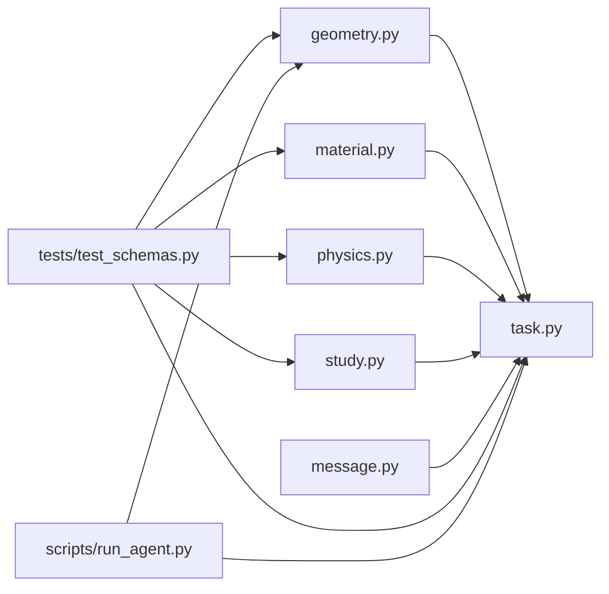

# 数据模型

<cite>
**本文引用的文件**
- [schemas/geometry.py](file://schemas/geometry.py)
- [schemas/material.py](file://schemas/material.py)
- [schemas/physics.py](file://schemas/physics.py)
- [schemas/study.py](file://schemas/study.py)
- [schemas/task.py](file://schemas/task.py)
- [schemas/message.py](file://schemas/message.py)
- [schemas/__init__.py](file://schemas/__init__.py)
- [tests/test_schemas.py](file://tests/test_schemas.py)
- [scripts/run_agent.py](file://scripts/run_agent.py)
</cite>

## 目录
1. [简介](#简介)
2. [项目结构](#项目结构)
3. [核心组件](#核心组件)
4. [架构总览](#架构总览)
5. [详细组件分析](#详细组件分析)
6. [依赖分析](#依赖分析)
7. [性能考虑](#性能考虑)
8. [故障排查指南](#故障排查指南)
9. [结论](#结论)
10. [附录](#附录)

## 简介
本文件系统性梳理 COMSOL Agent 的数据模型体系，覆盖几何、材料、物理场、研究与任务五大模型族，并说明它们之间的关系、消息传递格式与序列化机制、数据验证规则与约束、转换逻辑、使用示例、最佳实践与性能考量，以及扩展与定制指引。目标是帮助开发者与使用者在不深入源码的前提下，准确理解并正确使用数据模型。

## 项目结构
数据模型集中于 schemas 目录，采用“按领域分模块”的组织方式：
- 几何模型：定义二维/三维形状、布尔与成形操作、建模计划
- 材料模型：定义材料属性、材料定义与分配
- 物理模型：定义物理场、边界/域/初始条件、多物理场耦合
- 研究模型：定义研究类型、参数化扫描与研究计划
- 任务模型：定义执行步骤、推理检查点、观察结果、迭代记录、澄清问题与最终任务计划
- 消息模型：统一的历史消息结构，便于序列化与持久化

图表来源
- [schemas/geometry.py:1-200](file://schemas/geometry.py#L1-L200)
- [schemas/material.py:1-95](file://schemas/material.py#L1-L95)
- [schemas/physics.py:1-111](file://schemas/physics.py#L1-L111)
- [schemas/study.py:1-44](file://schemas/study.py#L1-L44)
- [schemas/task.py:1-192](file://schemas/task.py#L1-L192)
- [schemas/message.py:1-17](file://schemas/message.py#L1-L17)
- [tests/test_schemas.py:1-205](file://tests/test_schemas.py#L1-L205)
- [scripts/run_agent.py:1-76](file://scripts/run_agent.py#L1-L76)

章节来源
- [schemas/__init__.py:1-19](file://schemas/__init__.py#L1-L19)
- [schemas/geometry.py:1-200](file://schemas/geometry.py#L1-L200)
- [schemas/material.py:1-95](file://schemas/material.py#L1-L95)
- [schemas/physics.py:1-111](file://schemas/physics.py#L1-L111)
- [schemas/study.py:1-44](file://schemas/study.py#L1-L44)
- [schemas/task.py:1-192](file://schemas/task.py#L1-L192)
- [schemas/message.py:1-17](file://schemas/message.py#L1-L17)

## 核心组件
- 几何模型：形状、操作、维度与单位、建模计划
- 材料模型：属性、材料定义、分配策略
- 物理模型：物理场、边界/域/初始条件、多物理场耦合
- 研究模型：研究类型、参数化扫描、研究计划
- 任务模型：执行步骤、推理检查点、观察结果、迭代记录、澄清问题、任务计划
- 消息模型：统一的消息结构，便于序列化与持久化

章节来源
- [schemas/geometry.py:24-200](file://schemas/geometry.py#L24-L200)
- [schemas/material.py:25-95](file://schemas/material.py#L25-L95)
- [schemas/physics.py:56-111](file://schemas/physics.py#L56-L111)
- [schemas/study.py:21-44](file://schemas/study.py#L21-L44)
- [schemas/task.py:12-192](file://schemas/task.py#L12-L192)
- [schemas/message.py:8-17](file://schemas/message.py#L8-L17)

## 架构总览
数据模型之间存在清晰的组合关系：任务模型聚合几何、材料、物理场与研究计划；消息模型贯穿日志与历史记录；测试与运行入口展示了模型的序列化/反序列化与实际使用路径。

图表来源
- [schemas/geometry.py:24-200](file://schemas/geometry.py#L24-L200)
- [schemas/material.py:25-95](file://schemas/material.py#L25-L95)
- [schemas/physics.py:56-111](file://schemas/physics.py#L56-L111)
- [schemas/study.py:21-44](file://schemas/study.py#L21-L44)
- [schemas/task.py:94-192](file://schemas/task.py#L94-L192)
- [schemas/message.py:8-17](file://schemas/message.py#L8-L17)

## 详细组件分析

### 几何模型
- 形状类型：二维（rectangle/circle/ellipse/polygon）与三维（block/cylinder/sphere/cone/torus）
- 形状参数校验：针对不同形状强制要求特定参数并进行正数与数量校验
- 位置与旋转：支持二维默认坐标与三维可选旋转角
- 维度一致性：建模计划校验形状维度与设定维度的一致性
- 序列化：提供 to_dict/from_dict 以字典形式持久化/恢复

图表来源
- [schemas/geometry.py:45-112](file://schemas/geometry.py#L45-L112)

章节来源
- [schemas/geometry.py:24-200](file://schemas/geometry.py#L24-L200)
- [tests/test_schemas.py:18-51](file://tests/test_schemas.py#L18-L51)

### 材料模型
- 材料属性：名称、值（数值/表达式/数组）、单位
- 材料定义：标识名、显示名、内置库名（优先级高于自定义属性）、属性组
- 材料分配：将材料绑定到几何域，支持指定域列表或全选
- 序列化：to_dict/from_dict 用于持久化

章节来源
- [schemas/material.py:6-95](file://schemas/material.py#L6-L95)
- [tests/test_schemas.py:94-112](file://tests/test_schemas.py#L94-L112)

### 物理模型
- 物理场类型：热传导、电磁、结构、流体、声学、压电、化学、多体等
- 边界条件：名称、条件类型、选择（边界ID列表或全部）、参数
- 域条件：名称、条件类型、选择（域ID列表或全部）、参数
- 初始条件：变量名、初始值或表达式
- 多物理场耦合：类型、接口列表、参数
- 序列化：使用 Pydantic 默认 model_dump

章节来源
- [schemas/physics.py:6-111](file://schemas/physics.py#L6-L111)
- [tests/test_schemas.py:94-112](file://tests/test_schemas.py#L94-L112)

### 研究模型
- 研究类型：稳态、瞬态、特征值、频率、参数化
- 参数化扫描：参数名、起止值、步长或采样点数
- 研究计划：包含多个研究类型及其参数

章节来源
- [schemas/study.py:6-44](file://schemas/study.py#L6-L44)
- [tests/test_schemas.py:114-128](file://tests/test_schemas.py#L114-L128)

### 任务模型
- 执行步骤：步骤ID、类型（几何/材料/物理/网格/研究/求解/选择/几何IO/后处理）、动作、参数、状态、结果
- 推理检查点：检查点ID、类型（验证/验证/优化）、描述、标准、状态、反馈
- 观察结果：观察ID、关联步骤ID、时间戳、状态（成功/警告/错误）、消息、数据
- 迭代记录：迭代次数、时间、原因、变更、本次迭代观察
- 澄清问题：问题ID、文本、单选或多选、选项列表
- 回答：问题ID、选项ID列表
- 任务计划：可选包含几何/材料/物理/研究计划
- ReAct任务计划：任务ID、模型名、用户输入、维度、执行链路、推理链路、观察、迭代历史、状态、模型路径、输出目录、错误、集成建议、规划说明、停止点、澄清问题与回答、案例库建议、子计划动态属性

图表来源
- [schemas/task.py:115-192](file://schemas/task.py#L115-L192)

章节来源
- [schemas/task.py:12-192](file://schemas/task.py#L12-L192)
- [tests/test_schemas.py:130-205](file://tests/test_schemas.py#L130-L205)

### 消息模型
- 统一消息结构：角色（用户/助手/系统）、正文、可选元数据
- 用途：历史记录、持久化与日志

章节来源
- [schemas/message.py:8-17](file://schemas/message.py#L8-L17)

## 依赖分析
- 模块内聚：各模型模块职责单一，分别覆盖几何、材料、物理、研究、任务与消息
- 跨模块耦合：任务模型聚合四大模型；测试与运行入口演示了模型的使用路径
- 序列化与反序列化：几何与材料提供 to_dict/from_dict；其他模型使用 Pydantic 默认序列化

图表来源
- [schemas/geometry.py:1-200](file://schemas/geometry.py#L1-L200)
- [schemas/material.py:1-95](file://schemas/material.py#L1-L95)
- [schemas/physics.py:1-111](file://schemas/physics.py#L1-L111)
- [schemas/study.py:1-44](file://schemas/study.py#L1-L44)
- [schemas/task.py:1-192](file://schemas/task.py#L1-L192)
- [schemas/message.py:1-17](file://schemas/message.py#L1-L17)
- [tests/test_schemas.py:1-205](file://tests/test_schemas.py#L1-L205)
- [scripts/run_agent.py:1-76](file://scripts/run_agent.py#L1-L76)

章节来源
- [schemas/__init__.py:1-19](file://schemas/__init__.py#L1-L19)
- [schemas/geometry.py:1-200](file://schemas/geometry.py#L1-L200)
- [schemas/material.py:1-95](file://schemas/material.py#L1-L95)
- [schemas/physics.py:1-111](file://schemas/physics.py#L1-L111)
- [schemas/study.py:1-44](file://schemas/study.py#L1-L44)
- [schemas/task.py:1-192](file://schemas/task.py#L1-L192)
- [schemas/message.py:1-17](file://schemas/message.py#L1-L17)
- [tests/test_schemas.py:1-205](file://tests/test_schemas.py#L1-L205)
- [scripts/run_agent.py:1-76](file://scripts/run_agent.py#L1-L76)

## 性能考虑
- 序列化开销：几何与材料提供显式 to_dict/from_dict，避免深层嵌套模型的重复序列化；其他模型使用 Pydantic 默认序列化，简洁高效
- 校验成本：几何参数校验在构造阶段进行，提前暴露错误，减少下游执行失败概率
- 数据规模：任务模型中的执行步骤、观察与迭代记录可能随流程增长，建议按需持久化与清理
- 维度一致性：几何建模计划的维度校验可避免无效计算，提升执行效率

## 故障排查指南
- 几何参数缺失或非法：检查形状类型所需的参数是否齐全且满足正数/数量约束
- 维度不匹配：当包含三维形状时，确保建模计划维度设置为3
- 材料分配冲突：确认 domain_ids 与 assign_all 的组合逻辑，避免遗漏或重复分配
- 物理场边界/域选择：确保选择项为有效ID列表或“全部”，并提供必要参数
- 任务执行状态：通过 ExecutionStep.status 与 Observation.status 快速定位失败环节
- 序列化/反序列化：使用 to_dict/from_dict 或 model_dump/model_validate_json 验证数据完整性

章节来源
- [schemas/geometry.py:169-186](file://schemas/geometry.py#L169-L186)
- [schemas/material.py:64-71](file://schemas/material.py#L64-L71)
- [schemas/task.py:176-192](file://schemas/task.py#L176-L192)
- [tests/test_schemas.py:18-51](file://tests/test_schemas.py#L18-L51)
- [tests/test_schemas.py:54-92](file://tests/test_schemas.py#L54-L92)

## 结论
COMSOL Agent 的数据模型以 Pydantic 为基础，围绕几何、材料、物理场、研究与任务五大领域构建，具备明确的字段语义、严格的验证规则与完善的序列化机制。任务模型作为中枢，串联各领域计划，配合执行步骤、观察与迭代记录形成闭环。通过本文档，读者可以快速掌握模型定义、关系与使用方法，并据此进行扩展与定制。

## 附录

### 字段与业务规则摘要
- 几何
  - 形状类型与参数：见几何模型定义与校验逻辑
  - 维度与单位：建模计划包含 dimension 与 units
  - 维度一致性：禁止在二维计划中放置三维形状
- 材料
  - 属性：名称、值、单位
  - 定义：内置库名优先于自定义属性
  - 分配：支持指定域或全选
- 物理
  - 物理场类型枚举
  - 边界/域/初始条件：名称、类型、选择、参数
  - 耦合：类型、接口列表、参数
- 研究
  - 研究类型枚举
  - 参数化扫描：参数名、起止值、步长或采样点数
- 任务
  - 执行步骤：类型、动作、参数、状态
  - 推理检查点：类型、标准、状态
  - 观察结果：状态、消息、数据
  - 迭代记录：原因、变更、观察集合
  - 任务计划：可选包含四大计划
  - ReAct任务计划：执行/推理/观察/迭代链路与状态机

章节来源
- [schemas/geometry.py:24-200](file://schemas/geometry.py#L24-L200)
- [schemas/material.py:25-95](file://schemas/material.py#L25-L95)
- [schemas/physics.py:56-111](file://schemas/physics.py#L56-L111)
- [schemas/study.py:21-44](file://schemas/study.py#L21-L44)
- [schemas/task.py:94-192](file://schemas/task.py#L94-L192)

### 使用示例与最佳实践
- 示例路径
  - 几何序列化/反序列化：参见测试用例
    - [tests/test_schemas.py:54-92](file://tests/test_schemas.py#L54-L92)
  - 物理与研究序列化：参见测试用例
    - [tests/test_schemas.py:97-128](file://tests/test_schemas.py#L97-L128)
  - 任务执行步骤与 ReAct 计划：参见测试用例
    - [tests/test_schemas.py:133-205](file://tests/test_schemas.py#L133-L205)
  - 运行入口示例：参见脚本
    - [scripts/run_agent.py:50-63](file://scripts/run_agent.py#L50-L63)
- 最佳实践
  - 在构造阶段即进行参数校验，尽早发现错误
  - 使用 to_dict/from_dict 对几何与材料进行显式序列化
  - 为每个执行步骤设置清晰的 step_id 与 action，便于追踪
  - 通过 Observation 与 IterationRecord 记录关键节点，支撑迭代优化
  - 在 ReAct 任务计划中合理设置 stop_after_step，控制流程长度

章节来源
- [tests/test_schemas.py:1-205](file://tests/test_schemas.py#L1-L205)
- [scripts/run_agent.py:1-76](file://scripts/run_agent.py#L1-L76)

### 扩展与定制指南
- 新增几何形状
  - 在形状类型集合中添加新类型
  - 在参数校验中增加对应分支与约束
  - 如涉及三维，确保建模计划维度校验逻辑覆盖
- 新增物理场类型
  - 在物理场类型枚举中添加新类型
  - 根据需要扩展边界/域/初始条件参数
- 新增研究类型
  - 在研究类型枚举中添加新类型
  - 为新类型设计必要的参数与参数化扫描支持
- 新增执行步骤类型
  - 在执行步骤类型枚举中添加新类型
  - 明确动作与参数约定，补充序列化/反序列化逻辑
- 自定义序列化
  - 对于复杂模型，可仿照几何/材料提供 to_dict/from_dict
  - 对于简单模型，使用 Pydantic 默认序列化即可

章节来源
- [schemas/geometry.py:13-21](file://schemas/geometry.py#L13-L21)
- [schemas/physics.py:6-9](file://schemas/physics.py#L6-L9)
- [schemas/study.py:6-8](file://schemas/study.py#L6-L8)
- [schemas/task.py:16-26](file://schemas/task.py#L16-L26)