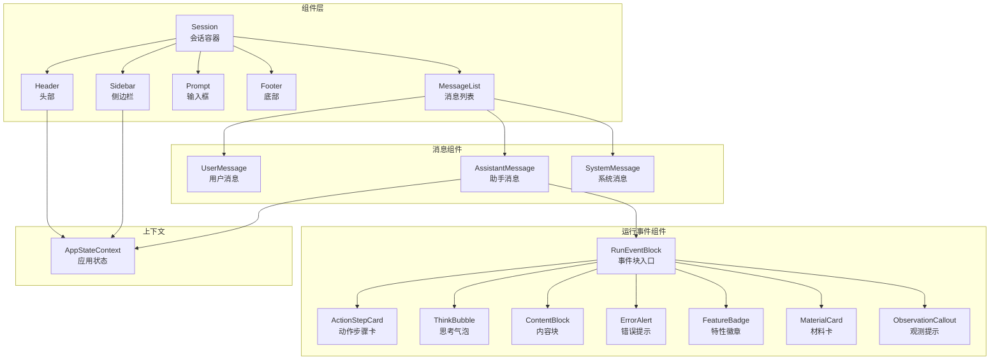
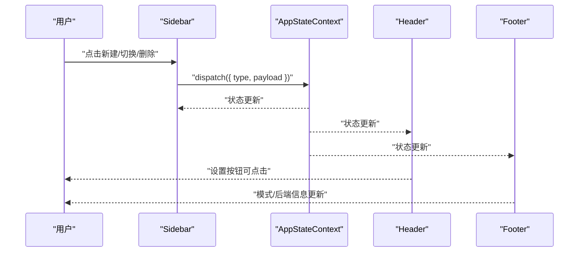
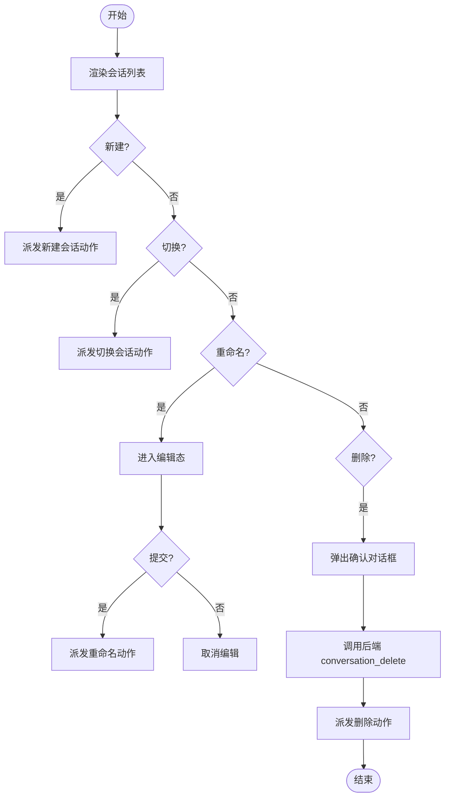
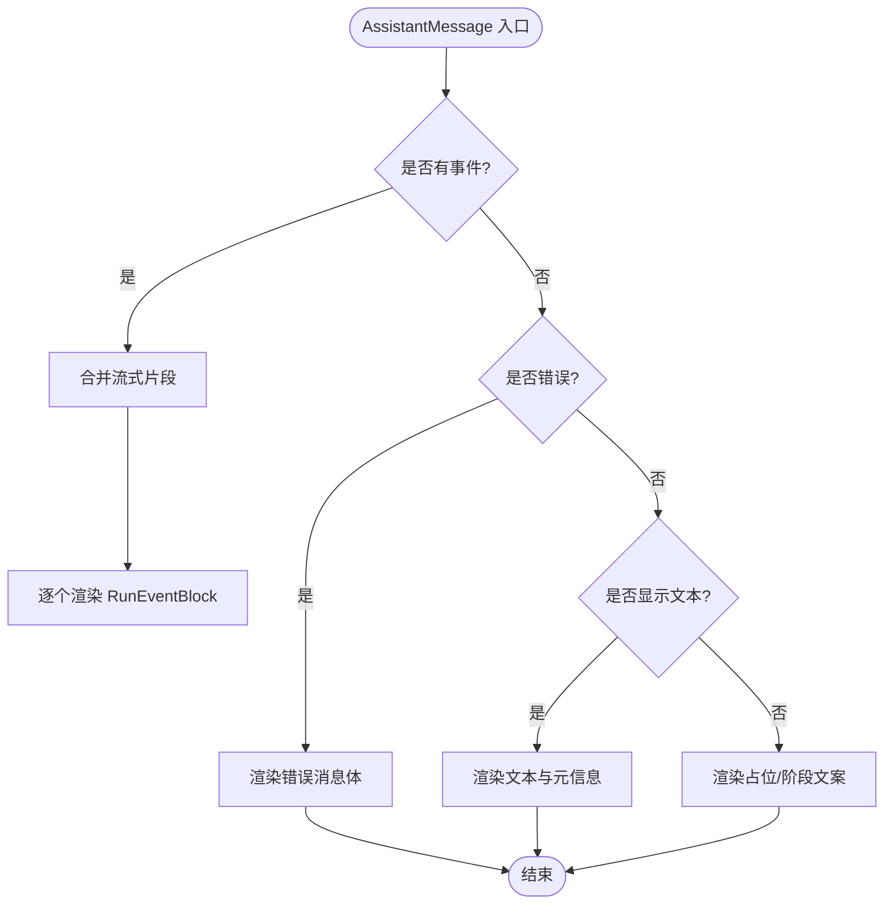
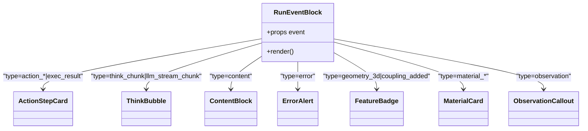
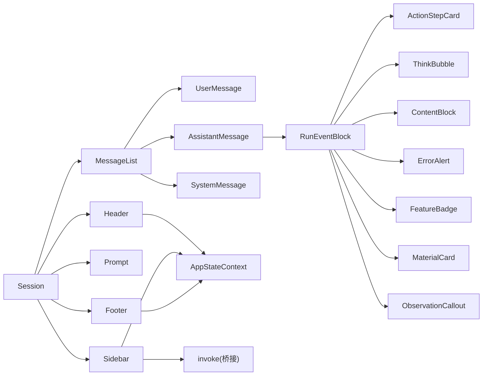

# 前端组件系统

<cite>
**本文引用的文件**
- [desktop/src/components/Header.tsx](file://desktop/src/components/Header.tsx)
- [desktop/src/components/Footer.tsx](file://desktop/src/components/Footer.tsx)
- [desktop/src/components/Sidebar.tsx](file://desktop/src/components/Sidebar.tsx)
- [desktop/src/components/Session.tsx](file://desktop/src/components/Session.tsx)
- [desktop/src/components/UserMessage.tsx](file://desktop/src/components/UserMessage.tsx)
- [desktop/src/components/AssistantMessage.tsx](file://desktop/src/components/AssistantMessage.tsx)
- [desktop/src/components/SystemMessage.tsx](file://desktop/src/components/SystemMessage.tsx)
- [desktop/src/components/run-events/index.tsx](file://desktop/src/components/run-events/index.tsx)
- [desktop/src/components/run-events/ActionStepCard.tsx](file://desktop/src/components/run-events/ActionStepCard.tsx)
- [desktop/src/components/run-events/ThinkBubble.tsx](file://desktop/src/components/run-events/ThinkBubble.tsx)
- [desktop/src/components/run-events/ContentBlock.tsx](file://desktop/src/components/run-events/ContentBlock.tsx)
- [desktop/src/components/run-events/ErrorAlert.tsx](file://desktop/src/components/run-events/ErrorAlert.tsx)
- [desktop/src/components/run-events/FeatureBadge.tsx](file://desktop/src/components/run-events/FeatureBadge.tsx)
- [desktop/src/components/run-events/MaterialCard.tsx](file://desktop/src/components/run-events/MaterialCard.tsx)
- [desktop/src/components/run-events/ObservationCallout.tsx](file://desktop/src/components/run-events/ObservationCallout.tsx)
- [desktop/src/context/AppStateContext.tsx](file://desktop/src/context/AppStateContext.tsx)
- [desktop/src/lib/types.ts](file://desktop/src/lib/types.ts)
</cite>

## 目录
1. [简介](#简介)
2. [项目结构](#项目结构)
3. [核心组件](#核心组件)
4. [架构总览](#架构总览)
5. [详细组件分析](#详细组件分析)
6. [依赖关系分析](#依赖关系分析)
7. [性能考量](#性能考量)
8. [故障排查指南](#故障排查指南)
9. [结论](#结论)
10. [附录](#附录)

## 简介
本文件面向COMSOL Agent桌面应用的前端组件系统，聚焦于基于React的组件架构设计与实现。文档围绕以下主题展开：
- 主要布局组件：Header、Footer、Sidebar、Session 的职责与协作方式
- 消息组件系统：UserMessage、AssistantMessage、SystemMessage 的渲染与交互
- 运行事件组件：RunEventBlock 及其子组件（ActionStepCard、ThinkBubble 等）如何可视化AI执行过程
- 组件间通信机制、props传递与状态管理
- 使用示例、样式定制与响应式设计建议

## 项目结构
前端位于 desktop/src，采用按功能域分层组织：
- components：页面级与业务组件（Header、Footer、Sidebar、Session、消息组件、运行事件组件）
- context：全局状态上下文（AppStateContext）
- lib：类型定义与通用库（types.ts）
- hooks：Tauri桥接钩子（useBridge）

图表来源
- [desktop/src/components/Session.tsx:6-17](file://desktop/src/components/Session.tsx#L6-L17)
- [desktop/src/components/Header.tsx:3-23](file://desktop/src/components/Header.tsx#L3-L23)
- [desktop/src/components/Footer.tsx:3-20](file://desktop/src/components/Footer.tsx#L3-L20)
- [desktop/src/components/Sidebar.tsx:18-174](file://desktop/src/components/Sidebar.tsx#L18-L174)
- [desktop/src/components/UserMessage.tsx:3-25](file://desktop/src/components/UserMessage.tsx#L3-L25)
- [desktop/src/components/AssistantMessage.tsx:82-142](file://desktop/src/components/AssistantMessage.tsx#L82-L142)
- [desktop/src/components/SystemMessage.tsx:3-6](file://desktop/src/components/SystemMessage.tsx#L3-L6)
- [desktop/src/components/run-events/index.tsx:14-49](file://desktop/src/components/run-events/index.tsx#L14-L49)
- [desktop/src/context/AppStateContext.tsx](file://desktop/src/context/AppStateContext.tsx)

章节来源
- [desktop/src/components/Session.tsx:6-17](file://desktop/src/components/Session.tsx#L6-L17)
- [desktop/src/components/Header.tsx:3-23](file://desktop/src/components/Header.tsx#L3-L23)
- [desktop/src/components/Footer.tsx:3-20](file://desktop/src/components/Footer.tsx#L3-L20)
- [desktop/src/components/Sidebar.tsx:18-174](file://desktop/src/components/Sidebar.tsx#L18-L174)
- [desktop/src/context/AppStateContext.tsx](file://desktop/src/context/AppStateContext.tsx)

## 核心组件
本节概述关键组件的职责与交互要点。

- Header
  - 展示当前会话标题与消息数量，并提供设置弹窗触发入口
  - 通过 AppStateContext 获取会话标题与消息数，派发设置对话框显示的动作
- Footer
  - 显示模式（Plan/Build）与后端标识
  - 基于 AppStateContext 的状态动态更新
- Sidebar
  - 列出历史会话，支持新建、切换、重命名、删除
  - 支持侧栏折叠状态持久化；删除会话时先调用后端接口，再更新本地状态
- Session
  - 组合 Header、MessageList、Prompt、Footer，形成会话主界面布局

章节来源
- [desktop/src/components/Header.tsx:3-23](file://desktop/src/components/Header.tsx#L3-L23)
- [desktop/src/components/Footer.tsx:3-20](file://desktop/src/components/Footer.tsx#L3-L20)
- [desktop/src/components/Sidebar.tsx:18-174](file://desktop/src/components/Sidebar.tsx#L18-L174)
- [desktop/src/components/Session.tsx:6-17](file://desktop/src/components/Session.tsx#L6-L17)

## 架构总览
组件间通信以AppStateContext为中心，通过dispatch统一派发动作，驱动状态变更与UI更新。Sidebar负责会话生命周期管理，Header/Foot负责信息展示，Session作为布局容器，消息组件负责对话内容渲染，运行事件组件负责AI执行过程的可视化。

图表来源
- [desktop/src/components/Sidebar.tsx:64-77](file://desktop/src/components/Sidebar.tsx#L64-L77)
- [desktop/src/context/AppStateContext.tsx](file://desktop/src/context/AppStateContext.tsx)
- [desktop/src/components/Header.tsx:11-19](file://desktop/src/components/Header.tsx#L11-L19)
- [desktop/src/components/Footer.tsx:6-16](file://desktop/src/components/Footer.tsx#L6-L16)

## 详细组件分析

### 布局组件
- Session
  - 负责组合Header、MessageList、Prompt、Footer，形成主布局
  - 适合在App.tsx中作为根容器使用
- Header
  - 读取会话标题与消息长度，提供设置按钮
  - 点击设置按钮派发动作以打开设置对话框
- Footer
  - 动态显示模式（Plan/Build）与后端名称
  - 用于向用户反馈当前工作模式与后端状态

章节来源
- [desktop/src/components/Session.tsx:6-17](file://desktop/src/components/Session.tsx#L6-L17)
- [desktop/src/components/Header.tsx:3-23](file://desktop/src/components/Header.tsx#L3-L23)
- [desktop/src/components/Footer.tsx:3-20](file://desktop/src/components/Footer.tsx#L3-L20)

### 侧边栏组件（Sidebar）
- 功能
  - 列出历史会话，支持新建、切换、重命名、删除
  - 折叠/展开控制，折叠状态持久化至localStorage
  - 删除会话时弹出确认对话框，调用后端接口后再更新本地状态
- 关键交互
  - 新建：派发新建会话动作
  - 切换：派发切换会话动作
  - 重命名：进入编辑态，失焦或回车提交
  - 删除：弹出确认，调用后端conversation_delete，随后派发删除动作
- 状态与存储
  - 通过AppStateContext读取当前会话ID与会话列表
  - 折叠状态本地持久化

图表来源
- [desktop/src/components/Sidebar.tsx:41-77](file://desktop/src/components/Sidebar.tsx#L41-L77)

章节来源
- [desktop/src/components/Sidebar.tsx:18-174](file://desktop/src/components/Sidebar.tsx#L18-L174)

### 消息组件系统
- UserMessage
  - 渲染用户消息文本，若提供onEditResend回调，则显示“编辑并重新建模”按钮
  - 适合在用户点击后将消息文本回填至Prompt并触发建模
- AssistantMessage
  - 根据消息是否包含事件、是否错误、是否当前忙碌等条件决定渲染策略
  - 若存在事件，合并流式片段为完整文本后逐个渲染为RunEventBlock
  - 提供打开模型目录与预览operations.md的能力
  - 显示时间戳与模型路径提取能力
- SystemMessage
  - 渲染系统消息，根据成功/失败状态切换样式类名

图表来源
- [desktop/src/components/AssistantMessage.tsx:82-142](file://desktop/src/components/AssistantMessage.tsx#L82-L142)

章节来源
- [desktop/src/components/UserMessage.tsx:3-25](file://desktop/src/components/UserMessage.tsx#L3-L25)
- [desktop/src/components/AssistantMessage.tsx:82-142](file://desktop/src/components/AssistantMessage.tsx#L82-L142)
- [desktop/src/components/SystemMessage.tsx:3-6](file://desktop/src/components/SystemMessage.tsx#L3-L6)

### 运行事件组件系统
- RunEventBlock（入口）
  - 根据事件类型映射到具体展示组件：计划卡片、阶段标签、思考气泡、动作步骤卡、步骤节点、材料卡、特性徽章、观测提示、错误告警、内容块等
  - 未知类型降级为回退块，输出事件类型与部分原始数据
- ActionStepCard
  - 展示动作开始/结束与执行结果，区分成功/失败状态
  - 从事件数据中抽取UI细节与目标对象
- ThinkBubble
  - 展示思考流（llm_stream_chunk/think_chunk），支持阶段标注与纯文本流式内容
- ContentBlock
  - 展示纯文本内容块
- ErrorAlert
  - 展示错误信息，带图标与文本
- FeatureBadge
  - 展示几何特征与多物理场耦合等特性
- MaterialCard
  - 展示材料添加开始与结束，结束时列出材料清单
- ObservationCallout
  - 展示观测信息，支持info/warning/error三种状态

图表来源
- [desktop/src/components/run-events/index.tsx:14-49](file://desktop/src/components/run-events/index.tsx#L14-L49)
- [desktop/src/components/run-events/ActionStepCard.tsx:9-63](file://desktop/src/components/run-events/ActionStepCard.tsx#L9-L63)
- [desktop/src/components/run-events/ThinkBubble.tsx:4-36](file://desktop/src/components/run-events/ThinkBubble.tsx#L4-L36)
- [desktop/src/components/run-events/ContentBlock.tsx:3-7](file://desktop/src/components/run-events/ContentBlock.tsx#L3-L7)
- [desktop/src/components/run-events/ErrorAlert.tsx:3-13](file://desktop/src/components/run-events/ErrorAlert.tsx#L3-L13)
- [desktop/src/components/run-events/FeatureBadge.tsx:3-18](file://desktop/src/components/run-events/FeatureBadge.tsx#L3-L18)
- [desktop/src/components/run-events/MaterialCard.tsx:3-33](file://desktop/src/components/run-events/MaterialCard.tsx#L3-L33)
- [desktop/src/components/run-events/ObservationCallout.tsx:3-24](file://desktop/src/components/run-events/ObservationCallout.tsx#L3-L24)

章节来源
- [desktop/src/components/run-events/index.tsx:14-61](file://desktop/src/components/run-events/index.tsx#L14-L61)
- [desktop/src/components/run-events/ActionStepCard.tsx:9-63](file://desktop/src/components/run-events/ActionStepCard.tsx#L9-L63)
- [desktop/src/components/run-events/ThinkBubble.tsx:4-36](file://desktop/src/components/run-events/ThinkBubble.tsx#L4-L36)
- [desktop/src/components/run-events/ContentBlock.tsx:3-7](file://desktop/src/components/run-events/ContentBlock.tsx#L3-L7)
- [desktop/src/components/run-events/ErrorAlert.tsx:3-13](file://desktop/src/components/run-events/ErrorAlert.tsx#L3-L13)
- [desktop/src/components/run-events/FeatureBadge.tsx:3-18](file://desktop/src/components/run-events/FeatureBadge.tsx#L3-L18)
- [desktop/src/components/run-events/MaterialCard.tsx:3-33](file://desktop/src/components/run-events/MaterialCard.tsx#L3-L33)
- [desktop/src/components/run-events/ObservationCallout.tsx:3-24](file://desktop/src/components/run-events/ObservationCallout.tsx#L3-L24)

## 依赖关系分析
- 组件依赖
  - Session依赖Header、MessageList、Prompt、Footer
  - MessageList依赖UserMessage、AssistantMessage、SystemMessage
  - AssistantMessage依赖RunEventBlock及其子组件
  - Header、Sidebar、Footer均依赖AppStateContext
  - Sidebar通过invoke调用后端桥接接口
- 类型与上下文
  - 所有消息与事件类型由lib/types.ts定义
  - AppStateContext提供全局状态与动作派发

图表来源
- [desktop/src/components/Session.tsx:6-17](file://desktop/src/components/Session.tsx#L6-L17)
- [desktop/src/components/Header.tsx:1-4](file://desktop/src/components/Header.tsx#L1-L4)
- [desktop/src/components/Footer.tsx:1-4](file://desktop/src/components/Footer.tsx#L1-L4)
- [desktop/src/components/Sidebar.tsx:1-4](file://desktop/src/components/Sidebar.tsx#L1-L4)
- [desktop/src/components/AssistantMessage.tsx:1-5](file://desktop/src/components/AssistantMessage.tsx#L1-L5)
- [desktop/src/components/run-events/index.tsx:1-12](file://desktop/src/components/run-events/index.tsx#L1-L12)
- [desktop/src/context/AppStateContext.tsx](file://desktop/src/context/AppStateContext.tsx)
- [desktop/src/lib/types.ts](file://desktop/src/lib/types.ts)

章节来源
- [desktop/src/components/Session.tsx:6-17](file://desktop/src/components/Session.tsx#L6-L17)
- [desktop/src/components/Header.tsx:1-4](file://desktop/src/components/Header.tsx#L1-L4)
- [desktop/src/components/Footer.tsx:1-4](file://desktop/src/components/Footer.tsx#L1-L4)
- [desktop/src/components/Sidebar.tsx:1-4](file://desktop/src/components/Sidebar.tsx#L1-L4)
- [desktop/src/components/AssistantMessage.tsx:1-5](file://desktop/src/components/AssistantMessage.tsx#L1-L5)
- [desktop/src/components/run-events/index.tsx:1-12](file://desktop/src/components/run-events/index.tsx#L1-L12)
- [desktop/src/context/AppStateContext.tsx](file://desktop/src/context/AppStateContext.tsx)
- [desktop/src/lib/types.ts](file://desktop/src/lib/types.ts)

## 性能考量
- 事件合并与渲染
  - AssistantMessage对llm_stream_chunk进行合并，减少渲染节点数量，提升滚动与渲染性能
- 本地持久化
  - Sidebar折叠状态本地缓存，避免每次重载初始化计算
- 按需渲染
  - RunEventBlock仅在事件类型匹配时渲染对应子组件，降低分支开销
- 大量事件的优化建议
  - 对超长事件列表可考虑虚拟化（例如使用react-window或类似方案）以限制DOM节点数量
  - 将不可见区域的组件卸载或懒加载，减少内存占用

## 故障排查指南
- 设置按钮无响应
  - 检查AppStateContext中的dispatch是否正确接入；确认Header中派发的动作类型是否存在reducer分支
- 侧边栏删除无效
  - 确认后端桥接接口是否可用；检查confirmDelete中invoke返回值与异常捕获逻辑
- 事件不显示或显示异常
  - 检查RunEventBlock的事件类型映射；对于未知类型，确认回退块是否正常输出
- 模型路径无法打开
  - AssistantMessage中openInFolder与openPreviewMd的桥接调用是否成功；失败时应提示复制路径到剪贴板

章节来源
- [desktop/src/components/Header.tsx:11-19](file://desktop/src/components/Header.tsx#L11-L19)
- [desktop/src/components/Sidebar.tsx:64-77](file://desktop/src/components/Sidebar.tsx#L64-L77)
- [desktop/src/components/run-events/index.tsx:46-61](file://desktop/src/components/run-events/index.tsx#L46-L61)
- [desktop/src/components/AssistantMessage.tsx:65-80](file://desktop/src/components/AssistantMessage.tsx#L65-L80)

## 结论
COMSOL Agent前端组件系统以Session为核心布局，结合Header/Footer/Sidebar提供完整的会话管理与信息展示；消息组件与运行事件组件共同呈现AI的思考与执行过程。通过AppStateContext集中管理状态与动作，组件间职责清晰、耦合度低，具备良好的扩展性与可维护性。建议在大量事件场景下引入虚拟化与懒加载策略，进一步优化性能表现。

## 附录
- 组件使用示例（路径指引）
  - 在App.tsx中渲染Session作为根组件
  - 在需要设置入口处，调用Header中派发的动作以打开设置对话框
  - 在消息列表中渲染UserMessage、AssistantMessage、SystemMessage
  - 在AssistantMessage中传入事件数组，由RunEventBlock自动选择渲染组件
- 样式定制与响应式设计
  - 建议为各组件容器定义统一的间距与字体规范，确保在不同分辨率下的可读性
  - 为Sidebar折叠状态提供过渡动画，改善用户体验
  - 为事件组件提供主题色系（成功/警告/错误），增强信息层级
- 类型与上下文
  - 所有消息与事件类型定义参考lib/types.ts
  - 全局状态与动作派发参考AppStateContext