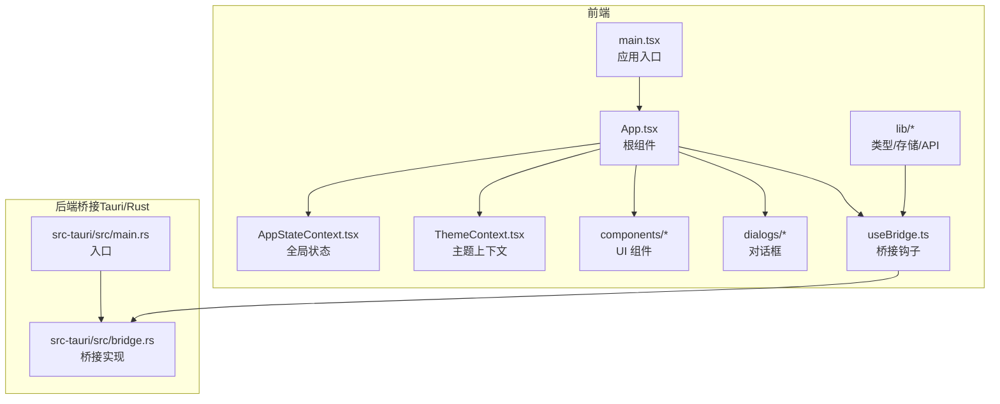
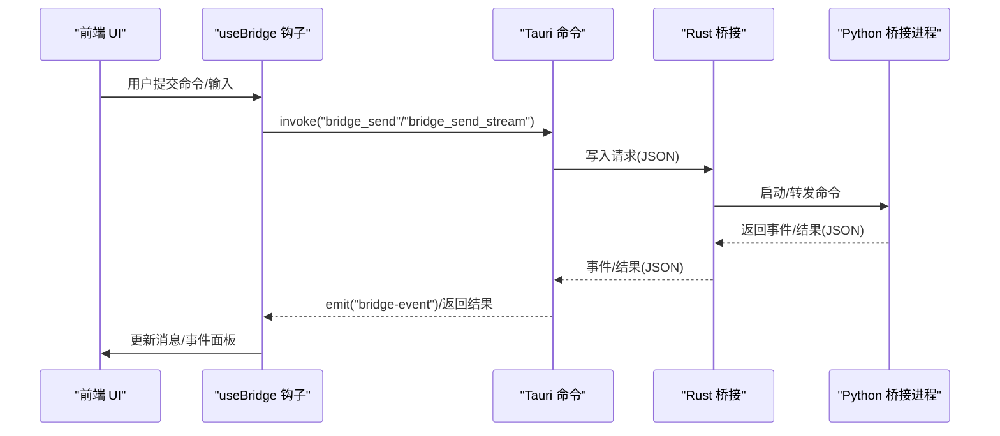
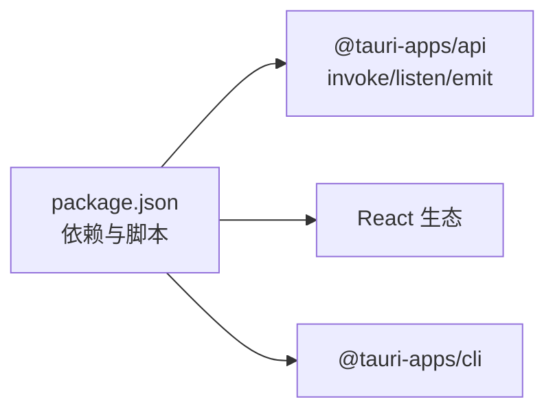

# 桌面应用

<cite>
**本文引用的文件**
- [desktop/src/main.tsx](file://desktop/src/main.tsx)
- [desktop/src/App.tsx](file://desktop/src/App.tsx)
- [desktop/src/context/AppStateContext.tsx](file://desktop/src/context/AppStateContext.tsx)
- [desktop/src/context/ThemeContext.tsx](file://desktop/src/context/ThemeContext.tsx)
- [desktop/src/hooks/useBridge.ts](file://desktop/src/hooks/useBridge.ts)
- [desktop/src/lib/api.ts](file://desktop/src/lib/api.ts)
- [desktop/src/lib/types.ts](file://desktop/src/lib/types.ts)
- [desktop/src/lib/conversationStorage.ts](file://desktop/src/lib/conversationStorage.ts)
- [desktop/src/components/Sidebar.tsx](file://desktop/src/components/Sidebar.tsx)
- [desktop/src/components/Session.tsx](file://desktop/src/components/Session.tsx)
- [desktop/src/components/dialogs/DialogOverlay.tsx](file://desktop/src/components/dialogs/DialogOverlay.tsx)
- [desktop/src-tauri/src/main.rs](file://desktop/src-tauri/src/main.rs)
- [desktop/src-tauri/src/bridge.rs](file://desktop/src-tauri/src/bridge.rs)
- [desktop/package.json](file://desktop/package.json)
</cite>

## 目录
1. [简介](#简介)
2. [项目结构](#项目结构)
3. [核心组件](#核心组件)
4. [架构总览](#架构总览)
5. [详细组件分析](#详细组件分析)
6. [依赖关系分析](#依赖关系分析)
7. [性能考量](#性能考量)
8. [故障排查指南](#故障排查指南)
9. [结论](#结论)
10. [附录](#附录)

## 简介
本文件为 COMSOL Agent 桌面应用的技术文档，聚焦于基于 Tauri + React + TypeScript 的桌面应用架构。文档从系统架构、前端组件体系、状态管理、后端桥接机制、事件系统、对话管理与主题切换等方面进行深入解析，并提供 UI 组件功能说明、交互流程与使用指南，帮助开发者快速理解与扩展应用。

## 项目结构
桌面应用位于 desktop 目录，采用前后端分离的组织方式：
- 前端（React + TypeScript）：位于 desktop/src，负责 UI、状态管理、对话框、主题与桥接调用。
- 后端桥接（Rust + Tauri）：位于 desktop/src-tauri，负责与 Python 桥接进程通信、事件派发、系统操作等。
- 构建与脚本：位于 desktop/scripts，以及 package.json 中的脚本命令。

图表来源
- [desktop/src/main.tsx:1-19](file://desktop/src/main.tsx#L1-L19)
- [desktop/src/App.tsx:1-100](file://desktop/src/App.tsx#L1-L100)
- [desktop/src/context/AppStateContext.tsx:1-389](file://desktop/src/context/AppStateContext.tsx#L1-L389)
- [desktop/src/context/ThemeContext.tsx:1-150](file://desktop/src/context/ThemeContext.tsx#L1-L150)
- [desktop/src/hooks/useBridge.ts:1-190](file://desktop/src/hooks/useBridge.ts#L1-L190)
- [desktop/src-tauri/src/main.rs:1-6](file://desktop/src-tauri/src/main.rs#L1-L6)
- [desktop/src-tauri/src/bridge.rs:1-640](file://desktop/src-tauri/src/bridge.rs#L1-L640)

章节来源
- [desktop/src/main.tsx:1-19](file://desktop/src/main.tsx#L1-L19)
- [desktop/src/App.tsx:1-100](file://desktop/src/App.tsx#L1-L100)
- [desktop/src-tauri/src/main.rs:1-6](file://desktop/src-tauri/src/main.rs#L1-L6)

## 核心组件
- 应用入口与根组件
  - 入口文件负责初始化主题、挂载 React 根节点，并包裹应用的 Provider 层。
  - 根组件负责渲染标题栏、侧边栏、主会话区、对话框覆盖层，并监听 Bridge 初始化状态与错误提示。
- 全局状态与对话框
  - 全局状态通过 useAppState 提供，包含会话列表、当前会话、消息列表、运行模式、后端配置、对话框状态等。
  - 对话框通过 DialogOverlay 统一处理遮罩与关闭逻辑，按 activeDialog 渲染具体对话框。
- 主题系统
  - ThemeContext 提供浅色/深色/系统三种模式与强调色预设，持久化到 localStorage，并响应系统主题变化。
- 桥接钩子
  - useBridge 封装了命令发送、流式事件监听、中断控制与斜杠命令路由，统一处理消息追加、事件拼接与最终化。
- 类型与存储
  - types.ts 定义消息、事件、对话框类型、快捷提示与 COMSOL 操作等核心类型。
  - conversationStorage.ts 提供会话与消息的本地持久化读写。

章节来源
- [desktop/src/main.tsx:1-19](file://desktop/src/main.tsx#L1-L19)
- [desktop/src/App.tsx:1-100](file://desktop/src/App.tsx#L1-L100)
- [desktop/src/context/AppStateContext.tsx:1-389](file://desktop/src/context/AppStateContext.tsx#L1-L389)
- [desktop/src/context/ThemeContext.tsx:1-150](file://desktop/src/context/ThemeContext.tsx#L1-L150)
- [desktop/src/hooks/useBridge.ts:1-190](file://desktop/src/hooks/useBridge.ts#L1-L190)
- [desktop/src/lib/types.ts:1-213](file://desktop/src/lib/types.ts#L1-L213)
- [desktop/src/lib/conversationStorage.ts:1-59](file://desktop/src/lib/conversationStorage.ts#L1-L59)

## 架构总览
应用采用“前端 React + 后端 Tauri/Rust”的双层架构：
- 前端通过 @tauri-apps/api 的 invoke 与 emit 接口与后端通信。
- 后端桥接进程负责启动 Python 桥接、读取握手信号、转发命令、解析 JSON 响应、派发流式事件、处理中断与重启。
- 前端通过 useBridge 监听 bridge-event 事件，实时更新消息与事件面板。

图表来源
- [desktop/src/hooks/useBridge.ts:1-190](file://desktop/src/hooks/useBridge.ts#L1-L190)
- [desktop/src-tauri/src/bridge.rs:352-528](file://desktop/src-tauri/src/bridge.rs#L352-L528)

章节来源
- [desktop/src/hooks/useBridge.ts:1-190](file://desktop/src/hooks/useBridge.ts#L1-L190)
- [desktop/src-tauri/src/bridge.rs:1-640](file://desktop/src-tauri/src/bridge.rs#L1-L640)

## 详细组件分析

### 应用入口与根组件
- 入口文件初始化主题，创建 React 根节点，按序包裹 AppStateProvider 与 ThemeProvider，再渲染 App。
- 根组件负责：
  - 监听 Escape 键关闭当前对话框；
  - 调用后端 apply_window_icon；
  - 拉取 bridge_init_status 并展示错误横幅；
  - 渲染标题栏、侧边栏、主会话区与对话框覆盖层。

章节来源
- [desktop/src/main.tsx:1-19](file://desktop/src/main.tsx#L1-L19)
- [desktop/src/App.tsx:1-100](file://desktop/src/App.tsx#L1-L100)

### 全局状态管理（AppStateContext）
- 状态结构
  - conversations：会话列表
  - currentConversationId：当前会话 ID
  - messagesByConversation：按会话分组的消息数组
  - mode：运行模式（run/plan）
  - backend：LLM 后端名称
  - outputDefault：默认输出文件名
  - execCodeOnly：是否仅执行代码
  - busyConversationId：正在执行的会话 ID
  - editingDraft：编辑草稿
  - activeDialog：当前激活的对话框类型
  - pendingPlanQuestions：计划模式下待澄清问题
  - lastPlanInput：上次用于生成 Plan 的输入
- 动作类型
  - NEW_CONVERSATION、SWITCH_CONVERSATION、SET_CONVERSATION_TITLE、DELETE_CONVERSATION
  - ADD_MESSAGE、APPEND_EVENT、FINALIZE_LAST
  - SET_MODE、SET_BACKEND、SET_OUTPUT、SET_EXEC_CODE_ONLY
  - SET_BUSY_CONVERSATION、SET_EDITING_DRAFT
  - REMOVE_MESSAGES_FROM_INDEX、SET_DIALOG、SET_PLAN_QUESTIONS、CLEAR_PLAN_QUESTIONS、SET_LAST_PLAN_INPUT、HYDRATE
- 数据持久化
  - 会话列表、消息分组、当前会话 ID 在状态变更时写入 localStorage。

章节来源
- [desktop/src/context/AppStateContext.tsx:1-389](file://desktop/src/context/AppStateContext.tsx#L1-L389)
- [desktop/src/lib/conversationStorage.ts:1-59](file://desktop/src/lib/conversationStorage.ts#L1-L59)

### 主题系统（ThemeContext）
- 支持的主题模式：light、dark、system
- 强调色预设与持久化存储键
- 初始化与系统主题监听：首次渲染时根据系统偏好设置 data-theme，系统主题变化时动态更新
- 提供 setThemeMode 与 setAccentColor 方法

章节来源
- [desktop/src/context/ThemeContext.tsx:1-150](file://desktop/src/context/ThemeContext.tsx#L1-L150)

### 桥接钩子（useBridge）
- 命令发送
  - sendCommand：一次性命令，成功后追加 assistant 消息
  - sendStreamCommand：流式命令，先追加空 assistant 消息，监听 bridge-event 事件增量更新，最后 finalize
- 中断控制
  - abortRun：向后端发送 bridge_abort，清理状态并提示已取消
- 斜杠命令路由
  - /run、/plan、/help、/ops、/api、/backend、/context、/exec、/output、/demo、/doctor、/exit
- 会话标题与模式
  - 首次用户输入时自动设置会话标题
  - 根据 mode 决定 plan/run 分支

章节来源
- [desktop/src/hooks/useBridge.ts:1-190](file://desktop/src/hooks/useBridge.ts#L1-L190)

### 对话框系统
- DialogOverlay
  - 统一的遮罩层，点击背景关闭
- 具体对话框
  - HelpDialog、BackendDialog、ContextDialog、ExecDialog、OutputDialog、SettingsDialog、ComsolOpsDialog、ApiBrowserDialog、PlanQuestionsDialog
- 根组件根据 state.activeDialog 渲染对应对话框

章节来源
- [desktop/src/components/dialogs/DialogOverlay.tsx:1-19](file://desktop/src/components/dialogs/DialogOverlay.tsx#L1-L19)
- [desktop/src/App.tsx:52-75](file://desktop/src/App.tsx#L52-L75)

### 侧边栏与会话管理
- 侧边栏
  - 切换折叠状态并持久化
  - 新建会话、重命名、删除会话（含确认对话框）
  - 删除会话时尝试调用后端 conversation_delete，失败也删除本地
- 会话布局
  - Session 组合 Header、MessageList、Prompt、Footer

章节来源
- [desktop/src/components/Sidebar.tsx:1-175](file://desktop/src/components/Sidebar.tsx#L1-L175)
- [desktop/src/components/Session.tsx:1-18](file://desktop/src/components/Session.tsx#L1-L18)

### 类型与 API
- 类型定义
  - ChatMessage、RunEvent、DialogType、Conversation、BridgeResponse、MyComsolModel、SlashCommandItem、QuickPromptGroup、ClarifyingQuestion/Answer、ComsolOp
- API 封装
  - listOfficialApis：封装后端 list_apis 命令，支持查询、分页参数

章节来源
- [desktop/src/lib/types.ts:1-213](file://desktop/src/lib/types.ts#L1-L213)
- [desktop/src/lib/api.ts:1-33](file://desktop/src/lib/api.ts#L1-L33)

### 后端桥接（Tauri/Rust）
- 进程启动与握手
  - init_bridge：查找项目根或打包资源中的 bridge 可执行文件，启动子进程，读取 _ready 握手信号
  - spawn_bridge_child：优先使用项目根目录的 Python 虚拟环境，否则回退到打包的 bridge 可执行文件
- 命令处理
  - bridge_send：写入 JSON 请求，读取一行 JSON 响应
  - bridge_send_stream：持续读取事件行（_event=true），直到遇到非事件响应
  - bridge_abort：终止子进程并重启桥接
  - bridge_init_status：返回 ready 与错误信息
- 事件派发
  - 流式事件通过 app.emit("bridge-event", payload) 发送到前端

章节来源
- [desktop/src-tauri/src/bridge.rs:184-328](file://desktop/src-tauri/src/bridge.rs#L184-L328)
- [desktop/src-tauri/src/bridge.rs:352-528](file://desktop/src-tauri/src/bridge.rs#L352-L528)
- [desktop/src-tauri/src/bridge.rs:555-564](file://desktop/src-tauri/src/bridge.rs#L555-L564)

## 依赖关系分析
- 前端依赖
  - @tauri-apps/api：与后端通信（invoke、listen、emit）
  - @tauri-apps/plugin-dialog：系统对话框能力
  - React 生态：React、React-DOM
- 构建与脚本
  - Vite、TypeScript、@tauri-apps/cli
  - 打包脚本 bundle：构建桥接、下载 JDK、调用 tauri build

图表来源
- [desktop/package.json:1-28](file://desktop/package.json#L1-L28)

章节来源
- [desktop/package.json:1-28](file://desktop/package.json#L1-L28)

## 性能考量
- 本地持久化
  - 会话与消息写入 localStorage，避免频繁网络请求；注意 localStorage 大小限制与序列化开销。
- 流式事件
  - 使用流式命令时，前端按事件增量更新，减少一次性大对象渲染压力。
- 主题与样式
  - 通过 data-theme 与 CSS 变量切换，避免重复重绘。
- 桥接重启
  - 子进程异常时自动重启，保证可用性，但需关注重启成本与日志截断策略。

## 故障排查指南
- Bridge 未就绪
  - 根组件会在 bridge_init_status 返回 error 时展示错误横幅，建议从项目根目录启动或开启调试日志查看临时目录日志。
- 桥接握手失败/超时
  - Rust 侧会在指定时间内等待 _ready 握手信号，失败时返回错误信息与最近 stderr 截图。
- 流式事件中断
  - 若子进程退出或 IO 异常，Rust 侧会标记流式状态并重启桥接；前端需确保事件监听在 finally 中清理。
- 对话框关闭
  - Esc 键与遮罩点击均可关闭当前对话框；确认删除等危险操作需二次确认。

章节来源
- [desktop/src/App.tsx:80-87](file://desktop/src/App.tsx#L80-L87)
- [desktop/src-tauri/src/bridge.rs:200-224](file://desktop/src-tauri/src/bridge.rs#L200-L224)
- [desktop/src/hooks/useBridge.ts:78-92](file://desktop/src/hooks/useBridge.ts#L78-L92)

## 结论
本应用以清晰的分层架构实现了桌面端与 Python 桥接的稳定通信，前端通过 React + TypeScript 提供良好的交互体验，后端通过 Tauri/Rust 实现跨平台与高性能的进程管理与事件派发。全局状态与主题系统增强了可维护性与用户体验。后续可在对话框扩展、事件可视化与性能优化方面进一步完善。

## 附录
- 组件使用指南（示例路径）
  - 新建会话：dispatch({ type: "NEW_CONVERSATION" })
  - 切换会话：dispatch({ type: "SWITCH_CONVERSATION", id })
  - 设置后端：dispatch({ type: "SET_BACKEND", backend })
  - 打开对话框：dispatch({ type: "SET_DIALOG", dialog: "help" | "backend" | ... })
  - 发送命令：useBridge().sendCommand("plan"/"run", payload)
  - 流式命令：useBridge().sendStreamCommand("run", payload)
  - 中断执行：useBridge().abortRun()