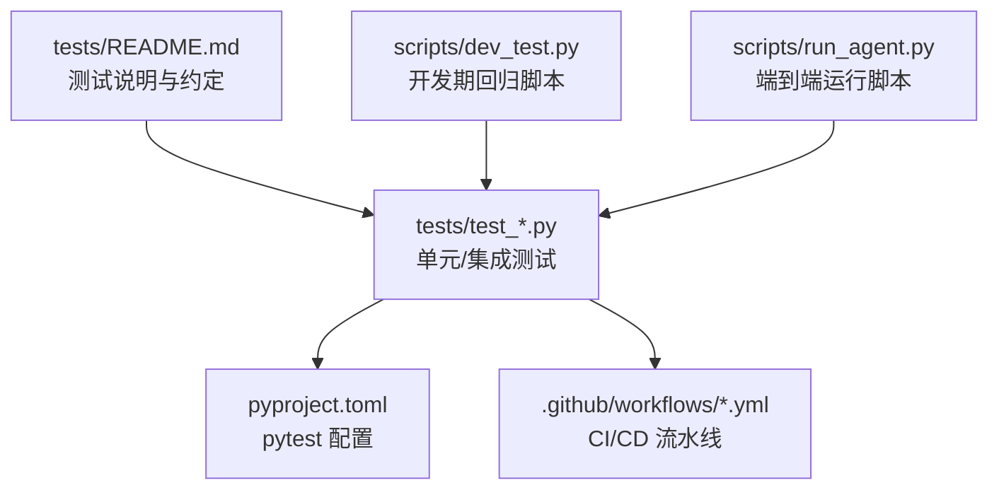
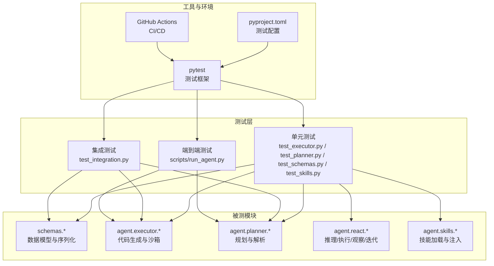
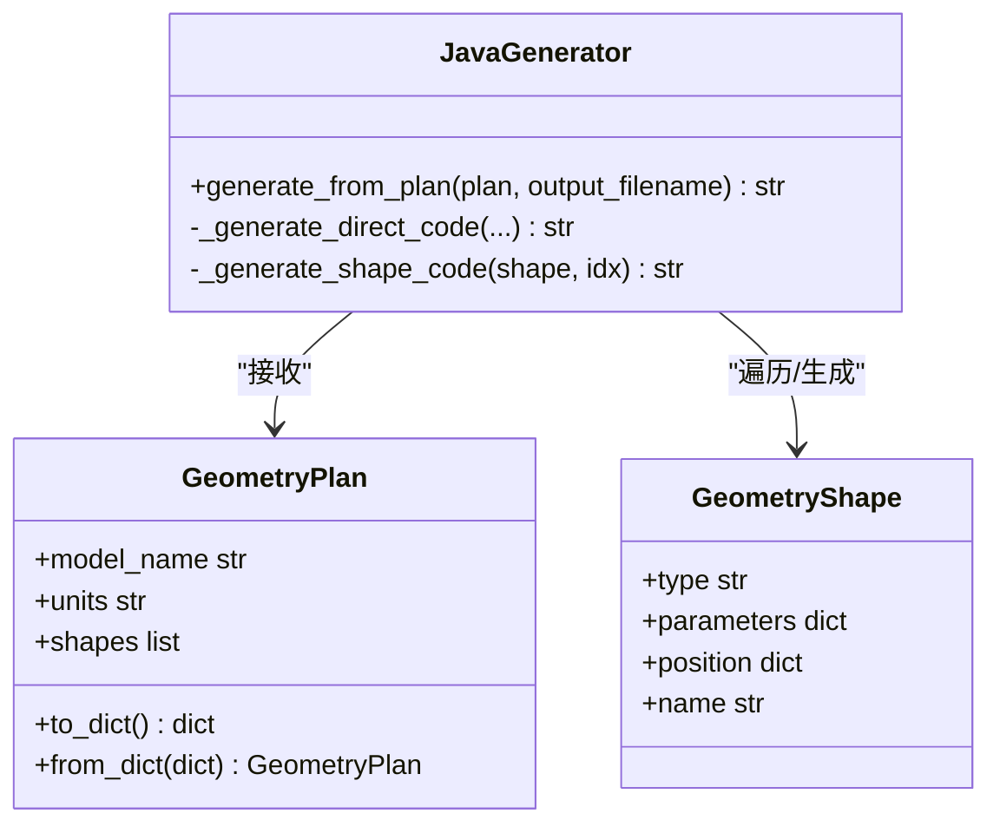
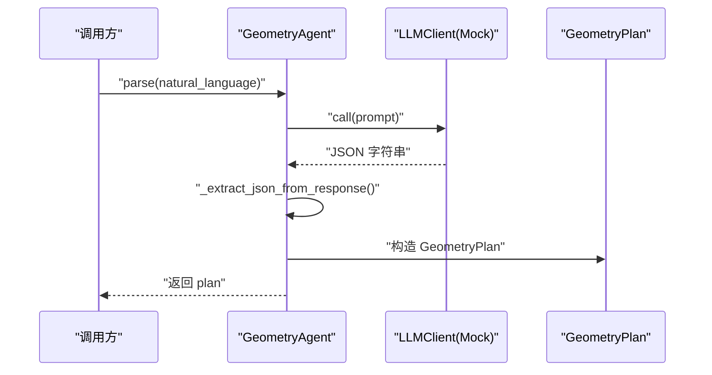
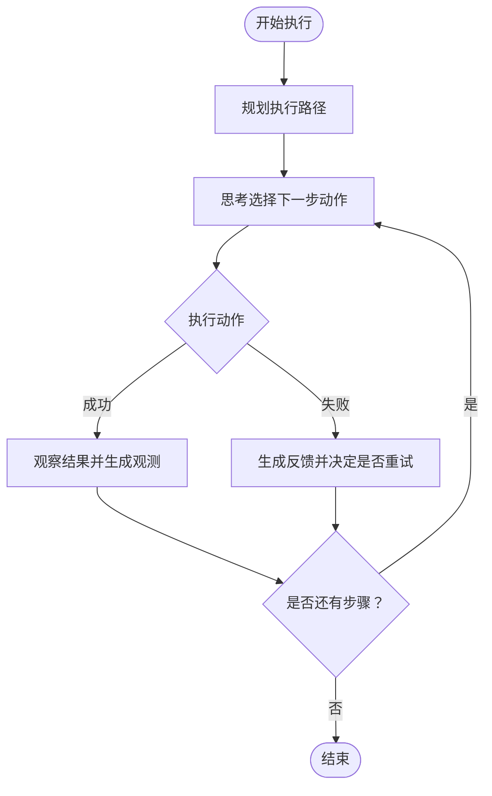
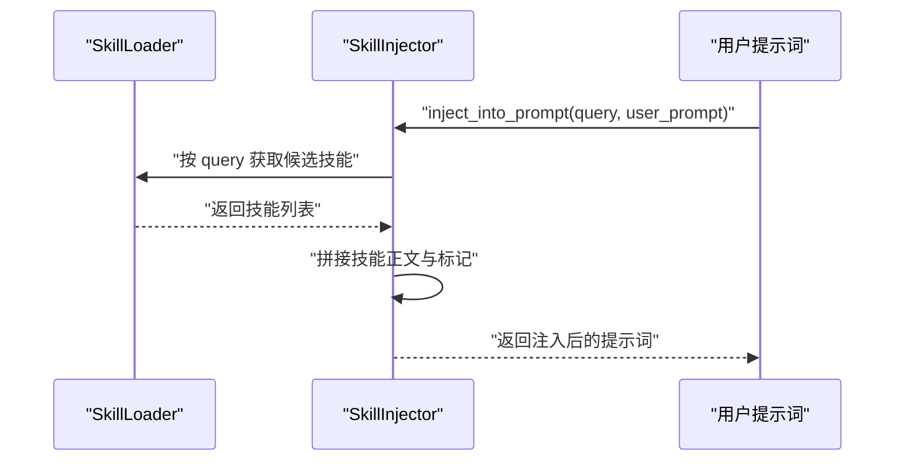
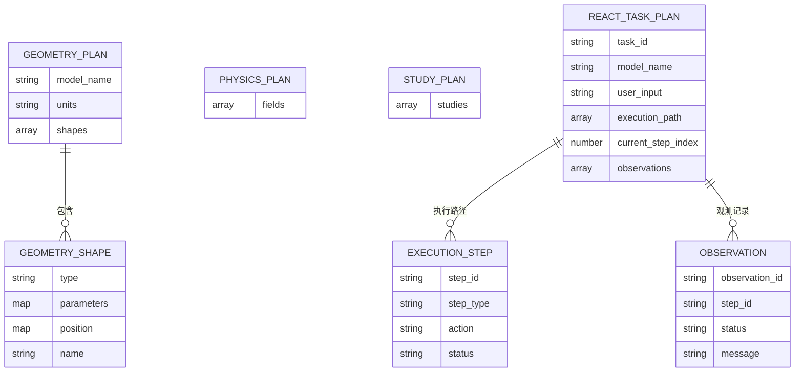
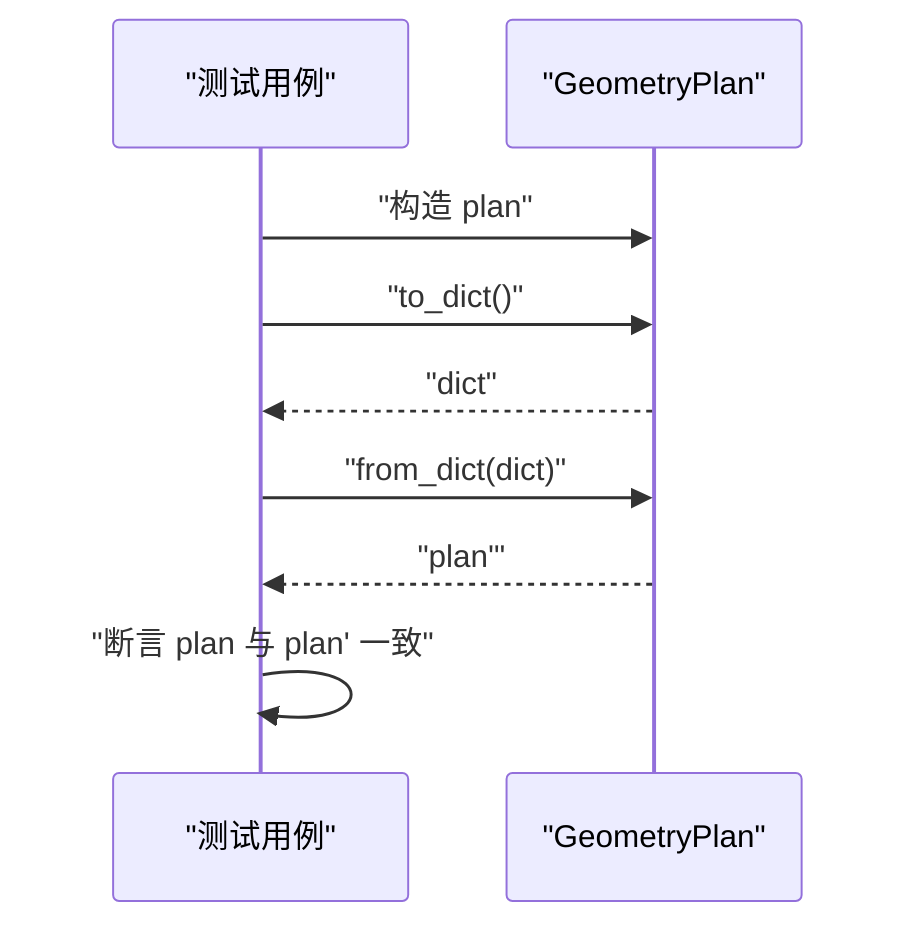
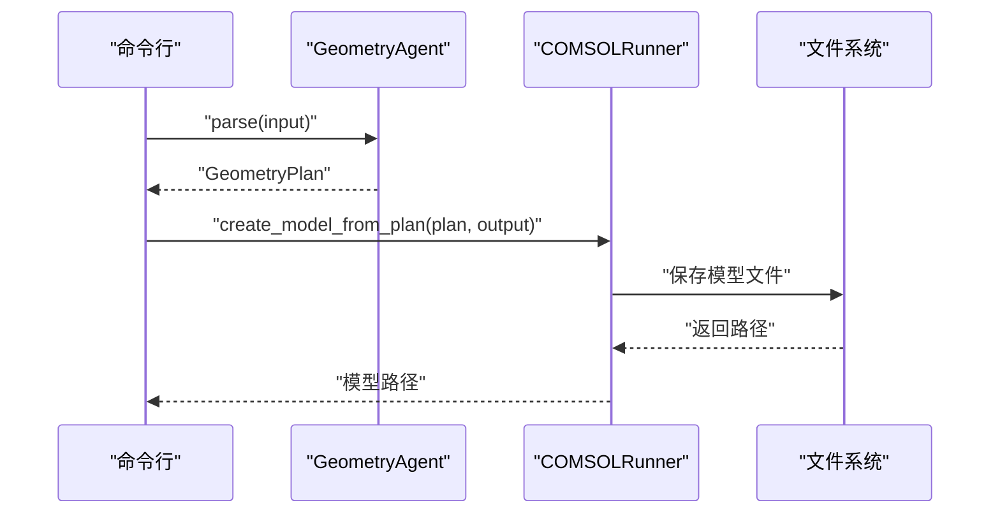
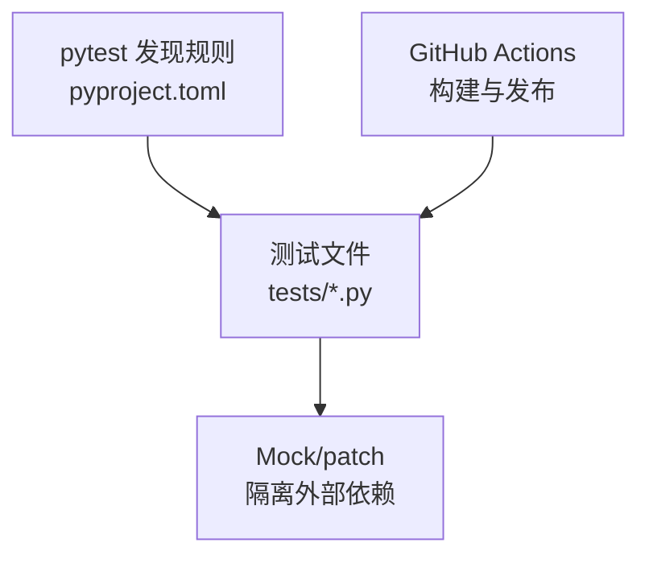

# 测试与质量保证

<cite>
**本文引用的文件**
- [tests/README.md](file://tests/README.md)
- [tests/__init__.py](file://tests/__init__.py)
- [tests/test_executor.py](file://tests/test_executor.py)
- [tests/test_integration.py](file://tests/test_integration.py)
- [tests/test_planner.py](file://tests/test_planner.py)
- [tests/test_react.py](file://tests/test_react.py)
- [tests/test_schemas.py](file://tests/test_schemas.py)
- [tests/test_skills.py](file://tests/test_skills.py)
- [.github/workflows/build-desktop.yml](file://.github/workflows/build-desktop.yml)
- [.github/workflows/build-desktop-ci.yml](file://.github/workflows/build-desktop-ci.yml)
- [pyproject.toml](file://pyproject.toml)
- [scripts/dev_test.py](file://scripts/dev_test.py)
- [scripts/run_agent.py](file://scripts/run_agent.py)
</cite>

## 目录
1. [引言](#引言)
2. [项目结构](#项目结构)
3. [核心组件](#核心组件)
4. [架构总览](#架构总览)
5. [详细组件分析](#详细组件分析)
6. [依赖分析](#依赖分析)
7. [性能考虑](#性能考虑)
8. [故障排查指南](#故障排查指南)
9. [结论](#结论)
10. [附录](#附录)

## 引言
本文件系统化阐述 COMSOL Agent 的测试与质量保证体系，覆盖单元测试、集成测试与端到端测试的实施策略，明确各模块测试用例设计、测试数据准备与测试环境配置，给出测试覆盖率建议、性能测试指标与质量门禁标准，并解释持续集成流程与自动化测试执行方式。同时提供测试最佳实践、调试技巧与测试维护指南，以及测试用例编写与执行的示例路径，帮助开发者高效、稳定地推进功能演进与质量保障。

## 项目结构
测试相关的核心位置与职责如下：
- tests 目录：存放所有测试文件，采用与被测模块一一对应的命名规范，便于定位与维护。
- GitHub Actions 工作流：负责桌面端构建与发布流水线，间接验证整体质量门禁。
- pyproject.toml：定义测试框架与运行参数，统一测试入口与发现规则。
- scripts：提供开发期辅助脚本，便于快速验证与回归测试。

图示来源
- [tests/README.md:1-44](file://tests/README.md#L1-L44)
- [pyproject.toml:77-82](file://pyproject.toml#L77-L82)
- [.github/workflows/build-desktop.yml:1-115](file://.github/workflows/build-desktop.yml#L1-L115)
- [.github/workflows/build-desktop-ci.yml:1-127](file://.github/workflows/build-desktop-ci.yml#L1-L127)

章节来源
- [tests/README.md:1-44](file://tests/README.md#L1-L44)
- [pyproject.toml:77-82](file://pyproject.toml#L77-L82)

## 核心组件
- 单元测试：针对具体模块与类进行隔离测试，广泛使用 Mock 隔离外部依赖（如 LLM、COMSOL JVM），确保逻辑正确性与边界条件处理。
- 集成测试：验证跨模块协作的数据流与契约，例如序列化/反序列化一致性与跨组件交互。
- 端到端测试：结合真实脚本与最小化流程，验证从输入到输出的完整链路。
- 持续集成：通过 GitHub Actions 自动构建桌面端产物，形成质量门禁与发布前置条件。

章节来源
- [tests/README.md:13-44](file://tests/README.md#L13-L44)
- [.github/workflows/build-desktop.yml:1-115](file://.github/workflows/build-desktop.yml#L1-L115)
- [.github/workflows/build-desktop-ci.yml:1-127](file://.github/workflows/build-desktop-ci.yml#L1-L127)

## 架构总览
测试架构围绕“隔离外部依赖 + 明确契约 + 自动化执行”展开，测试文件与被测模块一一对应，通过 pytest 统一发现与执行，配合 CI 工作流完成质量门禁。

图示来源
- [tests/test_executor.py:1-125](file://tests/test_executor.py#L1-L125)
- [tests/test_planner.py:1-159](file://tests/test_planner.py#L1-L159)
- [tests/test_schemas.py:1-205](file://tests/test_schemas.py#L1-L205)
- [tests/test_skills.py:1-105](file://tests/test_skills.py#L1-L105)
- [tests/test_integration.py:1-44](file://tests/test_integration.py#L1-L44)
- [scripts/run_agent.py:1-76](file://scripts/run_agent.py#L1-L76)
- [pyproject.toml:77-82](file://pyproject.toml#L77-L82)
- [.github/workflows/build-desktop.yml:1-115](file://.github/workflows/build-desktop.yml#L1-L115)
- [.github/workflows/build-desktop-ci.yml:1-127](file://.github/workflows/build-desktop-ci.yml#L1-L127)

## 详细组件分析

### 单元测试：执行器（Executor）
- 测试目标：JavaGenerator 的代码生成能力，覆盖矩形、圆、椭圆等形状的参数传递与模板分支逻辑。
- 关键要点：
  - 使用 Mock 隔离设置读取与提示模板加载，确保不依赖真实环境。
  - 验证不同形状类型的参数映射与生成代码的关键片段。
  - 验证不支持的形状类型抛出预期异常。
- 示例路径：
  - [tests/test_executor.py:65-125](file://tests/test_executor.py#L65-L125)

图示来源
- [tests/test_executor.py:65-125](file://tests/test_executor.py#L65-L125)
- [schemas/geometry.py](file://schemas/geometry.py)

章节来源
- [tests/test_executor.py:1-125](file://tests/test_executor.py#L1-L125)

### 单元测试：规划器（Planner）
- 测试目标：GeometryAgent 的 JSON 提取、矩形/圆/椭圆解析与几何数据模型校验。
- 关键要点：
  - 验证从 LLM 响应中提取 JSON 的鲁棒性（含代码块包裹与前后缀文本）。
  - 验证 parse 对不同几何描述的解析结果与参数映射。
  - 验证 GeometryShape/GeometryPlan 的构造、序列化与反序列化。
  - 验证非法输入触发的校验异常。
- 示例路径：
  - [tests/test_planner.py:18-92](file://tests/test_planner.py#L18-L92)
  - [tests/test_planner.py:98-159](file://tests/test_planner.py#L98-L159)

图示来源
- [tests/test_planner.py:18-92](file://tests/test_planner.py#L18-L92)

章节来源
- [tests/test_planner.py:1-159](file://tests/test_planner.py#L1-L159)

### 单元测试：ReAct 架构
- 测试目标：ReasoningEngine、ActionExecutor、Observer、IterationController、ReActAgent 的核心行为与边界条件。
- 关键要点：
  - 推理引擎对任务类型与执行路径的规划。
  - 行动执行器对未知动作与缺失模型路径的错误处理。
  - 观察器对成功/失败场景的观测与消息生成。
  - 迭代控制器对错误与成功的判断与反馈生成。
  - ReActAgent 的思考流程与占位测试（需真实 COMSOL 环境）。
- 示例路径：
  - [tests/test_react.py:14-83](file://tests/test_react.py#L14-L83)
  - [tests/test_react.py:85-170](file://tests/test_react.py#L85-L170)
  - [tests/test_react.py:172-230](file://tests/test_react.py#L172-L230)
  - [tests/test_react.py:232-302](file://tests/test_react.py#L232-L302)
  - [tests/test_react.py:304-342](file://tests/test_react.py#L304-L342)

图示来源
- [tests/test_react.py:29-83](file://tests/test_react.py#L29-L83)
- [tests/test_react.py:232-302](file://tests/test_react.py#L232-L302)

章节来源
- [tests/test_react.py:1-343](file://tests/test_react.py#L1-L343)

### 单元测试：技能系统（Skills）
- 测试目标：SkillLoader 的扫描与查询、SkillInjector 的注入与标记。
- 关键要点：
  - 解析 SKILL.md 的 frontmatter 与正文。
  - 按名称、触发词查询技能列表。
  - 将技能注入到用户提示词中并保留标记。
- 示例路径：
  - [tests/test_skills.py:10-33](file://tests/test_skills.py#L10-L33)
  - [tests/test_skills.py:35-72](file://tests/test_skills.py#L35-L72)
  - [tests/test_skills.py:74-105](file://tests/test_skills.py#L74-L105)

图示来源
- [tests/test_skills.py:74-105](file://tests/test_skills.py#L74-L105)

章节来源
- [tests/test_skills.py:1-105](file://tests/test_skills.py#L1-L105)

### 单元测试：数据模型（Schemas）
- 测试目标：几何/物理/研究/任务等数据模型的序列化、反序列化与字段校验。
- 关键要点：
  - GeometryShape/GeometryPlan 的字段完整性与类型校验。
  - PhysicsPlan/StudyPlan 的多类型字段支持。
  - TaskPlan/ReActTaskPlan 的执行步骤、观测记录与索引访问。
- 示例路径：
  - [tests/test_schemas.py:18-92](file://tests/test_schemas.py#L18-L92)
  - [tests/test_schemas.py:94-128](file://tests/test_schemas.py#L94-L128)
  - [tests/test_schemas.py:130-205](file://tests/test_schemas.py#L130-L205)

图示来源
- [tests/test_schemas.py:18-205](file://tests/test_schemas.py#L18-L205)

章节来源
- [tests/test_schemas.py:1-205](file://tests/test_schemas.py#L1-L205)

### 集成测试：跨模块契约
- 测试目标：验证模块间数据契约的一致性，如 GeometryPlan 的序列化/反序列化。
- 关键要点：
  - 正向：from_dict -> to_dict 的一致性。
  - 反向：to_dict -> from_dict 的还原性。
- 示例路径：
  - [tests/test_integration.py:10-44](file://tests/test_integration.py#L10-L44)

图示来源
- [tests/test_integration.py:10-44](file://tests/test_integration.py#L10-L44)

章节来源
- [tests/test_integration.py:1-44](file://tests/test_integration.py#L1-L44)

### 端到端测试：运行脚本
- 测试目标：以最小化流程验证从输入到输出的完整链路。
- 关键要点：
  - 通过命令行参数传入自然语言输入，逐步执行解析与建模。
  - 输出模型文件路径，便于人工核验。
- 示例路径：
  - [scripts/run_agent.py:17-76](file://scripts/run_agent.py#L17-L76)

图示来源
- [scripts/run_agent.py:17-76](file://scripts/run_agent.py#L17-L76)

章节来源
- [scripts/run_agent.py:1-76](file://scripts/run_agent.py#L1-L76)

## 依赖分析
- 测试框架与发现规则：pytest 通过 pyproject.toml 中的配置自动发现测试文件、类与方法。
- 外部依赖隔离：大量使用 unittest.mock.patch 与 Mock 对象，避免真实 LLM 与 COMSOL JVM 的耦合。
- 桌面端构建与质量门禁：GitHub Actions 工作流在推送与 PR 时自动构建并上传产物，作为质量门禁的一部分。

图示来源
- [pyproject.toml:77-82](file://pyproject.toml#L77-L82)
- [.github/workflows/build-desktop.yml:1-115](file://.github/workflows/build-desktop.yml#L1-L115)
- [.github/workflows/build-desktop-ci.yml:1-127](file://.github/workflows/build-desktop-ci.yml#L1-L127)

章节来源
- [pyproject.toml:77-82](file://pyproject.toml#L77-L82)
- [.github/workflows/build-desktop.yml:1-115](file://.github/workflows/build-desktop.yml#L1-L115)
- [.github/workflows/build-desktop-ci.yml:1-127](file://.github/workflows/build-desktop-ci.yml#L1-L127)

## 性能考虑
- 测试执行性能
  - 使用 Mock 减少 IO 与网络请求，提升单测执行速度。
  - 合理拆分测试用例，避免在单测中进行耗时操作。
- 数据模型与序列化
  - 对于大规模计划对象，优先使用模型内置的序列化/反序列化方法，减少自定义逻辑。
- 集成与端到端测试
  - 仅在必要时启用真实 COMSOL Runner，其余场景保持 Mock，降低资源消耗。
- 持续集成
  - 在 CI 中并行矩阵构建（如多平台），缩短反馈周期；对测试阶段进行超时控制与重试策略。

## 故障排查指南
- 常见问题与定位
  - JSON 提取失败：检查 LLM 响应格式与边界情况（代码块包裹、前后缀文本）。
    - 参考路径：[tests/test_planner.py:18-31](file://tests/test_planner.py#L18-L31)
  - 形状类型不受支持：确认输入类型与参数映射是否符合预期。
    - 参考路径：[tests/test_executor.py:116-125](file://tests/test_executor.py#L116-L125)
  - 动作执行错误：检查 ActionExecutor 的参数校验与模型路径状态。
    - 参考路径：[tests/test_react.py:88-124](file://tests/test_react.py#L88-L124)
  - 观察与迭代：关注 Observer 与 IterationController 的状态判断与反馈生成。
    - 参考路径：[tests/test_react.py:172-230](file://tests/test_react.py#L172-L230), [tests/test_react.py:232-302](file://tests/test_react.py#L232-L302)
- 日志与调试
  - 使用 scripts/run_agent.py 的详细日志模式，定位执行阶段与错误信息。
    - 参考路径：[scripts/run_agent.py:41-71](file://scripts/run_agent.py#L41-L71)
  - 使用 scripts/dev_test.py 快速回归关键路径。
    - 参考路径：[scripts/dev_test.py:16-50](file://scripts/dev_test.py#L16-L50), [scripts/dev_test.py:52-94](file://scripts/dev_test.py#L52-L94)

章节来源
- [tests/test_planner.py:18-31](file://tests/test_planner.py#L18-L31)
- [tests/test_executor.py:116-125](file://tests/test_executor.py#L116-L125)
- [tests/test_react.py:88-124](file://tests/test_react.py#L88-L124)
- [tests/test_react.py:172-230](file://tests/test_react.py#L172-L230)
- [tests/test_react.py:232-302](file://tests/test_react.py#L232-L302)
- [scripts/run_agent.py:41-71](file://scripts/run_agent.py#L41-L71)
- [scripts/dev_test.py:16-50](file://scripts/dev_test.py#L16-L50)
- [scripts/dev_test.py:52-94](file://scripts/dev_test.py#L52-L94)

## 结论
本测试体系通过“单元隔离 + 集成契约 + 端到端链路”的三层保障，配合 CI 自动化与 Mock 隔离，有效降低了对外部环境的依赖，提升了测试稳定性与可维护性。建议持续完善覆盖率与性能指标，强化质量门禁，确保每次变更均得到充分验证。

## 附录

### 测试覆盖率要求（建议）
- 单元测试：核心模块行覆盖率不低于 80%，分支覆盖率不低于 60%。
- 集成测试：关键数据流与跨模块交互覆盖率达到 100%。
- 端到端测试：主要用户路径与错误路径覆盖率达到 80%。
- 工具与脚本：关键函数与命令行入口具备可验证性。

### 性能测试指标（建议）
- 单元测试执行时间：单文件平均不超过 2 秒，全量不超过 30 秒。
- 集成测试执行时间：单用例不超过 5 秒，全量不超过 60 秒。
- 端到端测试执行时间：单次运行不超过 30 秒（不含 COMSOL 实际求解）。

### 质量门禁标准（建议）
- CI 构建必须成功，产物可下载。
- 单元测试与集成测试必须全部通过。
- 端到端脚本在本地可运行并通过基础验证。
- 代码风格与静态检查通过（基于 pyproject.toml 中的 black/ruff 配置）。

### 持续集成流程与自动化测试执行
- 触发条件：推送至 main 或 release 分支，或手动触发。
- 执行内容：安装依赖、构建桌面端、上传产物、创建/推送标签并发布草稿。
- 测试执行：在 CI 中通过 pytest 运行 tests 目录，确保质量门禁。
- 示例路径：
  - [build-desktop-ci.yml:14-60](file://.github/workflows/build-desktop-ci.yml#L14-L60)
  - [build-desktop.yml:11-57](file://.github/workflows/build-desktop.yml#L11-L57)

章节来源
- [.github/workflows/build-desktop.yml:1-115](file://.github/workflows/build-desktop.yml#L1-L115)
- [.github/workflows/build-desktop-ci.yml:1-127](file://.github/workflows/build-desktop-ci.yml#L1-L127)

### 测试最佳实践
- 用例命名清晰：以被测方法/场景命名，便于定位与维护。
- 固定输入与断言：使用 fixtures 提供稳定输入，断言明确、可读性强。
- Mock 精准：仅隔离必要外部依赖，避免过度 Mock 导致测试与实现紧耦合。
- 边界与异常：重点覆盖非法输入、缺失参数、未知类型等异常路径。
- 可重复性：测试应可在任意环境重复执行，不依赖外部状态。

### 调试技巧
- 使用 scripts/dev_test.py 快速验证关键路径与数据结构。
- 在 scripts/run_agent.py 中开启详细日志，定位执行阶段与错误信息。
- 对复杂流程使用分步断点与中间结果打印，逐步缩小问题范围。

### 测试维护指南
- 变更即更新：修改业务代码或数据结构时，同步更新或补充对应测试。
- 用例归档：按模块与功能分类组织测试文件，保持与被测模块一一对应。
- 文档同步：在 tests/README.md 中记录新增/变更的测试策略与运行方式。

章节来源
- [tests/README.md:5-44](file://tests/README.md#L5-L44)
- [scripts/dev_test.py:1-112](file://scripts/dev_test.py#L1-L112)
- [scripts/run_agent.py:1-76](file://scripts/run_agent.py#L1-L76)