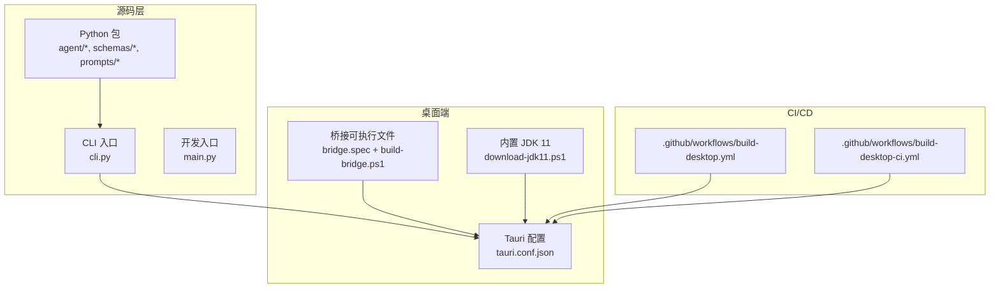
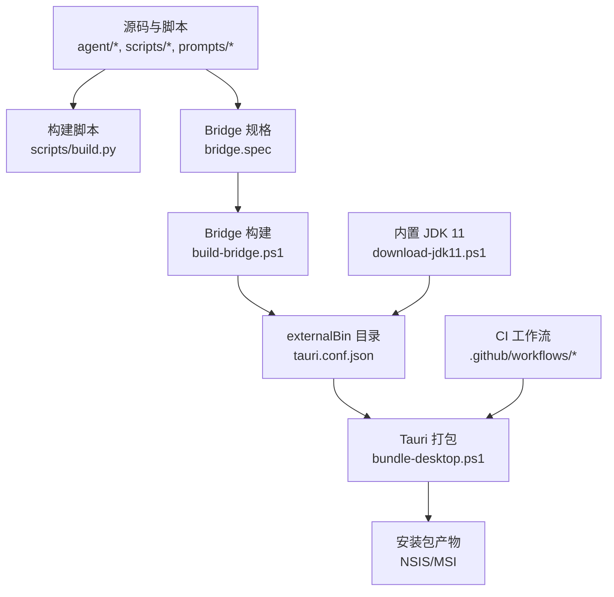
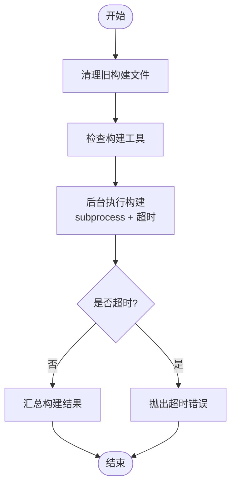
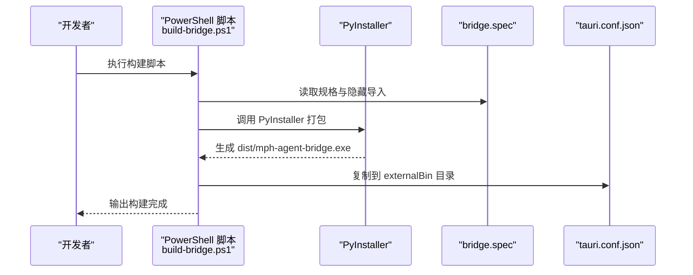
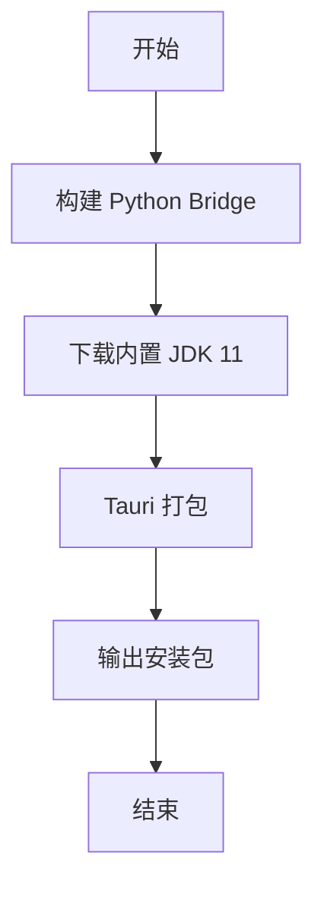
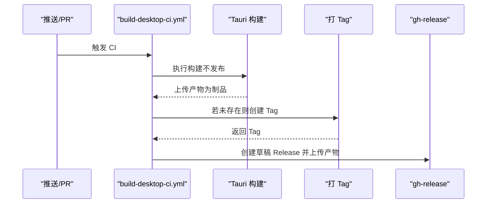
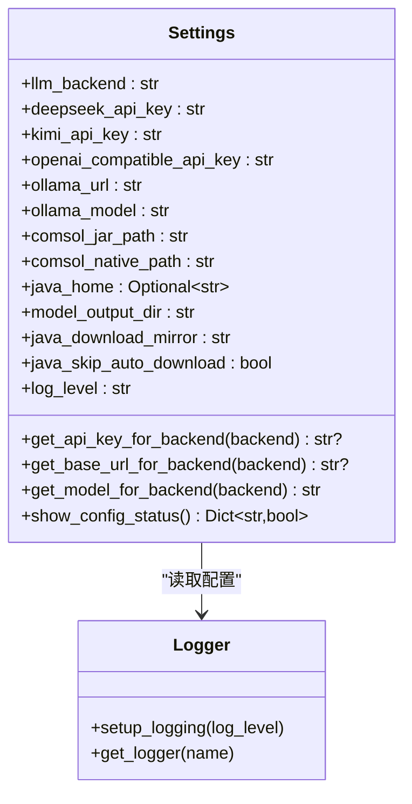
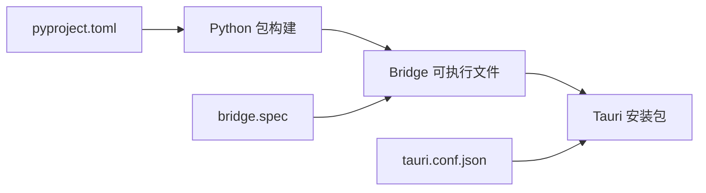

# 部署与运维

<cite>
**本文引用的文件**
- [scripts/build.py](file://scripts/build.py)
- [scripts/bundle-desktop.ps1](file://scripts/bundle-desktop.ps1)
- [desktop/scripts/build-bridge.ps1](file://desktop/scripts/build-bridge.ps1)
- [desktop/scripts/download-jdk11.ps1](file://desktop/scripts/download-jdk11.ps1)
- [desktop/scripts/bridge.spec](file://desktop/scripts/bridge.spec)
- [.github/workflows/build-desktop.yml](file://.github/workflows/build-desktop.yml)
- [.github/workflows/build-desktop-ci.yml](file://.github/workflows/build-desktop-ci.yml)
- [pyproject.toml](file://pyproject.toml)
- [tauri.conf.json](file://desktop/src-tauri/tauri.conf.json)
- [env.example](file://env.example)
- [agent/utils/config.py](file://agent/utils/config.py)
- [agent/utils/logger.py](file://agent/utils/logger.py)
- [cli.py](file://cli.py)
- [main.py](file://main.py)
- [scripts/run_agent.py](file://scripts/run_agent.py)
</cite>

## 目录
1. [简介](#简介)
2. [项目结构](#项目结构)
3. [核心组件](#核心组件)
4. [架构总览](#架构总览)
5. [详细组件分析](#详细组件分析)
6. [依赖关系分析](#依赖关系分析)
7. [性能考虑](#性能考虑)
8. [故障排查指南](#故障排查指南)
9. [结论](#结论)
10. [附录](#附录)

## 简介
本文件面向 COMSOL Agent 的部署与运维团队，系统性阐述构建流程、打包分发与版本管理策略，覆盖 Windows、macOS 与 Linux 的差异化处理，并给出 CI/CD 流水线配置、自动化部署与监控告警建议、生产环境配置管理、日志收集与性能监控、故障恢复与备份、安全加固以及运维最佳实践与应急响应指南。

## 项目结构
项目采用“Python 源码 + Tauri 桌面端 + 前端”三层结构：
- Python 源码位于 agent/ 与根目录脚本，提供核心推理、规划、执行与工具能力。
- 桌面端基于 Tauri（Rust + 前端），通过 externalBin 内嵌 Python bridge 可执行文件，随安装包分发。
- CI/CD 通过 GitHub Actions 实现跨平台构建与发布，支持草稿发布与自动打 Tag。

图表来源
- [tauri.conf.json:1-31](file://desktop/src-tauri/tauri.conf.json#L1-L31)
- [bridge.spec:1-70](file://desktop/scripts/bridge.spec#L1-L70)
- [build-bridge.ps1:1-50](file://desktop/scripts/build-bridge.ps1#L1-L50)
- [download-jdk11.ps1:1-53](file://desktop/scripts/download-jdk11.ps1#L1-L53)
- [build-desktop.yml:1-115](file://.github/workflows/build-desktop.yml#L1-L115)
- [build-desktop-ci.yml:1-127](file://.github/workflows/build-desktop-ci.yml#L1-L127)

章节来源
- [pyproject.toml:1-82](file://pyproject.toml#L1-L82)
- [tauri.conf.json:1-31](file://desktop/src-tauri/tauri.conf.json#L1-L31)

## 核心组件
- 构建与打包脚本
  - Python 分发包构建：scripts/build.py，负责清理、工具检查、构建、超时与进度展示。
  - 桌面端一键打包：scripts/bundle-desktop.ps1，串联 bridge 构建、JDK 下载与 Tauri 打包。
  - Python Bridge 构建：desktop/scripts/build-bridge.ps1，使用 PyInstaller 产出可执行文件并复制至 Tauri externalBin 目录。
  - Bridge 规格：desktop/scripts/bridge.spec，定义隐藏导入、资源打包与排除项。
- CI/CD 工作流
  - 发布工作流：.github/workflows/build-desktop.yml，支持手动触发与 release 分支，统一版本解析与同步。
  - CI 工作流：.github/workflows/build-desktop-ci.yml，主干推送触发构建与草稿发布，自动打 Tag。
- 配置与日志
  - 配置管理：agent/utils/config.py，基于 pydantic-settings 与 .env，提供 LLM、COMSOL、Java、日志等配置。
  - 日志系统：agent/utils/logger.py，基于 loguru，统一格式与级别。
  - 环境变量模板：env.example，涵盖 LLM、COMSOL、Java、日志等关键参数。
- 启动与入口
  - CLI：cli.py，封装桌面应用启动与 tui-bridge 子进程入口。
  - 开发入口：main.py，便于本地调试。

章节来源
- [build.py:1-407](file://scripts/build.py#L1-L407)
- [bundle-desktop.ps1:1-42](file://scripts/bundle-desktop.ps1#L1-L42)
- [build-bridge.ps1:1-50](file://desktop/scripts/build-bridge.ps1#L1-L50)
- [bridge.spec:1-70](file://desktop/scripts/bridge.spec#L1-L70)
- [build-desktop.yml:1-115](file://.github/workflows/build-desktop.yml#L1-L115)
- [build-desktop-ci.yml:1-127](file://.github/workflows/build-desktop-ci.yml#L1-L127)
- [config.py:1-164](file://agent/utils/config.py#L1-L164)
- [logger.py:1-41](file://agent/utils/logger.py#L1-L41)
- [env.example:1-47](file://env.example#L1-L47)
- [cli.py:1-121](file://cli.py#L1-L121)
- [main.py:1-14](file://main.py#L1-L14)

## 架构总览
下图展示从源码到桌面安装包的关键路径与集成点，突出 Python Bridge 的内嵌与 Tauri 的打包集成。

图表来源
- [build.py:135-299](file://scripts/build.py#L135-L299)
- [bridge.spec:10-69](file://desktop/scripts/bridge.spec#L10-L69)
- [build-bridge.ps1:19-46](file://desktop/scripts/build-bridge.ps1#L19-L46)
- [tauri.conf.json:24-29](file://desktop/src-tauri/tauri.conf.json#L24-L29)
- [download-jdk11.ps1:13-52](file://desktop/scripts/download-jdk11.ps1#L13-L52)
- [bundle-desktop.ps1:14-25](file://scripts/bundle-desktop.ps1#L14-L25)
- [build-desktop.yml:102-115](file://.github/workflows/build-desktop.yml#L102-L115)
- [build-desktop-ci.yml:51-57](file://.github/workflows/build-desktop-ci.yml#L51-L57)

## 详细组件分析

### Python 分发包构建流程
- 功能要点
  - 清理旧构建产物、检查构建工具、UTF-8 编码保障、进度条与超时控制、错误聚合与提示。
  - 支持 rich 进度条与简单模式双路径，超时默认 5 分钟，避免长时间卡死。
- 关键路径
  - 清理：_clean_build_files()
  - 工具检查：_check_build_tools()
  - 后台构建：_run_build()，模拟进度并处理超时
  - 主流程：build()

图表来源
- [build.py:302-320](file://scripts/build.py#L302-L320)
- [build.py:322-330](file://scripts/build.py#L322-L330)
- [build.py:332-403](file://scripts/build.py#L332-L403)
- [build.py:135-299](file://scripts/build.py#L135-L299)

章节来源
- [build.py:1-407](file://scripts/build.py#L1-L407)

### Python Bridge 构建与内嵌
- 功能要点
  - 自动识别目标三元组，使用 PyInstaller 构建可执行文件，复制到 Tauri externalBin 目录。
  - 优先使用 uv run 以确保项目依赖可用，否则回退到系统 python。
  - 通过 bridge.spec 精确声明隐藏导入、数据资源与排除项，减少体积并提升稳定性。
- 关键路径
  - 三元组与命名：build-bridge.ps1 第 12-14 行
  - PyInstaller 调用与校验：build-bridge.ps1 第 22-43 行
  - externalBin 配置：tauri.conf.json 第 28 行
  - 规格文件：bridge.spec 第 10-69 行

图表来源
- [build-bridge.ps1:19-46](file://desktop/scripts/build-bridge.ps1#L19-L46)
- [bridge.spec:10-69](file://desktop/scripts/bridge.spec#L10-L69)
- [tauri.conf.json:28](file://desktop/src-tauri/tauri.conf.json#L28)

章节来源
- [build-bridge.ps1:1-50](file://desktop/scripts/build-bridge.ps1#L1-L50)
- [bridge.spec:1-70](file://desktop/scripts/bridge.spec#L1-L70)
- [tauri.conf.json:24-29](file://desktop/src-tauri/tauri.conf.json#L24-L29)

### 桌面端一键打包
- 功能要点
  - 串联 bridge 构建、JDK 下载与 Tauri 打包，输出 NSIS/MSI 安装包。
  - 在 CI 中通过脚本统一执行，确保产物一致性。
- 关键路径
  - 顺序执行：build-bridge.ps1 → download-jdk11.ps1 → tauri build
  - 产物定位：desktop/src-tauri/target/release/bundle/{nsis,msi}

图表来源
- [bundle-desktop.ps1:14-25](file://scripts/bundle-desktop.ps1#L14-L25)
- [download-jdk11.ps1:13-52](file://desktop/scripts/download-jdk11.ps1#L13-L52)
- [build-bridge.ps1:19-46](file://desktop/scripts/build-bridge.ps1#L19-L46)

章节来源
- [bundle-desktop.ps1:1-42](file://scripts/bundle-desktop.ps1#L1-42)

### CI/CD 流水线
- 发布工作流（手动/Release 分支）
  - 解析版本与 release tag，必要时将版本写回项目配置，确保构建产物版本一致。
  - 使用 tauri-action 执行打包与发布，创建草稿 Release。
- CI 工作流（主干/PR）
  - 构建成功后自动打 Tag，创建草稿 Release 并上传 exe/msi。
  - 产物上传为后续发布工作流复用。

图表来源
- [build-desktop-ci.yml:14-127](file://.github/workflows/build-desktop-ci.yml#L14-L127)
- [build-desktop.yml:11-115](file://.github/workflows/build-desktop.yml#L11-L115)

章节来源
- [.github/workflows/build-desktop.yml:1-115](file://.github/workflows/build-desktop.yml#L1-L115)
- [.github/workflows/build-desktop-ci.yml:1-127](file://.github/workflows/build-desktop-ci.yml#L1-L127)

### 配置管理与日志
- 配置管理
  - 基于 pydantic-settings 与 .env，支持多 LLM 后端、COMSOL、Java、日志级别等。
  - 自动推导安装目录与项目根目录，确保输出目录稳定可靠。
- 日志系统
  - 基于 loguru，统一格式与级别，避免默认处理器污染。
- 环境变量模板
  - env.example 提供 LLM、COMSOL、Java、日志等关键参数说明。

图表来源
- [config.py:55-164](file://agent/utils/config.py#L55-L164)
- [logger.py:22-41](file://agent/utils/logger.py#L22-L41)
- [env.example:1-47](file://env.example#L1-L47)

章节来源
- [agent/utils/config.py:1-164](file://agent/utils/config.py#L1-L164)
- [agent/utils/logger.py:1-41](file://agent/utils/logger.py#L1-L41)
- [env.example:1-47](file://env.example#L1-L47)

### 跨平台部署与差异化处理
- Windows
  - 使用 PowerShell 脚本链路：build-bridge.ps1、download-jdk11.ps1、bundle-desktop.ps1。
  - Tauri externalBin 与 NSIS/MSI 打包，内置 JDK 11。
- macOS/Linux
  - Tauri 配置支持多目标，externalBin 与资源路径保持一致。
  - 通过 CI 工作流矩阵扩展平台，或在本地使用相同脚本链路。

章节来源
- [tauri.conf.json:24-29](file://desktop/src-tauri/tauri.conf.json#L24-L29)
- [build-desktop.yml:18-21](file://.github/workflows/build-desktop.yml#L18-L21)
- [build-desktop-ci.yml:16-22](file://.github/workflows/build-desktop-ci.yml#L16-L22)

### 版本管理策略
- 版本来源
  - 以 desktop/src-tauri/tauri.conf.json 的 version 字段为准。
- 版本同步
  - 发布工作流在 tag 触发时将版本写回 tauri.conf.json、Cargo.toml 与 desktop/package.json。
- 自动打 Tag
  - CI 工作流在主干推送成功后自动创建 desktop-vX.Y.Z 的 Tag 并创建草稿 Release。

章节来源
- [build-desktop.yml:34-82](file://.github/workflows/build-desktop.yml#L34-L82)
- [build-desktop.yml:102-115](file://.github/workflows/build-desktop.yml#L102-L115)
- [build-desktop-ci.yml:80-126](file://.github/workflows/build-desktop-ci.yml#L80-L126)

## 依赖关系分析
- Python 包与桌面端
  - pyproject.toml 定义了构建后端、依赖与打包范围，确保桌面端可运行。
  - bridge.spec 显式声明 agent/schemas/prompts 等模块与隐藏导入，避免冷启动问题。
- CI 与本地一致性
  - CI 工作流与本地脚本链路一致，确保产物可复现。

图表来源
- [pyproject.toml:60-67](file://pyproject.toml#L60-L67)
- [bridge.spec:17-39](file://desktop/scripts/bridge.spec#L17-L39)
- [tauri.conf.json:24-29](file://desktop/src-tauri/tauri.conf.json#L24-L29)

章节来源
- [pyproject.toml:1-82](file://pyproject.toml#L1-L82)
- [bridge.spec:1-70](file://desktop/scripts/bridge.spec#L1-L70)
- [tauri.conf.json:1-31](file://desktop/src-tauri/tauri.conf.json#L1-L31)

## 性能考虑
- 构建超时与稳定性
  - scripts/build.py 对构建过程设置超时与进度反馈，避免长时间卡死。
- Bridge 体积与启动
  - bridge.spec 排除大型 ML 库，隐藏导入精准，减少冷启动时间。
- 日志开销
  - 日志默认级别为 INFO，可在运行时调整，避免生产环境过度 IO。

章节来源
- [build.py:43-133](file://scripts/build.py#L43-L133)
- [bridge.spec:43-46](file://desktop/scripts/bridge.spec#L43-L46)
- [logger.py:22-41](file://agent/utils/logger.py#L22-L41)

## 故障排查指南
- 构建失败
  - 检查 Python 依赖与 UTF-8 环境变量设置；查看 scripts/build.py 的错误聚合输出。
  - 关注超时与子进程状态，必要时增大超时或优化依赖安装。
- Bridge 启动失败
  - 确认 externalBin 目录存在对应三元组命名的可执行文件；检查 bridge.spec 的隐藏导入是否完整。
- JDK 相关问题
  - 若 COMSOL JNI 初始化失败，检查 COMSOL_NATIVE_PATH 或使用内置 JDK 11（download-jdk11.ps1）。
- 日志与配置
  - 使用 agent/utils/logger.py 的 setup_logging 设置日志级别；核对 agent/utils/config.py 的配置加载顺序与输出目录。

章节来源
- [build.py:214-229](file://scripts/build.py#L214-L229)
- [build-bridge.ps1:41-46](file://desktop/scripts/build-bridge.ps1#L41-L46)
- [bridge.spec:17-39](file://desktop/scripts/bridge.spec#L17-L39)
- [download-jdk11.ps1:13-52](file://desktop/scripts/download-jdk11.ps1#L13-L52)
- [logger.py:22-41](file://agent/utils/logger.py#L22-L41)
- [config.py:98-103](file://agent/utils/config.py#L98-L103)

## 结论
本项目通过清晰的脚本链路与 CI/CD 工作流，实现了跨平台的桌面端分发与版本管理。Python Bridge 的内嵌与 Tauri 的打包集成，确保了最终用户的安装体验与运行稳定性。结合配置与日志体系，运维团队可在生产环境中快速定位问题并进行优化。

## 附录

### 生产环境配置管理
- 使用 .env 管理 LLM、COMSOL、Java 与日志级别；避免硬编码敏感信息。
- 通过 agent/utils/config.py 的单例模式确保配置一致性与目录初始化。

章节来源
- [env.example:1-47](file://env.example#L1-L47)
- [config.py:156-164](file://agent/utils/config.py#L156-L164)

### 日志收集与性能监控
- 日志格式与级别：agent/utils/logger.py
- 建议在生产环境接入集中式日志（如 ELK/Fluentd/Sentry）与指标采集（Prometheus/OpenTelemetry）。

章节来源
- [logger.py:22-41](file://agent/utils/logger.py#L22-L41)

### 故障恢复与备份
- 备份策略
  - 定期备份模型输出目录与 .env 配置。
  - 备份 Tauri 安装包与发布 Tag，确保可回滚。
- 恢复流程
  - 通过 CI 工作流回滚到指定 Tag；恢复 .env 与输出目录后重启服务。

章节来源
- [.github/workflows/build-desktop.yml:102-115](file://.github/workflows/build-desktop.yml#L102-L115)
- [.github/workflows/build-desktop-ci.yml:97-126](file://.github/workflows/build-desktop-ci.yml#L97-L126)

### 安全加固
- 限制 Bridge 权限与最小化依赖，避免引入高风险库。
- 使用只读文件系统与受限用户运行服务端组件。
- 通过 CI 签名与校验安装包，防止供应链攻击。

章节来源
- [bridge.spec:43-46](file://desktop/scripts/bridge.spec#L43-L46)
- [.github/workflows/build-desktop.yml:102-115](file://.github/workflows/build-desktop.yml#L102-L115)

### 运维最佳实践
- 使用 uv run 管理依赖与运行环境，确保一致性。
- 将桌面应用启动委托给 cli.py，避免直接调用底层细节。
- 在 CI 中启用产物缓存与并发矩阵，缩短构建时间。

章节来源
- [cli.py:87-121](file://cli.py#L87-L121)
- [.github/workflows/build-desktop.yml:86-92](file://.github/workflows/build-desktop.yml#L86-L92)
- [.github/workflows/build-desktop-ci.yml:35-41](file://.github/workflows/build-desktop-ci.yml#L35-L41)