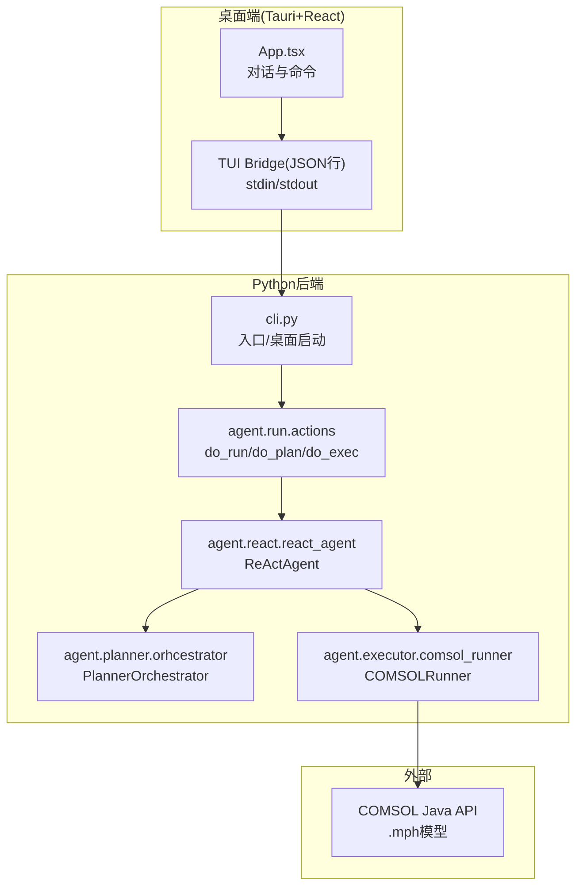
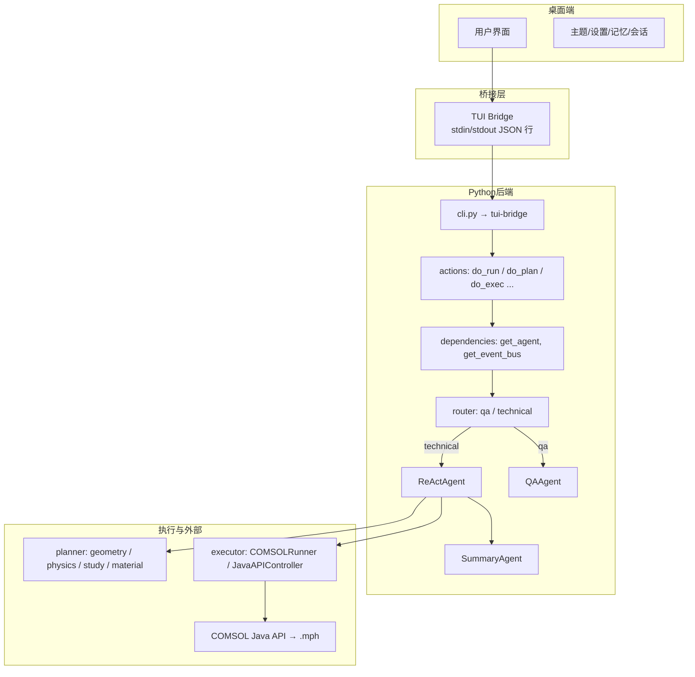
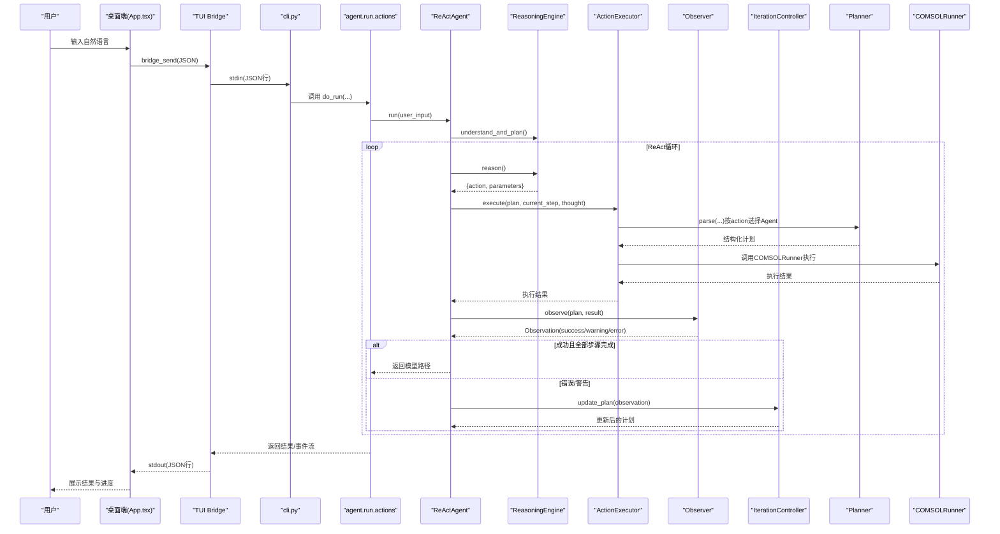
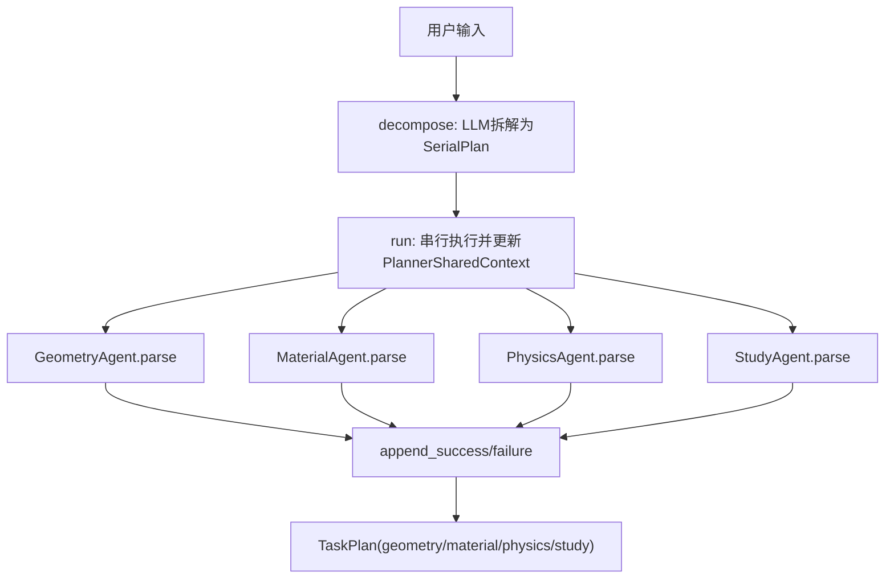
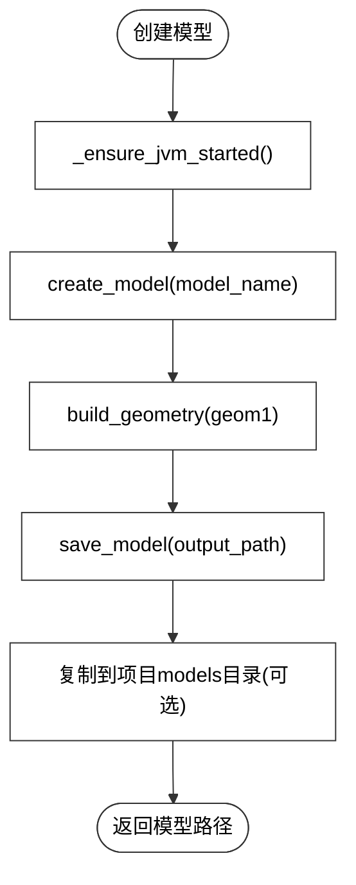
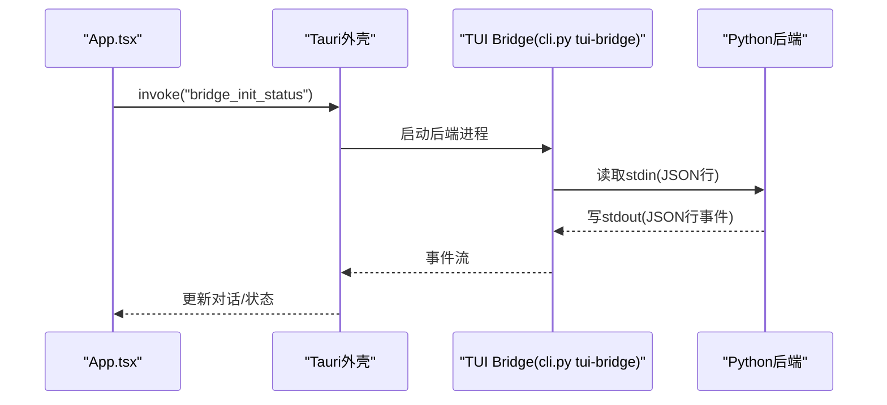
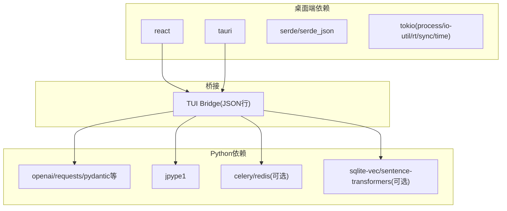

# 项目概述

<cite>
**本文引用的文件**
- [main.py](file://main.py)
- [cli.py](file://cli.py)
- [pyproject.toml](file://pyproject.toml)
- [agent/README.md](file://agent/README.md)
- [docs/architecture/architecture.md](file://docs/architecture/architecture.md)
- [docs/getting-started/INSTALL.md](file://docs/getting-started/INSTALL.md)
- [desktop/src/App.tsx](file://desktop/src/App.tsx)
- [desktop/src-tauri/src/main.rs](file://desktop/src-tauri/src/main.rs)
- [desktop/src-tauri/Cargo.toml](file://desktop/src-tauri/Cargo.toml)
- [agent/core/base.py](file://agent/core/base.py)
- [agent/react/react_agent.py](file://agent/react/react_agent.py)
- [agent/planner/orchestrator.py](file://agent/planner/orchestrator.py)
- [agent/executor/comsol_runner.py](file://agent/executor/comsol_runner.py)
</cite>

## 目录
1. [引言](#引言)
2. [项目结构](#项目结构)
3. [核心组件](#核心组件)
4. [架构总览](#架构总览)
5. [详细组件分析](#详细组件分析)
6. [依赖分析](#依赖分析)
7. [性能考量](#性能考量)
8. [故障排查指南](#故障排查指南)
9. [结论](#结论)
10. [附录](#附录)

## 引言
COMSOL Agent 是一个面向科学仿真的 AI 驱动智能助手，目标是将用户的自然语言建模需求自动转化为完整的 COMSOL Multiphysics 模型文件（.mph）。它通过“理解 → 规划 → 执行 → 观察 → 迭代”的 ReAct 循环，结合 Planner 的结构化解析与 Executor 的 COMSOL Java API 调用，形成从自然语言到仿真模型的端到端工作流。项目采用“Python + Tauri + React + Rust”的技术栈组合，既保证了科学计算与 AI 能力的灵活性，又提供了跨平台的桌面端用户体验。

本项目适合初学者快速理解“自然语言 → 仿真模型”的转化过程，也适合有经验的开发者深入掌握 ReAct 架构、Planner/Executor 设计、事件驱动与可观测性、以及与 COMSOL 的 Java 互操作细节。

## 项目结构
项目采用“多模块分层 + 桌面端桥接”的组织方式：
- Python 后端（agent/）：包含路由、会话、ReAct 核心、Planner、Executor、工具注册表、技能系统、提示词与 LLM 客户端、日志与环境检查等。
- 桌面端（desktop/）：React + Tauri，负责用户交互、对话展示、命令与状态管理，并通过 TUI Bridge 与 Python 后端通信。
- 文档（docs/）：架构设计、安装与使用、贡献与发布等。
- 脚本与配置（scripts/、pyproject.toml、desktop/src-tauri/Cargo.toml 等）：构建、打包、依赖与运行时配置。

图表来源
- [docs/architecture/architecture.md:11-49](file://docs/architecture/architecture.md#L11-L49)
- [cli.py:18-84](file://cli.py#L18-L84)
- [desktop/src/App.tsx:47-50](file://desktop/src/App.tsx#L47-L50)

章节来源
- [agent/README.md:1-95](file://agent/README.md#L1-L95)
- [docs/architecture/architecture.md:1-269](file://docs/architecture/architecture.md#L1-L269)
- [pyproject.toml:1-82](file://pyproject.toml#L1-L82)

## 核心组件
- 路由与会话编排：根据输入类型分流至 Q&A 或技术执行流，支持依赖注入与事件总线。
- ReActAgent：统一的推理-执行-观察-迭代循环，支持事件驱动与可观测性，逐步完善计划直至完成或失败。
- Planner 编排器：将自然语言拆解为串行步骤（几何/材料/物理/研究），并通过共享上下文协调各子 Agent。
- Executor 执行器：负责 JVM 生命周期管理、COMSOL Java API 调用、几何构建与模型保存。
- 技能与提示：通过技能注入与提示模板增强理解与规划质量。
- 桌面端桥接：Tauri + React 与 Python 后端通过 JSON 行协议通信，实现流式事件推送与命令执行。

章节来源
- [agent/README.md:73-95](file://agent/README.md#L73-L95)
- [docs/architecture/architecture.md:106-148](file://docs/architecture/architecture.md#L106-L148)

## 架构总览
系统分为三层：桌面端（Tauri + React）、桥接层（TUI Bridge）、Python 后端（Agent 与 COMSOL 执行）。用户通过桌面应用或 CLI 输入自然语言，经路由与 ReAct 流程，最终生成 .mph 模型文件。

图表来源
- [docs/architecture/architecture.md:11-49](file://docs/architecture/architecture.md#L11-L49)

章节来源
- [docs/architecture/architecture.md:1-269](file://docs/architecture/architecture.md#L1-L269)

## 详细组件分析

### ReActAgent：推理-执行-观察-迭代循环
ReActAgent 是技术路径的核心，负责将自然语言逐步转化为结构化计划并执行，同时通过观察与迭代不断优化，直至完成或失败。

图表来源
- [agent/react/react_agent.py:60-215](file://agent/react/react_agent.py#L60-L215)
- [agent/planner/orchestrator.py:365-449](file://agent/planner/orchestrator.py#L365-L449)
- [agent/executor/comsol_runner.py:326-351](file://agent/executor/comsol_runner.py#L326-L351)
- [desktop/src/App.tsx:47-50](file://desktop/src/App.tsx#L47-L50)

章节来源
- [agent/react/react_agent.py:1-469](file://agent/react/react_agent.py#L1-L469)
- [docs/architecture/architecture.md:106-148](file://docs/architecture/architecture.md#L106-L148)

### Planner 编排器：串行步骤与共享上下文
Planner 编排器将用户输入拆解为串行步骤（几何/材料/物理/研究），并在每一步执行前后维护共享上下文，使后续步骤能感知前面的成功或失败，从而提升鲁棒性。

图表来源
- [agent/planner/orchestrator.py:291-449](file://agent/planner/orchestrator.py#L291-L449)

章节来源
- [agent/planner/orchestrator.py:1-450](file://agent/planner/orchestrator.py#L1-L450)
- [docs/architecture/architecture.md:193-234](file://docs/architecture/architecture.md#L193-L234)

### COMSOLRunner：JVM生命周期与几何构建
COMSOLRunner 负责 JVM 的启动与关闭、类路径与本地库路径的设置、几何形状的创建与构建、以及模型的保存。它通过 jpype1 与 COMSOL Java API 交互，支持 2D/3D 几何形状的创建与保存为 .mph 文件。

图表来源
- [agent/executor/comsol_runner.py:97-359](file://agent/executor/comsol_runner.py#L97-L359)

章节来源
- [agent/executor/comsol_runner.py:1-359](file://agent/executor/comsol_runner.py#L1-L359)

### 桌面端桥接：Tauri + React 与 Python 通信
桌面端通过 Tauri 与 React 实现用户界面，使用 invoke 与后端桥接。桥接层通过 JSON 行协议与 Python 后端通信，实现命令发送、事件流接收与 UI 实时更新。

图表来源
- [desktop/src/App.tsx:47-50](file://desktop/src/App.tsx#L47-L50)
- [cli.py:99-116](file://cli.py#L99-L116)

章节来源
- [desktop/src/App.tsx:1-100](file://desktop/src/App.tsx#L1-L100)
- [cli.py:1-121](file://cli.py#L1-L121)
- [desktop/src-tauri/src/main.rs:1-6](file://desktop/src-tauri/src/main.rs#L1-L6)

## 依赖分析
- Python 侧依赖：包含 LLM 客户端、提示词加载、日志、向量检索（可选）、Celery（可选）、JPype1（COMSOL Java 互操作）等。
- 桌面端依赖：Tauri 2、React、Serde、Tokio 等，用于进程管理与桥接通信。
- 关键耦合点：桌面端通过 TUI Bridge 与 Python 后端通信；Python 后端通过 ReActAgent 协调 Planner 与 Executor；Executor 通过 COMSOLRunner 与 Java API 交互。

图表来源
- [pyproject.toml:26-56](file://pyproject.toml#L26-L56)
- [desktop/src-tauri/Cargo.toml:14-19](file://desktop/src-tauri/Cargo.toml#L14-L19)

章节来源
- [pyproject.toml:1-82](file://pyproject.toml#L1-L82)
- [desktop/src-tauri/Cargo.toml:1-20](file://desktop/src-tauri/Cargo.toml#L1-L20)

## 性能考量
- JVM 启动成本：COMSOLRunner 在首次使用时启动 JVM，后续复用以减少开销。可在桌面端保持后端常驻，避免重复启动。
- 事件流与 UI 更新：ReActAgent 发出的事件以 JSON 行流式传输，前端按事件增量更新，降低一次性渲染压力。
- 向量检索与技能注入：启用向量检索可提升技能匹配效率，但需权衡额外依赖与内存占用。
- 迭代控制：ReActAgent 对错误进行可恢复性判断与迭代更新，避免无效重试导致的资源浪费。

## 故障排查指南
- 环境变量未生效：优先使用 .env 文件，确保在正确的 shell 中设置并重启终端。
- COMSOL JAR 路径错误：确认 COMSOL 6.3+ 使用 plugins 目录，6.1 使用单个 jar 文件；路径大小写与权限正确。
- Java 环境错误：推荐使用项目内置 JDK 11（首次使用 COMSOL 时自动下载），或确保 JAVA_HOME 指向兼容版本。
- 桌面端构建报错：Windows 需要 MSVC 工具链或 GNU 工具链（MinGW）之一，确保链接器可用。
- 桌面端桥接未就绪：检查 bridge_init_status 返回的错误信息，必要时开启调试日志并查看临时目录日志文件。

章节来源
- [docs/getting-started/INSTALL.md:94-180](file://docs/getting-started/INSTALL.md#L94-L180)

## 结论
COMSOL Agent 将自然语言理解、结构化规划、可恢复迭代与 COMSOL Java API 调用有机结合，形成了从需求到模型的自动化流水线。其“Python + Tauri + React + Rust”的技术栈组合兼顾了科学计算灵活性与桌面端用户体验，具备良好的扩展性与可观测性。对于初学者，建议从安装与基本命令入手；对于开发者，可深入 ReAct 循环、Planner/Executor 设计与桥接通信机制，进一步扩展技能与功能。

## 附录
- 安装与使用：通过 uv sync 安装依赖，使用 uv run python cli.py 启动桌面应用；按需配置 LLM 后端、COMSOL JAR 路径与 JAVA_HOME。
- 环境检查：在桌面端输入 /doctor 进行环境诊断，确保各组件可用。
- 开发模式：修改代码后立即生效，无需重新安装。

章节来源
- [docs/getting-started/INSTALL.md:1-180](file://docs/getting-started/INSTALL.md#L1-L180)
- [main.py:1-14](file://main.py#L1-L14)
- [cli.py:87-121](file://cli.py#L87-L121)